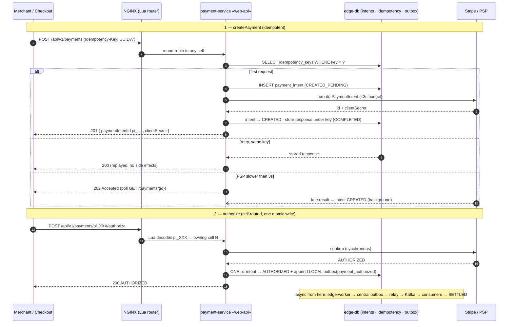

# MoR-Payment-Platform
Please check [here](docs/architecture/architecture.md) for detailed architecture details.
> Event-Driven Payment Infrastructure for Merchant-of-Record Platforms

**MoR-Payment-Platform** is a technical showcase of how large marketplace platforms
— Uber, bol.com, Amazon Marketplace, Airbnb — structure their payment and accounting flows
under a Merchant-of-Record model.

The system models the three fundamental money movements that every MoR environment reduces to:

- **Pay-ins** — shopper → platform (authorization + capture)
- **Internal reallocations** — platform → internal accounts (fees, commissions, settlements)
- **Pay-outs** — platform → sellers or external beneficiaries

Rather than simulating a complete product, the platform implements a realistic subset of
production-grade flows: synchronous authorization, multi-seller decomposition, asynchronous
capture pipelines, idempotent state transitions, retries, and double-entry ledger recording.
The goal is not feature completeness — it is **correctness, architectural integrity, and
fault-tolerant coordination across bounded contexts**.

Shopper Journey

At the domain layer, the system follows **DDD principles** with clear aggregate boundaries
(`PaymentIntent`, `Payment`, `PaymentOrder`, `Ledger`). Each event — authorization, capture
request, PSP result, finalization, journal posting — is immutable and drives the next step
in the workflow. At the infrastructure layer, the system relies on **hexagonal architecture**,
the **outbox pattern**, **Kafka-based orchestration**, and **idempotent command/event handlers**
to guarantee exactly-once processing across distributed components. All payment and ledger
flows are asynchronous, partition-aligned, and fault-tolerant by design.

From an engineering standpoint, the project demonstrates how to structure a modern, cloud-ready
financial system on a production-grade stack: **Kotlin**, **Spring Boot**, **Kafka**,
**PostgreSQL**, **Redis**, **Liquibase**, **Docker**, and **Kubernetes**. It surfaces practical
system-design choices: resiliency patterns, retries with jitter, consumer lag–driven scaling,
Kafka partitioning strategy, deterministic Snowflake-style ID generation, and observability
via **Prometheus/Grafana** and structured JSON logging.

This repository is written for **backend engineers, architects, and SREs** who want to
understand how MoR platforms implement correct financial flows, reconcile eventual consistency
with strict accounting rules, and build event-driven systems that hold up under real-world load.

---

## Engineering Deep Dives

The design decisions in this platform don't fit in a README.
Two companion articles go deeper on the problems that matter most in production financial systems:

- **[Architecture of Financial Integrity](YOUR_MEDIUM_URL_1)** — How DDD enforces that invalid
  domain states are not just detected, but made structurally impossible. Covers private
  constructors as invariant enforcers, immutable state machines that reject illegal transitions,
  ghost-payment prevention via lifecycle bridges, and a framework-free double-entry ledger
  where the accounting rules live in the domain — not the database.

- **[Idempotency and the Outbox Pattern](https://medium.com/@dcaglar1987/building-for-failures-payment-apis-idempotency-and-the-outbox-pattern-c50847f92ee4)** — How a payment API stays correct
  under network retries, race conditions, and infrastructure outages. Covers the four idempotency
  scenarios (first request, concurrent race, valid retry, key-reuse attack), the dual-write trap,
  and the transactional outbox as the reliability edge between your database and Kafka.

> Every pattern described in these articles is implemented in this codebase.

---

Please check [here](docs/architecture/architecture.md) for detailed architecture details.

