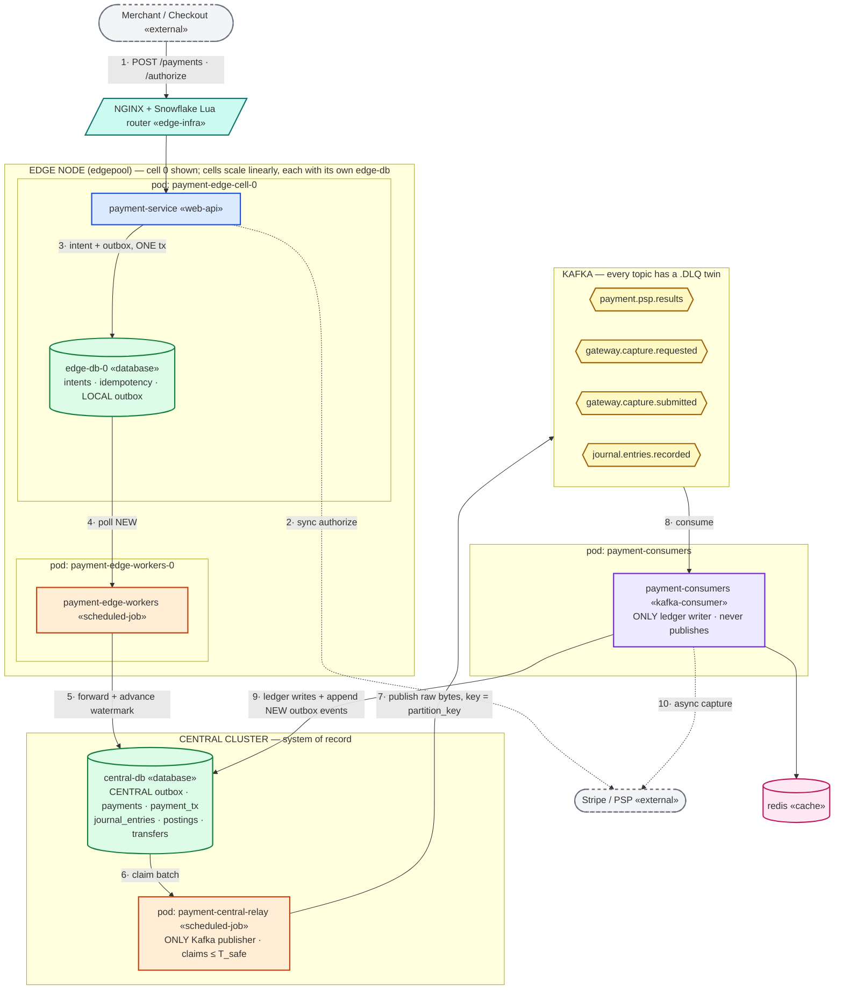
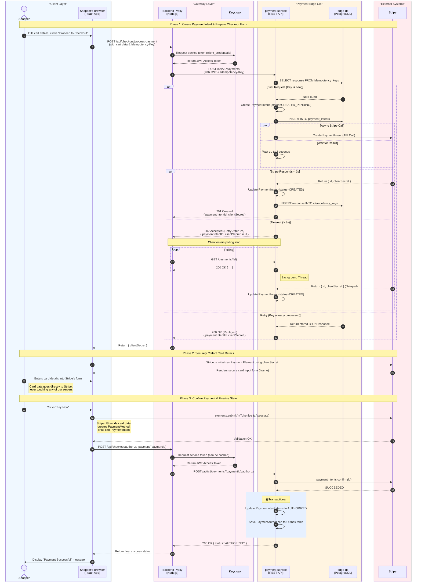
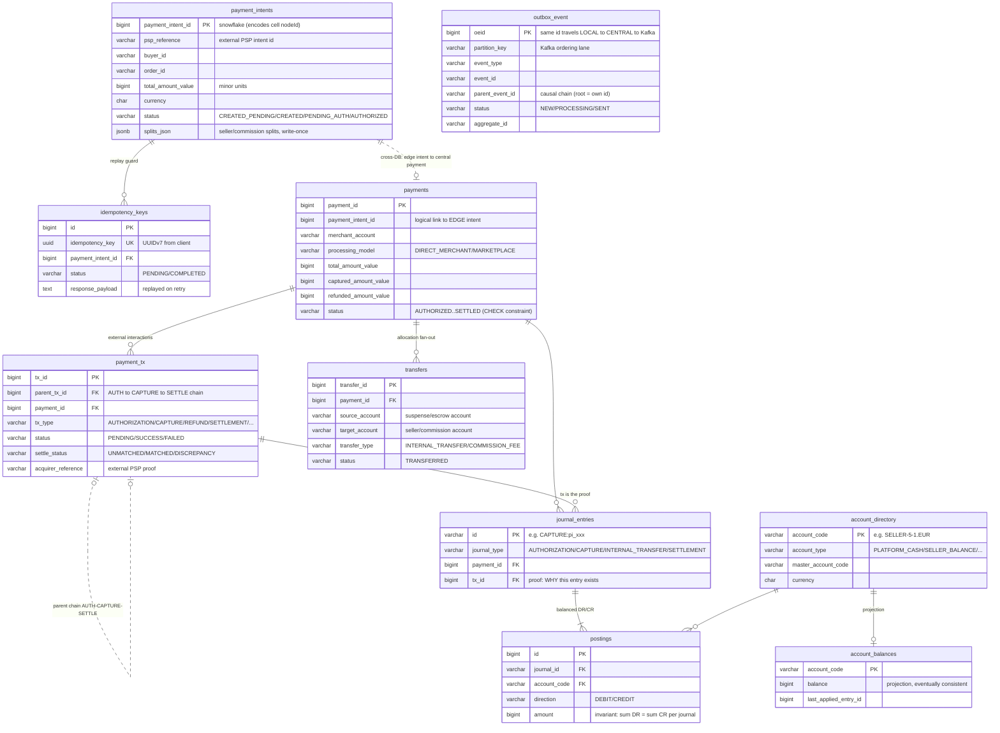
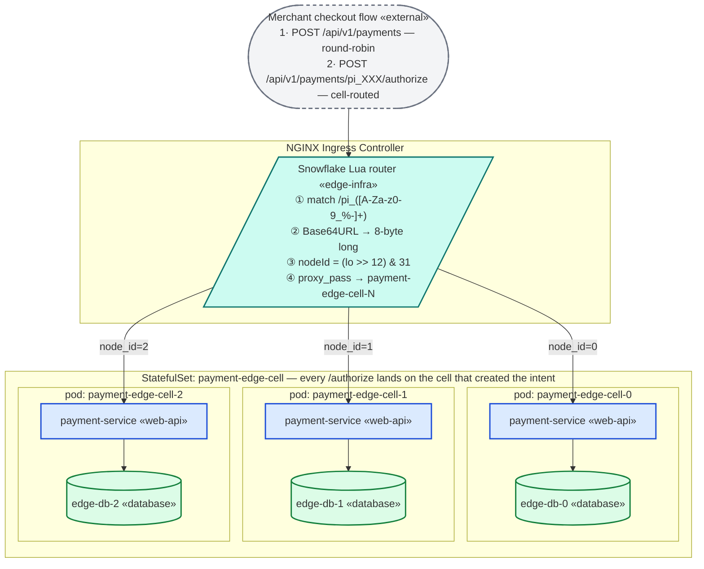
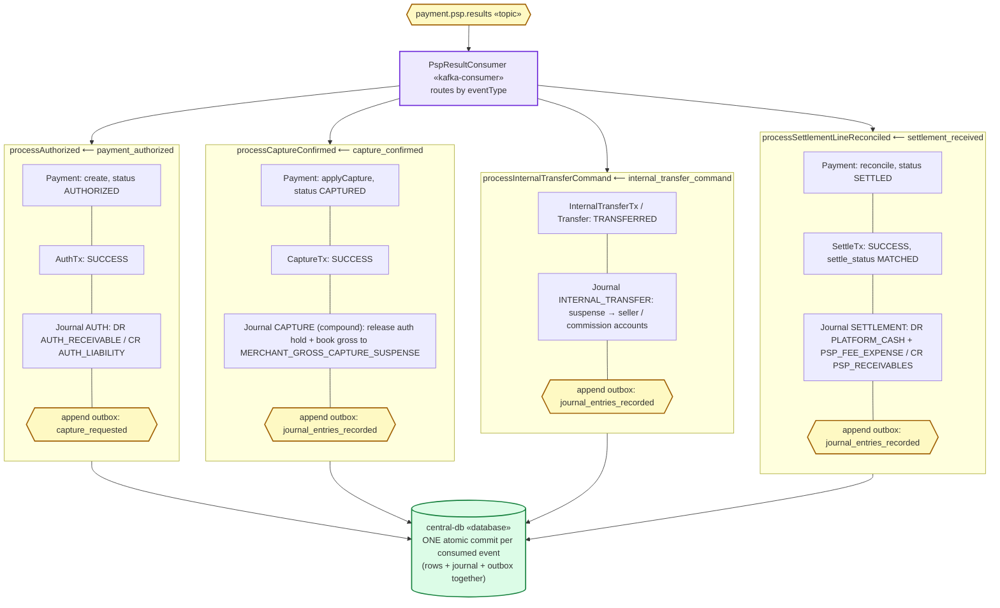

# 🟦 Event-Driven Payments & Ledger Infrastructure for Multi-Seller Platforms

This project represents a backend **payment platform for  Merchant-of-Record (MoR) environment**.  
Think of a multi-seller e-commerce marketplace where shoppers can buy items from different sellers in a single checkout.  
The platform manages the **full payment lifecycle**: synchronous authorization, multi-seller decomposition, seller-level operations, and internal financial accounting.

---

# 🟦   High Level Plaform Arhictecture

## Diagram standard (applies to every diagram in this doc)
C4 discipline, Mermaid syntax: **one altitude per diagram** (L2 topology here; per-module L3 detail lives with each module), a **fixed stereotype taxonomy**, and a **vertical spine** (`flowchart TB`).

| Stereotype | Meaning | Color/Shape |
|---|---|---|
| «web-api» | synchronous REST app (payment-service) | blue rectangle |
| «scheduled-job» | poller, no inbound traffic (payment-edge-workers, payment-central-relay) | orange rectangle |
| «kafka-consumer» | @KafkaListener app (payment-consumers) | purple rectangle |
| «database» / «cache» | Postgres / Redis | green / pink cylinder |
| «topic» | Kafka topic (each has a .DLQ twin) | yellow hexagon |
| «external» | third party (PSP, merchant) | dashed gray |
| «edge-infra» | ingress / router | teal |
| pod: … | co-location boundary | labeled subgraph |

### L2 — System Topology (request path reads top→bottom; numbered edges 1→10 tell the flow)

### Authorization Flow (This illustrates a demo checkout PCI compliant checkout page
##Please note that in direct integrations merchant will do 2 http call
   1-Sending  POST request on /api/v1/payments(with JWT & Idempotency-Key),a response with paymentintentid returned to merchant
   2-Using the payment intentid  in the response of step-1 , merhcant calls  POST /api/v1/payments/{paymentIntentId}/authorize(with JWT))

# 🟩 Key Clarifications (MoR Model)

### **1. Is the payment platform internal?**
Yes. The payment platform is an **internal backend domain service**, not exposed to shoppers directly. While it provides endpoints like `POST /api/v1/payments/{paymentId}/authorize`, these are meant to be called by your own internal proxies or checkout services, never directly by the shopper's browser.

---

### **2. Do we perform the actual financial authorization ourselves?**
No. Even though we expose an `/authorize` endpoint to orchestrate the flow, we do not perform the actual financial authorization. We simply act as a gateway to trigger and record the authorization happening at an external PSP (like Stripe).  
From the PSP’s perspective, we appear as a **single merchant-of-record**; seller details remain completely internal to our ledger.

---

### **3. Do we distribute funds to sellers internally?**
Yes. As the MoR, the platform manages all **fund allocation**, applies platform fees, credits seller balances, and schedules payouts.  
The PSP simply transfers funds into the MoR account.

---

### **4. Why separate PaymentIntent and Payment?**
PaymentIntent is just a domain entity living in edge layer and edge db so its not a global entity,but Payment is part of central cluster and it is the real entity created after a financial ionteraction with external world

# 🟧 Functional Requirements
*(written using Shopper, Seller, and Internal Services as actors)*

## **For Shoppers**

### **FR1 — Shoppers should be able to make a payment for a multi-seller basket.**
- A shopper must be able to proceed to checkout page(cretePaymentIntent), and then pay via clicking pay button on checkout page(authorize endpoint)

### **FR2 — Shoppers should be able to see accurate payment authorization status.**
- Shoppers should be able to view whether their payment is authorized or declined, its a syncronous psp call, and shoppers can see payment status via the paymentintent

---

## **For Sellers**

### **FR3 — Sellers should be able to receive their portion of a shopper’s payment if defined in splits array
- Each seller must receive the correctly allocated share of the total payment based on the items purchased from them.

### **FR4 — Sellers should be able to view their financial state.**
- Sellers should be able to access their balances, payable amounts, and payout summaries via projected views

---

## **For Internal Services (Checkout / Order / Finance / Payouts)**

### **FR5 — Checkout/Order Service should be able to create a PaymentIntent.**
- It must be possible for the Order Service to create a PaymentIntent and obtain the generated Intent along with its seller-level PaymentSplits.

### **FR6 — Checkout/Order Service should be able to trigger authorization via PSP.**
- The system must allow Checkout to authorize the total payment amount through an external PSP.

### **FR7 — Internal services should be able to perform operations.**
- Internal services must be able to request captures, cancellations, and refunds *per Payment*.

### **FR8 — The system must maintain internal fund distribution for reporting and payouts.**
- Internal components (Finance, Payouts) must be able to retrieve seller payables, platform fees, and other financial allocations.

---

# 🟥 Non-Functional Requirements
*(written using “The system should be…” statements)*

### **NFR1 — The system should be highly available.**
Payment creation and authorization must remain available during peak checkout traffic.

### **NFR2 — The system should ensure strong consistency for financial data.**
State transitions must never lead to incorrect balances or double charges.

### **NFR3 — The system should be secure.**
Sensitive financial data must be protected using proper authentication, authorization, and encryption.

### **NFR4 — The system should be observable.**
Logs, metrics, and tracing must allow operators to understand system behavior and diagnose issues.

### **NFR5 — The system should be scalable.**
It must support increasing transaction volumes, sellers, and asynchronous workflows without degradation.

### **NFR6 — The system must be correct under retries and failures.**
Even under retries, restarts, and network issues, financial outcomes must remain correct.

---

# 🟦 Architecture Summary (Non-Functional / Implementation Section)

The platform internally uses:
- **Event-driven architecture** for asynchronous flows for capture,refund,paymentsplits, transfers and the ledger flow
- **Kafka topics** for execution queuing and PSP results
- **Idempotent state transitions** to ensure correctness under retries
- **Double-entry ledger** for immutable financial history
- **PSP gateway client** for authorization, capture, refund, and cancel operations
- **Internal balance tracking** for seller payables and platform revenues

---

# 🟩 Core Entities & Data Model

## Actors
- **Shopper** — end-user paying for a multi-seller basket (never calls our APIs directly).
- **Seller** — marketplace participant who receives a share of each payment and later payouts.
- **Internal services** — Checkout/Order, Finance: the actual API callers.

### Persistence model (ER) — derived from the Liquibase changelogs
> Source of truth: charts/central-db/db + charts/payment-edge-cell/db changelogs.
> payment_intents/idempotency_keys/outbox_event(LOCAL) live in each EDGE db; everything else in central-db.
> The dashed intent→payment link is cross-database (logical, no FK).

## Entity lifecycle & rationale (companion to the ER above)

| Entity | Created when / by | Why it exists |
|---|---|---|
| **PaymentIntent** (edge) | `POST /payments` → `CREATED_PENDING`, → `CREATED` once the PSP id arrives | Separates edge-local *intent to pay* from central money movement; makes authorization idempotent and retry-safe |
| **Payment** (central) | `PspResultConsumer`, when the PSP authorization is `AUTHORIZED` | The actual financial transaction: aggregate totals (captured/refunded), links back via `payment_intent_id` |
| **OutboxEvent** | Same DB transaction as the state change (edge or central) | Exactly-once publishing through the DB commit — eliminates the dual-write problem |
| **Payment Tx** | One per external PSP interaction (auth / capture / refund / settle) | Audit of each network call incl. acquirer references — the **proof** every journal entry cites via `tx_id` |
| **JournalEntry** | By consumers, in the same commit as state + tx | Immutable double-entry record; invariant **Σ DEBIT = Σ CREDIT** per journal |
| **Posting** | With its journal entry | One DR/CR leg against one account |
| **Account** | Seeded from `account_directory.csv` (changelog loadData) | Money moves between accounts, never free variables: `PLATFORM_CASH`, `PSP_RECEIVABLES`, `AUTH_RECEIVABLE/LIABILITY`, `MERCHANT_GROSS_CAPTURE_SUSPENSE`, seller balance accounts, commission escrow/revenue, `PSP_FEE_EXPENSE` |
| **Balance** | Projection from applied entries (Redis deltas + snapshot job) | Reporting/payouts; **eventually consistent by design** — the sync path never waits on it |

# 🟦 System Design & Modular Architecture

The platform follows a **Hexagonal (Ports & Adapters)** pattern to separate business policy from technical details, ensuring high availability (NFR1) and consistency (NFR2).

### **1. `payment-domain` (Core Business Logic)**
- **Role**: Pure Kotlin business rules and data models.
- **Components**: Entities (`Payment`, `PaymentIntent`), Value Objects, and Domain Events.
- **Traits**: Zero dependencies on Spring or MyBatis. Implements **Double-entry ledger** logic and **Idempotent state transitions**.

### **2. `payment-application` (Orchestration & Ports)**
- **Role**: Implements Use Cases, coordinates business flows, and defines Ports.
- **Components**: Inbound Ports (Use Cases), Outbound Ports (Database/Kafka interfaces), and Core Domain Services.
- **Logic**: Manages internal fund distribution, platform fees, and retry policies for PSP operations.

### **3. `common-db` (Shared Database Infrastructure)**
- **Role**: Reusable MyBatis utilities, JSON typehandlers, and base configuration templates.
- **Traits**: Provides `mybatis-config-template.xml` and standard JSONb handling across the platform.

### **4. `common-kafka` (Shared Messaging Infrastructure)**
- **Role**: Reusable Kafka utilities, generic event envelopes, and Jackson ser/deser configurations.
- **Traits**: Ensures type safety and consistent payload formatting for all Kafka producers and consumers.

### **5. `payment-infrastructure` (Shared Technical Adapters)**
- **Role**: General utility implementations like the Snowflake ID Generator.
- **Traits**: Contains only truly common infrastructure utilities, completely decoupled from database entities or Kafka topics.

### **4. `payment-service` (API & Edge Cell Inbound Adapter)**
- **Role**: API gateway only talks to external PSP, and save result to local db, and return reesult to shopper in for the Edge Cell Pod.
- **REST API**: Spring Web MVC controllers exposed to internal checkout/order services for synchronous payments and intents.
- **Ports & Adapters**: Implements local database storage using `LocalOutboxWriterPort` to guarantee transaction safety.
- **Wiring**: Manages local Edge Cell lifecycle, thread pools, and local database connection.

### **5. `payment-edge-workers` (Standalone Outbox Forwarder)**
- **Role**: Background worker that bridges the Edge Cell to the Central Node.
- **Outbox Forwarding**: Runs `LocalOutboxForwarderJob` asynchronously to claim local outbox events using `LocalOutboxEdgePort` and forward them to the Central consolidated DB using `CentralOutboxEdgePort`.
- **Fault Isolation**: Deployed in its own isolated Pod on the same edge node. If the worker encounters issues, crashes, or requires maintenance, it can be restarted by Kubernetes without taking down the entire synchronous Web API and local database.

### **6. `payment-central-relay` (Central Outbox Publisher)**
- **Role**: Centralized high-performance scheduler that publishes events to Kafka.
- **Resilient Relaying**: Hosts the global `OutboxRelayJob` which queries eligible events from the Central DB outbox using `CentralOutboxRelayPort` and a safe watermark (`T_Safe`).
- **Kafka Publishing**: Uses an isolated thread pool and `PaymentEventPublisher` to publish events strictly in-order to Kafka with guaranteed at-least-once delivery.

### **7. `payment-consumers` (Asynchronous Workers & Ledger Processors)**
- **Role**: Central asynchronous consumer engine.
- **Kafka Listeners**: Hosts all `@KafkaListener` components for capture, refund, PSP results, ledger recording, and balance updates.
- **Workloads**: Coordinates heavy asynchronous tasks like calling external PSP Gateways and executing double-entry ledger bookkeeping.

## 🟦 Outbox Pattern Implementation (Two-Stage Edge-to-Central)

The system uses a **Two-Stage Transactional Outbox Pattern** to ensure reliable event publishing from distributed stateless edge nodes to a highly available central relay, which ultimately publishes to Kafka.

### **Stage 1: Edge Node (The Edge Cell Topology)**

The Edge layer is responsible for synchronous payment acceptance (Stripe integration, intent creation) and local outbox creation. To achieve low-latency communication and perfectly linear horizontal scaling, the Edge layer components are scheduled together using strict **Kubernetes Node Affinity**, but deployed as **separate Pods** for lifecycle fault isolation.

**The Edge Components (Strict Co-location Ratio):**
A single Edge Cell ecosystem runs on an isolated `edgepool` node and consists of separate Pods communicating over the internal cluster network:
1. **`payment-service and local-edge-db lives in the same pod, local-edge-db- designed as initcointeinr restartpolicy=always` Pod (Web API)**: Handles high-throughput synchronous checkouts and creates `OutboxEvent` record persist local edge dbb
3. **`payment-edge-workers` Pod (Forwarder)**:  Background worker running in its own standalone Pod that polls the `edge-db` for `NEW` outbox events and pushes them to the **Central DB**.

**Fault Tolerance Hardening:**
- **Lifecycle Fault Isolation**: Previously, the worker and API shared the same Pod (the Sidecar pattern). However, if the worker crashed or required a restart, Kubernetes would forcefully terminate the entire Pod, bringing down the healthy Web API and Database with it. By separating them into independent Pods, a worker maintenance cycle or crash has zero impact on the synchronous Web API's uptime.
- **Co-Located Scheduling**: Even though they are separate Pods, strict `nodeSelector` rules force them to land on the exact same physical `edgepool` Virtual Machine, minimizing network latency while maximizing fault isolation.
- **Topology Spread Constraints**: The Edge Cells are mathematically forced to spread evenly across Cloud Availability Zones to survive datacenter outages.

### **Stage 1B: Snowflake-Aware Ingress Routing (Stateful Cell Routing)**

To achieve high horizontal scalability (NFR5) and fault isolation (NFR1), the Edge Layer utilizes a **cell-based stateful architecture**. Each `payment-edge-cell` pod is completely isolated, running its own dedicated database (e.g., `edge-db-N`). A pod can only read and write to its own database. 

This design introduces a critical invariant:
> **A `PaymentIntent` created by Cell Pod N must always be authorized/processed by Cell Pod N.**

If an incoming `/authorize` request is routed to the wrong pod (e.g., round-robin to Pod 0 instead of Pod 1 where the intent was created), the pod's database query will return `null` and cause a `NullPointerException` (HTTP 500), since the data only exists in Pod 1's local database. Under scale (e.g., 3 replicas), a standard round-robin load balancer would misroute approximately $77\%$ of all `/authorize` requests.

#### **The Routing Solution: NGINX OpenResty Lua Router**
Rather than introducing application-level routing tables, distributed caches, or shared databases (which violate cell isolation), routing is solved purely mathematically at the network boundary using a **Snowflake-Aware Lua Router** running inside the NGINX Ingress Controller.

#### **How It Works Under the Hood:**
1. **Creation**: When a payment intent is created (`POST /api/v1/payments`), the request is load-balanced (round-robin) to any edge pod. The receiving pod (e.g., Pod 1) generates a 64-bit **Snowflake ID** encoding its own `nodeId` in bits 16–12. This ID is encoded into a URL-safe Base64 string prefixed with `pi_` (e.g., `pi_AByj...`) and returned to the merchant.
2. **Interception**: When the merchant confirms the payment (`POST /api/v1/payments/pi_AByj.../authorize`), NGINX intercepts the request via `access_by_lua_block`.
3. **Mathematical Decoding**:
   - The router extracts the Base64 token from the URI path.
   - It replaces URL-safe characters (`-` -> `+`, `_` -> `/`) and appends padding (`=`) to reconstruct standard Base64.
   - It decodes the Base64 string into 8 raw bytes.
   - Using the lower 4 bytes (as Lua 5.1 has no native 64-bit integer type), it calculates:
     $$\text{nodeId} = \lfloor \frac{\text{lo}}{4096} \rfloor \pmod{32}$$
     *(Which corresponds to shifting the lower half right by 12 bits and masking with 31).*
4. **Dynamic Routing**: The router assigns the `$cell_target` variable to the exact StatefulSet pod's headless service DNS name:
   `payment-edge-cell-<nodeId>.payment-edge-cell-headless.payment.svc.cluster.local`
   NGINX then executes `proxy_pass` to route the request directly to the correct cell.

This purely mathematical router requires **zero application code changes**, **zero client-side URL changes**, has no database or cache lookups, introduces under `< 1ms` latency overhead, and successfully brings the scale-out `/authorize` error rate down to **0%**.

### **Stage 2: Central Node (payment-central-relay & payment-consumers)**

The Central layer acts as the global system of record, ledger orchestrator, and Kafka publisher/consumer. It is divided into two highly available, autonomous modules to preserve separate scaling and thread/resource isolation boundaries:

- **`payment-central-relay`**: A dedicated, non-blocking service containing the global `OutboxRelayJob` and the `PaymentEventPublisher`. It continuously polls the Central DB's `outbox_event` table based on a globally safe `T_Safe` watermark (derived from all edge nodes) and publishes outbox events strictly in-order to Kafka using an isolated `resilientExecutor` thread pool.
- **`payment-consumers`**: Purely asynchronous consumer application containing all Kafka `@KafkaListener` event handlers. It consumes event streams from Kafka topics, handles PSP capture/refund execution, manages terminal result updates, and coordinates double-entry ledger bookkeeping and Redis balance-cache updates.

**Host Deployment, Fault Isolation, and Non-Sidecar Pattern:**
Unlike the Edge Cell which strictly enforces the Kubernetes Sidecar pattern (forcing the API, the local PostgreSQL database, and the local edge worker to reside in the same Pod to share localhost-based low-latency networking and co-located physical disk storage), **the Central Cluster components do NOT apply the sidecar pattern**. 

Since this represents an asynchronous processing path, **`payment-central-relay` and `payment-consumers` must NOT be co-located in the same Pod or physical host node**. Instead, they are completely decoupled asynchronously via Kafka to maximize durability and high availability:
- **Fault Domain Isolation**: If `payment-central-relay` (the outbox relay job) crashes or experiences an outage, `payment-consumers` remains fully operational. It continues to process, execute, and settle any backlog of payment events already stored in the Kafka cluster without interruption.
- **Resource Independence**: If the consumer layer experiences high latency due to slow external PSP gateway responses or intensive batch ledger writes, it will not steal CPU resources, memory, or DB connections from `payment-central-relay`, preventing cascading failures.
- **Anti-Affinity Scheduling**: Kubernetes deployments utilize **Pod Anti-Affinity rules** to physically separate `payment-central-relay` and `payment-consumers` onto different physical compute nodes and Availability Zones.

**Why This Topology:**
- **High Availability**: Edge cells can continue accepting payments and writing to their local Postgres databases even if the Central DB or Kafka goes down entirely.
- **Resource & Fault Isolation**: The outbox publishing scheduler run-loop is isolated in `payment-central-relay` with its own thread pool, ensuring that heavy consumer processing (e.g. slow PSP gateway calls or batch ledger updates in `payment-consumers`) can never block or exhaust the outbox publishing thread allocation.
- **Independent Scaling & Topology Separation**: Edge Cells can be scaled out linearly to handle localized high checkout volumes. Meanwhile, the central `payment-consumers` and `payment-central-relay` scale independently on separate compute hosts to handle global asynchronous workloads without constraints on co-location.
- **Guaranteed At-Least-Once Delivery**: Events are durably stored in the local outboxes first, forwarded to the central consolidated outbox, and only marked as dispatched upon a successful Kafka ack.

### **Stage 3: Outbox Port Architecture & Flow Control**

To maintain a strict **Hexagonal (Ports & Adapters)** design and prevent architectural pollution, outbox capabilities are split into four highly specialized outbound ports with clean, distinct responsibilities:

1. **`LocalOutboxWriterPort`**:
   - **Declared in**: `payment-application` / `ports/outbound`
   - **Used by**: `payment-service` (Web API)
   - **Responsibility**: Invoked within the local Edge transaction boundary to write `OutboxEvent` records directly into the local postgres database (`local-edge-db`).
2. **`LocalOutboxEdgePort`**:
   - **Declared in**: `payment-application` / `ports/outbound`
   - **Used by**: `payment-edge-workers` (Local Sidecar Forwarder)
   - **Responsibility**: Reads, claims, and marks local outbox events as dispatched. Declares specific methods such as `findEligible(batchSize, workerId)` and `markDispatched(events)`.
3. **`CentralOutboxEdgePort`**:
   - **Declared in**: `payment-application` / `ports/outbound`
   - **Used by**: `payment-edge-workers` (Local Sidecar Forwarder)
   - **Responsibility**: Acts as a bridge between edge node container and the consolidated Central DB cluster. Invoked by the local forwarder to insert batches of claimed edge events (`insertBatch(edgeNodeId, entries)`) into the central `outbox_event` table.
4. **`CentralOutboxRelayPort`**:
   - **Declared in**: `payment-application` / `ports/outbound`
   - **Used by**: `payment-central-relay` (Central Outbox Publisher)
   - **Responsibility**: Provides the read/write API for the central consolidated outbox table. Exposes `findEligible(tSafe, batchSize)` to query unclaimed events safely behind the watermark `T_Safe`, and `markDispatched(oeid)` to finalize publication upon successful Kafka broker acknowledgment.

### **Stage 4: Database Connection URLs & Role-Based Credentials**

In line with strict security and network isolation principles, **there is no shared database configuration or connection account**. Each runtime component is allocated a dedicated PostgreSQL user role with the minimum privileges required to perform its specific task.

#### **1. Edge Database Access (Local Edge Cell)**
- **Scope**: Local transactions, high throughput, low latency.
- **Config Variable**: `EDGE_DB_URL`
- **JDBC Connection URL**: `jdbc:postgresql://localhost:5432/edge-db?options=-c%20timezone=UTC`
- **Component Credentials**:
  * **`payment-service`**:
    * **Username Key**: `EDGE_DB_PAYMENT_SERVICE_USERNAME`
    * **Username**: `edge_db_payment_service_username`
  * **`payment-edge-workers`**:
    * **Username Key**: `EDGE_DB_PAYMENT_EDGE_WORKERS_USERNAME`
    * **Username**: `edge_db_payment_edge_workers_username`

#### **2. Central Database Access (Global Consolidated State)**
- **Scope**: Multi-seller consolidated outbox, double-entry ledger bookkeeping, and global account balance snapshots.
- **Config Variable**: `CENTRAL_DB_URL` (mapped internally to `SPRING_DATASOURCE_URL` or resolved locally via `SPRING_DATASOURCE_CENTRAL_URL`).
- **JDBC Connection URLs**:
  - **Kubernetes / Containerized Production**:
    `jdbc:postgresql://central-db-postgresql:5432/central-db?options=-c%20timezone=UTC`
  - **Local Development Environment**:
    `jdbc:postgresql://localhost:5432/central-db?options=-c%20timezone=UTC`
- **Component Credentials**:
  * **`payment-consumers`**:
    * **Username Key**: `CENTRAL_DB_PAYMENT_CONSUMERS_USERNAME`
    * **Username**: `central_db_payment_consumers_username`
  * **`payment-edge-workers`** (when writing to central outbox):
    * **Username Key**: `CENTRAL_DB_PAYMENT_EDGE_WORKERS_USERNAME`
    * **Username**: `central_db_payment_edge_workers_username`
  * **`payment-central-relay`** (when relaying central outbox to Kafka):
    * **Username Key**: `CENTRAL_DB_PAYMENT_CENTRAL_RELAY_USERNAME`
    * **Username**: `central_db_payment_central_relay_username`

---

## Consumer Architecture (L3 — payment-consumers)
> Visualized by the L2 System Topology (top of this doc) and the L3 PspResultConsumer diagram below.

A new simplified Kafka consumer architecture has been introduced to streamline PSP operations and double-entry bookkeeping.

**Why we moved away from the "Consume-Process-Publish" pattern:**
Historically, consumers would read an event, process it (e.g. call a PSP), and then immediately publish a new event using Kafka Transactions. This attempted to achieve "exactly-once" delivery semantics but caused significant issues:
- **Abusing Kafka as a Database**: Relying on Kafka transactions to guarantee state consistency across external API calls and database commits led to fragile, blocking architectures.
- **Blocking Calls in Transactions**: External PSP calls (which can be slow) held open Kafka transactions, reducing throughput and risking transaction timeouts.
- **Unrealistic Exactly-Once Guarantees**: Achieving true exactly-once semantics across a database, an external HTTP API, and Kafka is impossible without distributed locks or 2PC (Two-Phase Commit).

**The New Pattern (Outbox-Driven Consumers):**
1. **Intents (Capture/Refund Received)**: `CaptureReceived` events denote that an intent to capture has been recorded in the database edge outbox.
2. **Executors (`CaptureCommandExecutor`)**: These components listen to `capture-execution-queue`. They perform the synchronous call to the external PSP Gateway. Upon receiving a terminal or retryable result, they **do not publish back to Kafka directly**. Instead, they write a `ExternalAsyncCaptureToPspPerformed` event into the Central Database Outbox.
3. **Outbox Relay**: The `OutboxRelayJob` reads these results from the database outbox and publishes them asynchronously to their respective Kafka topics (e.g., `psp-result-queue`, `capture-execution-queue`, `internal-transfer-queue`, `journal.entries.recorded`) based on the event type.
4. **Result Processing (`PspResultConsumer`)**: Listens to the `psp-result-queue` to apply the results to the central database, finalize payment statuses, trigger internal double-entry ledger bookkeeping, and schedule any required internal transfers.

### L3 — PspResultConsumer branches (inside payment-consumers; one atomic commit per consumed event)

### AccountBalanceConsumer Details ( TODO )

###  CaptureCommandExecutor/RefundCommandExecutor Details ( TODO )

###  GrossCaptureAllocationConsumer Details ( TODO )

###  SimulatedSdrStreamingProcessorConsumer Details ( TODO )

## 🟦 Kafka Event Typology & Type Verification

To satisfy strict financial auditability and message correctness (NFR2/NFR6), the platform implements **strict compile-time type-safety** and **declarative runtime serialization**. 

### 1. The Kafka Event and Command Topology

The following catalog defines every event and command passing through Kafka, including their exact topic mappings, event type strings, payload envelope classes, publishers, and consumers:

| No. | Logical Event / Command | Event Type String (`eventType`) | Envelope Payload Class | Kafka Topic                 | Publisher Module & Class | Consumer Module & Class | Consumer Group ID | Container Factory Bean |
|---|---|---|---|-----------------------------|---|---|---|---|
| **1** | **Payment Authorized Event** | `"payment_authorized"` | `EventEnvelope<PaymentAuthorized>` | `payment.psp.results`       | `payment-central-relay` `OutboxRelayJob` | `payment-consumers` `PspResultConsumer` | `payment-core.psp-result-consumer` | `payment-core.psp-result-consumer-factory` |
| **2** | **Capture Requested Event** | `"capture_requested"` | `EventEnvelope<CaptureRequested>` | `gateway.capture.requested` | `payment-central-relay` `OutboxRelayJob` | `payment-consumers` `CaptureCommandExecutor` | `gateway-workers.capture-command-executor` | `gateway-workers.capture-command-executor-factory` |
| **3** | **Capture Submitted Event** | `"capture_submitted"` | `EventEnvelope<CaptureSubmitted>` | `gateway.capture.submitted` | `payment-central-relay` `OutboxRelayJob` | `payment-consumers` `CapturePspPerformedConsumer` | `payment-core.capture-submitted` | `payment-core.capture-submitted-factory` |
| **4** | **Capture Confirmed Event** | `"capture_confirmed"` | `EventEnvelope<CaptureConfirmed>` | `payment.psp.results`       | `payment-central-relay` `OutboxRelayJob` | `payment-consumers` `PspResultConsumer` | `payment-core.psp-result-consumer` | `payment-core.psp-result-consumer-factory` |
| **5** | **Internal Transfer Command** | `"internal_transfer_command"` | `EventEnvelope<InternalTransferCommand>` | `payment.psp.results`       | `payment-central-relay` `OutboxRelayJob` | `payment-consumers` `PspResultConsumer` | `payment-core.psp-result-consumer` | `payment-core.psp-result-consumer-factory` |
| **6** | **Journal Entries Recorded** | `"journal_entries_recorded"` | `EventEnvelope<JournalEntriesRecorded>` | `journal.entries.recorded`  | `payment-consumers` `ProcessPspResultUseCase` | `payment-consumers` `GrossCaptureAllocationConsumer` `AccountBalanceConsumer` `SimulatedSdrStreamingProcessorConsumer` | `payment.gross-capture-allocation-consumer-group` `ledger-engine.account-balance-consumer` `ledger-engine.simulated-settlement-consumer` | `...-factory` |
| **7** | **Settlement Received Event** | `"settlement_received_by_psp"` | `EventEnvelope<SettlementReceived>` | `payment.psp.results`       | `payment-central-relay` `OutboxRelayJob` | `payment-consumers` `PspResultConsumer` | `payment-core.psp-result-consumer` | `payment-core.psp-result-consumer-factory` |

---

### 2. Strict Type Safety & Generics Preservation

#### High-Performance Outbox Event Relay (The "Zero-Deserialization" Flow) & Type Preservation
In early iterations, generic event envelopes were sometimes cast to a raw `EventEnvelope<Event>` base wrapper during Kafka publishing, or required costly deserialize-reserialize cycles in the Relay Job. This degraded performance and risked stripping Jackson of the concrete metadata needed to map nested JSON sub-structures correctly. 

To harden this and improve performance, the system strictly implements **concrete type preservation at the point of creation** and uses **raw byte forwarding** during publication:
1. **At Event Creation (`OutboxEventEventFactory`)**:
   Concrete type preservation is guaranteed at the edge. The system constructs the exact compile-time generic `EventEnvelope<T>` (e.g., `EventEnvelope<PaymentAuthorized>`) and serializes it to a JSON payload *before* persisting it into the local outbox. Essential observability metadata (`traceId`, `eventId`, `parentEventId`, `eventType`) is extracted and stored as dedicated columns in the outbox table.
2. **At Publication (`OutboxRelayJob` & `RawEventPublisher`)**:
   The `OutboxRelayJob` bypasses JSON deserialization entirely. Instead of attempting to parse and cast to concrete `EventEnvelope<T>` wrappers, it uses the `RawEventPublisher` to stream the pre-serialized `payload` directly to Kafka as raw bytes. It also injects the necessary type metadata (`eventType`, `traceId`, `eventId`) directly into the Kafka headers. This maintains strict type safety for downstream consumers while maximizing relay throughput.

#### Runtime Deserialization Binding
Kafka messages are consumed using Spring Kafka's `ErrorHandlingDeserializer` delegating to our custom `EventEnvelopeKafkaDeserializer`. 
- **The Metadata Catalog (`PaymentEventMetadataCatalog`)**:
  Maintains a registry mapping each event class to a specific `TypeReference<EventEnvelope<T>>`.
- **Deserializer Resolution**:
  When a byte array is pulled from a topic, the deserializer resolves the topic's corresponding `TypeReference` from the catalog and calls `objectMapper.readValue(data, typeRef)`. This forces Jackson to reconstruct the exact nested type (e.g. `CaptureReceived`) instead of falling back to a raw map or base class.
- **Type Filtering**:
  At the container listener level (`KafkaTypedConsumerFactoryConfig`), the container factory is registered with a `RecordFilterStrategy` matching the class's exact expected event type. This ensures that any malformed or unexpected events are filtered or routed to the DLQ immediately without crashing the consumer.

---

## 🟦 Observability: Metrics, Tracing, and Exemplars (OpenTelemetry)

To satisfy **NFR4 (Observability)** and provide deterministic debugging across our asynchronous, distributed components, the platform relies exclusively on **OpenTelemetry (OTel)** for both distributed tracing and metrics generation.

### 1. The Instrumentation Strategy: `otel-spring-starter` vs. Alternatives
A deliberate architectural decision was made regarding how OpenTelemetry is integrated into the Spring Boot ecosystem:
* **NO Java Agent**: We explicitly **do not use** the OpenTelemetry Java Agent (`-javaagent:opentelemetry-javaagent.jar`). While the agent provides "magic" byte-code manipulation for auto-instrumentation, it obscures the trace lifecycle, can introduce classloader conflicts, and makes manual context propagation harder to reason about in our highly customized outbox workers.
* **NO Micrometer**: We explicitly **do not rely** on Spring Boot 3's built-in Micrometer metrics, Micrometer Tracing, or its OTel bridges (`management.tracing.enabled=false`). Mixing Micrometer with OTel often leads to duplicate spans or context propagation conflicts. All custom Micrometer metrics have been fully deprecated and migrated to explicit OpenTelemetry metrics.
* **YES to `otel-spring-starter`**: Instead, the platform integrates the official **OpenTelemetry Spring Boot Starter**. This provides clean, native, and explicit auto-instrumentation for standard Spring HTTP and Kafka flows directly within our application code boundary, giving us full control over the trace context.

### 2. Modern Telemetry Infrastructure (Push over Pull)
The local and remote infrastructure (`local` and `azure` profiles) deploys a centralized **OpenTelemetry Collector**. 
* **Metrics Push Strategy**: Instead of relying on Prometheus to scrape application endpoints (`/metrics`) via `ServiceMonitors`, applications push their OTel metrics directly to the OTel Collector. The collector then acts as an agent, securely pushing the metrics into Prometheus via the `remote_write` API.
* **Tempo and Posthog**:  **Grafana Tempo** is the designated tracing backend to use locally, in Azure Posthog is configured as backend for traces  The OTel collector buffers incoming OTLP traces and forwards them directly to Tempo.
* **Exemplars Integration**: The architecture leverages OTel Exemplars, allowing us to natively link high-cardinality trace IDs directly to aggregated metric points (e.g., latency histograms) inside Grafana dashboards.
* **Custom Service Configuration**: OTel custom configuration (such as sampling rates, specific exporter settings, or service attributes) can be easily managed per-service via their respective Helm `values.yaml` files. This allows for tailored telemetry settings across both `local` and `azure` profiles.

### 3. Manual Context Propagation for the Outbox Pattern
While the `otel-spring-starter` automatically instruments standard HTTP requests and Spring Kafka listeners, our two-stage outbox architecture introduces asynchronous database polling gaps that require careful manual instrumentation:

* **Edge Context Preservation**: When `OutboxEvent` records are created synchronously at the Edge API, the current active OTel `traceId` and `eventId` are explicitly extracted and persisted as physical columns in the `outbox_event` table. This durably bridges the gap between the HTTP request and future database workers.
* **Manual Context Resumption (`CentralOutboxDispatchWorker`)**: Background workers that poll the database outbox operate entirely outside of a standard HTTP or Kafka context. These components manually construct OTel Spans and re-hydrate the trace context from the `outbox_event` table columns using explicit OTel API helpers. This ensures that a trace initiated by a shopper's HTTP checkout request perfectly links to the Kafka messages consumed by the ledger engine hours later.
