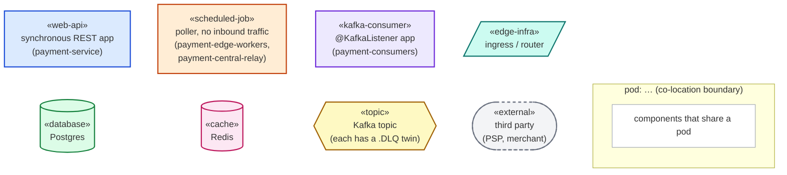
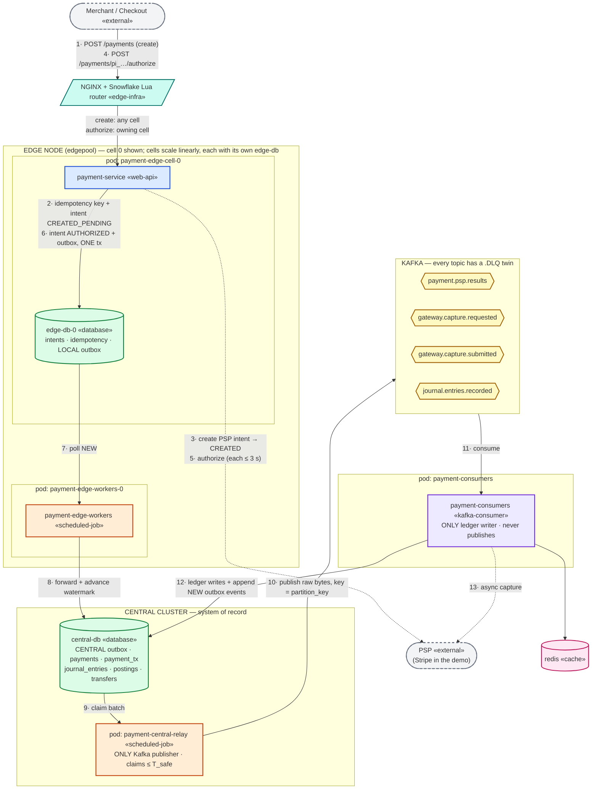
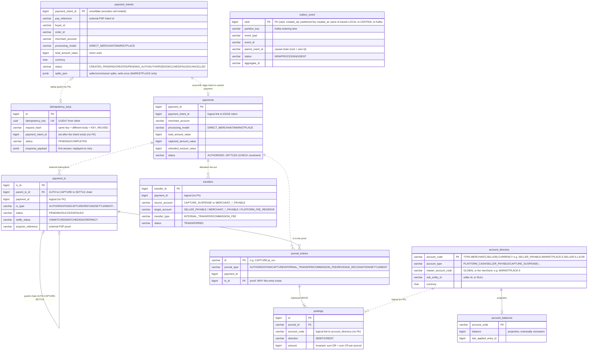
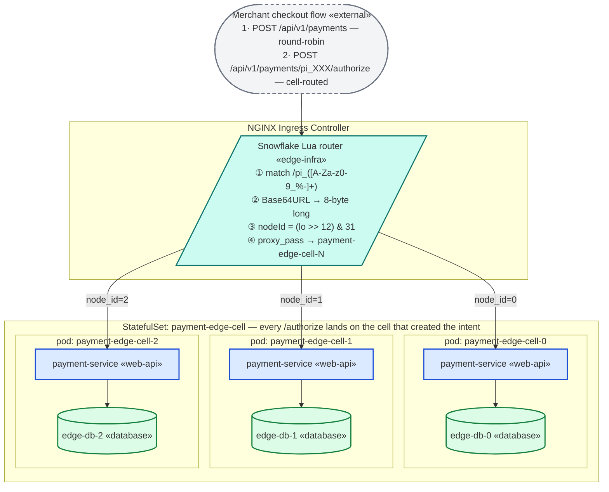
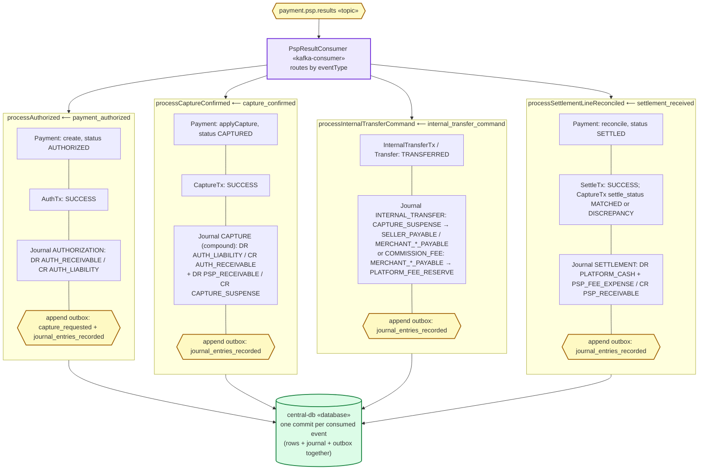

# 🟦 Event-Driven Payments & Ledger Infrastructure for Multi-Seller Platforms

This project represents a backend **payment platform for  Merchant-of-Record (MoR) environment**.  
Think of a multi-seller e-commerce marketplace where shoppers can buy items from different sellers in a single checkout.  
The platform manages the **full payment lifecycle**: synchronous authorization, multi-seller decomposition, seller-level operations, and internal financial accounting.

---

# 🟦   High Level Plaform Arhictecture

## Diagram standard (applies to every diagram in this doc)
C4 discipline, Mermaid syntax: **one altitude per diagram** (L2 topology here; per-module L3 detail lives with each module), a **fixed stereotype taxonomy**, and a **vertical spine** (`flowchart TB`).

Legend — every diagram below uses exactly these shapes and colors (same `classDef`s):

```mermaid
flowchart LR
    classDef webapi fill:#dbeafe,stroke:#1d4ed8,stroke-width:2px
    classDef job fill:#ffedd5,stroke:#c2410c,stroke-width:2px
    classDef consumer fill:#ede9fe,stroke:#6d28d9,stroke-width:2px
    classDef db fill:#dcfce7,stroke:#15803d,stroke-width:2px
    classDef cache fill:#fce7f3,stroke:#be185d,stroke-width:2px
    classDef topic fill:#fef9c3,stroke:#a16207,stroke-width:2px
    classDef external fill:#f3f4f6,stroke:#6b7280,stroke-width:2px,stroke-dasharray:5 5
    classDef infra fill:#ccfbf1,stroke:#0f766e,stroke-width:2px
    classDef plain fill:#ffffff,stroke:#9ca3af,stroke-width:1px

    W["«web-api»<br/>synchronous REST app<br/>(payment-service)"]:::webapi
    J["«scheduled-job»<br/>poller, no inbound traffic<br/>(payment-edge-workers,<br/>payment-central-relay)"]:::job
    K["«kafka-consumer»<br/>@KafkaListener app<br/>(payment-consumers)"]:::consumer
    I[/"«edge-infra»<br/>ingress / router"/]:::infra
    D[("«database»<br/>Postgres")]:::db
    C[("«cache»<br/>Redis")]:::cache
    T{{"«topic»<br/>Kafka topic<br/>(each has a .DLQ twin)"}}:::topic
    E(["«external»<br/>third party<br/>(PSP, merchant)"]):::external
    subgraph POD["pod: … (co-location boundary)"]
        P["components that share a pod"]:::plain
    end

    W ~~~ J ~~~ K ~~~ I
    D ~~~ C ~~~ T ~~~ E ~~~ POD
```

### L2 — System Topology (request path reads top→bottom; numbered edges 1→13 tell the flow)
Steps 1–3 are **create** (`POST /payments`: no outbox event yet), 4–6 are **authorize** (the only edge step that writes an outbox event), 7–13 are the asynchronous path.

```mermaid
flowchart TB
    classDef webapi fill:#dbeafe,stroke:#1d4ed8,stroke-width:2px
    classDef job fill:#ffedd5,stroke:#c2410c,stroke-width:2px
    classDef consumer fill:#ede9fe,stroke:#6d28d9,stroke-width:2px
    classDef db fill:#dcfce7,stroke:#15803d,stroke-width:2px
    classDef cache fill:#fce7f3,stroke:#be185d,stroke-width:2px
    classDef topic fill:#fef9c3,stroke:#a16207,stroke-width:2px
    classDef external fill:#f3f4f6,stroke:#6b7280,stroke-width:2px,stroke-dasharray:5 5
    classDef infra fill:#ccfbf1,stroke:#0f766e,stroke-width:2px

    CLIENT(["Merchant / Checkout «external»"]):::external
    NGINX[/"NGINX + Snowflake Lua router «edge-infra»"/]:::infra
    CLIENT -->|"1· POST /payments (create)<br/>4· POST /payments/pi_…/authorize"| NGINX

    subgraph EDGE["EDGE NODE (edgepool) — cell 0 shown; cells scale linearly, each with its own edge-db"]
        direction TB
        subgraph CELLPOD["pod: payment-edge-cell-0"]
            direction TB
            PS["payment-service «web-api»"]:::webapi
            EDB[("edge-db-0 «database»<br/>intents · idempotency · LOCAL outbox")]:::db
            PS -->|"2· idempotency key + intent CREATED_PENDING<br/>6· intent AUTHORIZED + outbox, ONE tx"| EDB
        end
        subgraph EWPOD["pod: payment-edge-workers-0"]
            EW["payment-edge-workers «scheduled-job»"]:::job
        end
        EDB -->|"7· poll NEW"| EW
    end
    NGINX -->|"create: any cell<br/>authorize: owning cell"| PS

    PSP(["PSP «external»<br/>(Stripe in the demo)"]):::external
    PS -.->|"3· create PSP intent → CREATED<br/>5· authorize (each ≤ 3 s)"| PSP

    subgraph CENTRALDB["CENTRAL CLUSTER — system of record"]
        direction TB
        CDB[("central-db «database»<br/>CENTRAL outbox · payments · payment_tx<br/>journal_entries · postings · transfers")]:::db
        RELAY["pod: payment-central-relay «scheduled-job»<br/>ONLY Kafka publisher · claims ≤ T_safe"]:::job
        CDB -->|"9· claim batch"| RELAY
    end
    EW -->|"8· forward + advance watermark"| CDB

    subgraph KAFKA["KAFKA — every topic has a .DLQ twin"]
        direction LR
        T1{{"payment.psp.results"}}:::topic
        T2{{"gateway.capture.requested"}}:::topic
        T3{{"gateway.capture.submitted"}}:::topic
        T4{{"journal.entries.recorded"}}:::topic
    end
    RELAY -->|"10· publish raw bytes, key = partition_key"| KAFKA

    subgraph CONS_BAND["pod: payment-consumers"]
        CONS["payment-consumers «kafka-consumer»<br/>ONLY ledger writer · never publishes"]:::consumer
    end
    KAFKA -->|"11· consume"| CONS
    REDIS[("redis «cache»")]:::cache
    CONS -->|"12· ledger writes + append NEW outbox events"| CDB
    CONS -.->|"13· async capture"| PSP
    CONS --> REDIS
```

### Authorization Flow (demo PCI-compliant checkout page)
A merchant makes two HTTP calls:
1. `POST /api/v1/payments` (JWT + `Idempotency-Key`) → returns the `paymentIntentId` (and the PSP `clientSecret` once the PSP has created its intent).
2. `POST /api/v1/payments/{paymentIntentId}/authorize` (JWT) → authorizes it at the PSP.

The PSP is behind `PspAuthorizationGatewayPort`; the demo uses Stripe (Payment Element), the tests use WireMock as the PSP. Every error body carries a stable `code` (`INVALID_REQUEST`, `FORBIDDEN`, `NOT_FOUND`, `IN_PROGRESS`, `KEY_REUSED`, `RETRY_LATER`, `INTERNAL_ERROR`); `409` and `503` also carry `Retry-After: 2`.

```mermaid
sequenceDiagram
    autonumber

    box rgb(240, 248, 255) "Client Layer"
        actor Shopper
        participant Browser as Shopper's Browser<br/>(React App)
    end

    box rgb(255, 240, 245) "Gateway Layer"
        participant Proxy as Backend Proxy<br/>(Node.js)
        participant Keycloak
    end

    box rgb(255, 244, 225) "Payment Edge Cell"
        participant PaymentSvc as payment-service<br/>(REST API)
        participant EdgeDB as edge-db<br/>(PostgreSQL)
    end

    box rgb(255, 235, 238) "External Systems"
        participant PSP as PSP<br/>(Stripe in the demo)
    end

    %% Step 1: Create Payment Intent
    Note over Shopper, PSP: Phase 1: Create Payment Intent & Prepare Checkout Form

    Shopper->>Browser: Fills cart details, clicks "Proceed to Checkout"
    Browser->>Proxy: POST /api/checkout/process-payment<br/>(with cart data & Idempotency-Key)

    Proxy->>Keycloak: Request service token (client_credentials)
    Keycloak-->>Proxy: Return JWT Access Token

    Proxy->>PaymentSvc: POST /api/v1/payments<br/>(with JWT & Idempotency-Key)

    %% --- IDEMPOTENCY FLOW ---
    PaymentSvc->>EdgeDB: INSERT INTO idempotency_keys (key, request_hash, PENDING)<br/>ON CONFLICT DO NOTHING
    alt Inserted (first request for this key)
        PaymentSvc->>EdgeDB: INSERT INTO payment_intents (status=CREATED_PENDING)

        par PSP call on a worker thread
            PaymentSvc->>PSP: Create PaymentIntent (PSP idempotency key per step)
        and Wait for Result
            PaymentSvc->>PaymentSvc: Wait up to 3 seconds
        end

        alt PSP answers < 3s
            PSP-->>PaymentSvc: { id, clientSecret }
            PaymentSvc->>EdgeDB: UPDATE payment_intents (status=CREATED)
            PaymentSvc->>EdgeDB: UPDATE idempotency_keys (COMPLETED, response_payload, payment_intent_id)
            PaymentSvc-->>Proxy: 201 Created + Location<br/>{ paymentIntentId, clientSecret }
        else PSP refuses our request for good
            PaymentSvc->>EdgeDB: UPDATE payment_intents (status=FAILED)
            PaymentSvc->>EdgeDB: UPDATE idempotency_keys (COMPLETED, response = FAILED)
            PaymentSvc-->>Proxy: 422 { status: FAILED }
        else PSP unavailable / outcome unknown
            PaymentSvc->>EdgeDB: DELETE idempotency_keys row (key can be retried)
            PaymentSvc-->>Proxy: 503 RETRY_LATER (Retry-After: 2)
        else Timeout (> 3s)
            PaymentSvc->>EdgeDB: UPDATE idempotency_keys (COMPLETED, response = CREATED_PENDING)
            PaymentSvc-->>Proxy: 202 Accepted + Location (Retry-After: 2)<br/>{ paymentIntentId, clientSecret: null }

            loop Polling
                Proxy->>PaymentSvc: GET /api/v1/payments/{id}
                PaymentSvc-->>Proxy: 200 OK { status, clientSecret }
            end

            Note right of PaymentSvc: Background thread
            PSP-->>PaymentSvc: { id, clientSecret } (delayed)
            PaymentSvc->>EdgeDB: UPDATE payment_intents (status=CREATED)
        end

    else Conflict (key already exists)
        PaymentSvc->>EdgeDB: SELECT FROM idempotency_keys WHERE key = ?
        alt Different request body (hash differs)
            PaymentSvc-->>Proxy: 422 KEY_REUSED
        else First request still running (PENDING)
            PaymentSvc-->>Proxy: 409 IN_PROGRESS (Retry-After: 2)
        else COMPLETED
            PaymentSvc-->>Proxy: Replay of the first answer: same status (201/202/422)<br/>+ Idempotent-Replayed: true
        end
    end
    %% --- END IDEMPOTENCY FLOW ---

    Proxy-->>Browser: Return { clientSecret }

    %% Step 2: Collect Card Details via the PSP's hosted form
    Note over Shopper, PSP: Phase 2: Securely Collect Card Details

    Browser->>PSP: PSP JS initializes the payment form using clientSecret
    PSP-->>Browser: Renders secure card input form (iframe)

    Shopper->>Browser: Enters card details into the PSP's form
    Note right of Shopper: Card data goes directly to the PSP,<br/>never touching any of our servers.

    %% Step 3: Confirm Payment with the PSP and Authorize Internally
    Note over Shopper, PSP: Phase 3: Confirm Payment & Finalize State

    Shopper->>Browser: Clicks "Pay Now"
    Browser->>PSP: elements.submit() (Tokenize & Associate)
    Note right of Browser: PSP JS sends card data,<br/>creates PaymentMethod,<br/>links it to PaymentIntent
    PSP-->>Browser: Validation OK
    Browser->>Proxy: POST /api/checkout/authorize-payment/{paymentId}

    Proxy->>Keycloak: Request service token (can be cached)
    Keycloak-->>Proxy: Return JWT Access Token

    Proxy->>PaymentSvc: POST /api/v1/payments/{paymentId}/authorize

    alt Intent not found in this cell
        PaymentSvc-->>Proxy: 404 NOT_FOUND
    else Intent is CREATED_PENDING (PSP intent not created yet)
        PaymentSvc-->>Proxy: 409 (Retry-After: 2)
    else Intent already decided (AUTHORIZED / DECLINED / FAILED) or PENDING_AUTH
        PaymentSvc-->>Proxy: Current state (200 / 422 / 202), no PSP call
    else Intent is CREATED
        PaymentSvc->>EdgeDB: UPDATE status CREATED → PENDING_AUTH (only one request wins)
        PaymentSvc->>PSP: Authorize (same PSP idempotency key on every attempt)<br/>wait up to 3 seconds

        alt PSP: authorized
            rect rgb(230, 240, 255)
                note over PaymentSvc: ONE local transaction
                PaymentSvc->>EdgeDB: Update PaymentIntent status to AUTHORIZED
                PaymentSvc->>EdgeDB: Insert payment_authorized into the local outbox
            end
            PaymentSvc-->>Proxy: 200 OK { status: AUTHORIZED }
        else PSP: card declined (a result, not an error)
            PaymentSvc->>EdgeDB: status = DECLINED (final)
            PaymentSvc-->>Proxy: 200 OK { status: DECLINED }
        else PSP refuses our request for good
            PaymentSvc->>EdgeDB: status = FAILED (final, nothing charged)
            PaymentSvc-->>Proxy: 422 { status: FAILED }
        else PSP unavailable / outcome unknown
            PaymentSvc->>EdgeDB: status back to CREATED (safe to authorize again)
            PaymentSvc-->>Proxy: 503 RETRY_LATER (Retry-After: 2)
        else Timeout (> 3s)
            PaymentSvc-->>Proxy: 202 Accepted + Location (Retry-After: 2)<br/>{ status: PENDING_AUTH }
            Note right of PaymentSvc: Background thread stores the late answer<br/>with the same rules as above
        end
    end

    Proxy-->>Browser: Return final status
    Browser->>Shopper: Display the result
```

# 🟩 Key Clarifications (MoR Model)

### **1. Is the payment platform internal?**
Yes. The payment platform is an **internal backend domain service**, not exposed to shoppers directly. While it provides endpoints like `POST /api/v1/payments/{paymentId}/authorize`, these are meant to be called by your own internal proxies or checkout services, never directly by the shopper's browser.

---

### **2. Do we perform the actual financial authorization ourselves?**
No. Even though we expose an `/authorize` endpoint to orchestrate the flow, we do not perform the actual financial authorization. We simply act as a gateway to trigger and record the authorization happening at an external PSP (Stripe in the demo; any PSP behind `PspAuthorizationGatewayPort`).  
From the PSP’s perspective, we appear as a **single merchant-of-record**; seller details remain completely internal to our ledger.

---

### **3. Do we distribute funds to sellers internally?**
Yes. As the MoR, the platform manages all **fund allocation**, applies platform fees, and credits seller balances (`SELLER_PAYABLE`). Payouts are not implemented yet: the ledger shows what each seller is owed, but no payout job moves it.  
The PSP simply transfers funds into the MoR account.

---

### **4. Why separate PaymentIntent and Payment?**
PaymentIntent is just a domain entity living in edge layer and edge db so its not a global entity,but Payment is part of central cluster and it is the real entity created after a financial ionteraction with external world

# 🟧 Functional Requirements
*(written using Shopper, Seller, and Internal Services as actors)*

## **For Shoppers**

### **FR1 — Shoppers should be able to make a payment for a multi-seller basket.**
- A shopper must be able to proceed to checkout page(cretePaymentIntent), and then pay via clicking pay button on checkout page(authorize endpoint)

### **FR2 — Shoppers should be able to see accurate payment authorization status.**
- Shoppers should be able to view whether their payment is authorized or declined, its a syncronous psp call, and shoppers can see payment status via the paymentintent

---

## **For Sellers**

### **FR3 — Sellers should be able to receive their portion of a shopper’s payment if defined in splits array
- Each seller must receive the correctly allocated share of the total payment based on the items purchased from them.

### **FR4 — Sellers should be able to view their financial state.**
- Sellers should be able to access their balances, payable amounts, and payout summaries via projected views

---

## **For Internal Services (Checkout / Order / Finance / Payouts)**

### **FR5 — Checkout/Order Service should be able to create a PaymentIntent.**
- It must be possible for the Order Service to create a PaymentIntent and obtain the generated Intent along with its seller-level PaymentSplits.

### **FR6 — Checkout/Order Service should be able to trigger authorization via PSP.**
- The system must allow Checkout to authorize the total payment amount through an external PSP.

### **FR7 — Internal services should be able to perform operations.**
- Internal services must be able to request captures, cancellations, and refunds *per Payment*.
- *Status:* only capture exists today (`POST /api/v1/payments/{paymentIntentId}/captures`); cancel and refund are not implemented.

### **FR8 — The system must maintain internal fund distribution for reporting and payouts.**
- Internal components (Finance, Payouts) must be able to retrieve seller payables, platform fees, and other financial allocations.

---

# 🟥 Non-Functional Requirements
*(written using “The system should be…” statements)*

### **NFR1 — The system should be highly available.**
Payment creation and authorization must remain available during peak checkout traffic.

### **NFR2 — The system should ensure strong consistency for financial data.**
State transitions must never lead to incorrect balances or double charges.

### **NFR3 — The system should be secure.**
Sensitive financial data must be protected using proper authentication, authorization, and encryption.

### **NFR4 — The system should be observable.**
Logs, metrics, and tracing must allow operators to understand system behavior and diagnose issues.

### **NFR5 — The system should be scalable.**
It must support increasing transaction volumes, sellers, and asynchronous workflows without degradation.

### **NFR6 — The system must be correct under retries and failures.**
Even under retries, restarts, and network issues, financial outcomes must remain correct.

---

# 🟦 Architecture Summary (Non-Functional / Implementation Section)

The platform internally uses:
- **Event-driven architecture** for asynchronous flows: capture, payment splits, transfers and the ledger flow
- **Kafka topics** for execution queuing and PSP results
- **Idempotent state transitions** to ensure correctness under retries
- **Double-entry ledger** for immutable financial history
- **PSP gateway client** for authorization and capture (refund and cancel are not implemented yet)
- **Internal balance tracking** for seller payables and platform revenues

---

# 🟩 Core Entities & Data Model

## Actors
- **Shopper** — end-user paying for a multi-seller basket (never calls our APIs directly).
- **Seller** — marketplace participant who receives a share of each payment and later payouts.
- **Internal services** — Checkout/Order, Finance: the actual API callers.

### Persistence model (ER) — derived from the Liquibase changelogs
> Source of truth: charts/central-db/db + charts/payment-edge-cell/db changelogs.
> payment_intents/idempotency_keys/outbox_event(LOCAL) live in each EDGE db; everything else in central-db.
> Solid lines are real foreign keys (`payment_tx.parent_tx_id`, `journal_entries.tx_id`, `postings.journal_id`); dashed lines are logical links without an FK. The intent→payment link is also cross-database.

```mermaid
erDiagram
    payment_intents {
        bigint payment_intent_id PK "snowflake (encodes cell nodeId)"
        varchar psp_reference "external PSP intent id"
        varchar buyer_id
        varchar order_id
        varchar merchant_account
        varchar processing_model "DIRECT_MERCHANT/MARKETPLACE"
        bigint total_amount_value "minor units"
        char currency
        varchar status "CREATED_PENDING/CREATED/PENDING_AUTH/AUTHORIZED/DECLINED/FAILED/CANCELLED"
        jsonb splits_json "seller/commission splits, write-once (MARKETPLACE only)"
    }
    idempotency_keys {
        bigint id PK
        uuid idempotency_key UK "UUIDv7 from client"
        varchar request_hash "same key + different body = KEY_REUSED"
        bigint payment_intent_id "set after the intent exists (no FK)"
        varchar status "PENDING/COMPLETED"
        jsonb response_payload "first answer, replayed on retry"
    }
    payments {
        bigint payment_id PK
        bigint payment_intent_id "logical link to EDGE intent"
        varchar merchant_account
        varchar processing_model "DIRECT_MERCHANT/MARKETPLACE"
        bigint total_amount_value
        bigint captured_amount_value
        bigint refunded_amount_value
        varchar status "AUTHORIZED..SETTLED (CHECK constraint)"
    }
    payment_tx {
        bigint tx_id PK
        bigint parent_tx_id FK "AUTH to CAPTURE to SETTLE chain"
        bigint payment_id "logical (no FK)"
        varchar tx_type "AUTHORIZATION/CAPTURE/REFUND/SETTLEMENT/..."
        varchar status "PENDING/SUCCESS/FAILED"
        varchar settle_status "UNMATCHED/MATCHED/DISCREPANCY"
        varchar acquirer_reference "external PSP proof"
    }
    journal_entries {
        varchar id PK "e.g. CAPTURE:pi_xxx"
        varchar journal_type "AUTHORIZATION/CAPTURE/INTERNAL_TRANSFER/COMMISSION_FEE/REVENUE_RECOGNITION/SETTLEMENT"
        bigint payment_id
        bigint tx_id FK "proof: WHY this entry exists"
    }
    postings {
        bigint id PK
        varchar journal_id FK
        varchar account_code "logical link to account_directory (no FK)"
        varchar direction "DEBIT/CREDIT"
        bigint amount "invariant: sum DR = sum CR per journal"
    }
    account_directory {
        varchar account_code PK "TYPE.MERCHANT[.SELLER].CURRENCY e.g. SELLER_PAYABLE.MARKETPLACE-5.SELLER-5-1.EUR"
        varchar account_type "PLATFORM_CASH/SELLER_PAYABLE/CAPTURE_SUSPENSE/..."
        varchar master_account_code "GLOBAL or the merchant, e.g. MARKETPLACE-5"
        varchar sub_entity_id "seller id, or NULL"
        char currency
    }
    account_balances {
        varchar account_code PK
        bigint balance "projection, eventually consistent"
        bigint last_applied_entry_id
    }
    transfers {
        bigint transfer_id PK
        bigint payment_id "logical (no FK)"
        varchar source_account "CAPTURE_SUSPENSE or MERCHANT_*_PAYABLE"
        varchar target_account "SELLER_PAYABLE / MERCHANT_*_PAYABLE / PLATFORM_FEE_RESERVE"
        varchar transfer_type "INTERNAL_TRANSFER/COMMISSION_FEE"
        varchar status "TRANSFERRED"
    }
    outbox_event {
        bigint oeid PK "PK (oeid, created_at); partitioned by created_at; same id travels LOCAL to CENTRAL to Kafka"
        varchar partition_key "Kafka ordering lane"
        varchar event_type
        varchar event_id
        varchar parent_event_id "causal chain (root = own id)"
        varchar status "NEW/PROCESSING/SENT"
        varchar aggregate_id
    }

    payment_intents |o..o| idempotency_keys : "replay guard (no FK)"
    payment_intents ||..o| payments : "cross-DB: edge intent to central payment"
    payments ||..o{ payment_tx : "external interactions"
    payment_tx |o--o| payment_tx : "parent chain AUTH-CAPTURE-SETTLE"
    payments ||..o{ journal_entries : ""
    payment_tx ||--o{ journal_entries : "tx is the proof"
    journal_entries ||--|{ postings : "balanced DR/CR"
    account_directory ||..o{ postings : "logical (no FK)"
    account_directory ||--o| account_balances : "projection"
    payments ||..o{ transfers : "allocation fan-out"

```

## Entity lifecycle & rationale (companion to the ER above)

| Entity | Created when / by | Why it exists |
|---|---|---|
| **PaymentIntent** (edge) | `POST /payments` → `CREATED_PENDING`, → `CREATED` once the PSP id arrives; `/authorize` → `PENDING_AUTH` → `AUTHORIZED` / `DECLINED` / `FAILED` | Separates edge-local *intent to pay* from central money movement; makes authorization idempotent and retry-safe |
| **Payment** (central) | `PspResultConsumer`, when the PSP authorization is `AUTHORIZED` | The actual financial transaction: aggregate totals (captured/refunded), links back via `payment_intent_id` |
| **OutboxEvent** | Same DB transaction as the state change (edge or central) | Removes the dual-write problem: an event exists if and only if its state change committed. Publishing is at-least-once; consumers deduplicate |
| **Payment Tx** | One per external PSP interaction (auth / capture / refund / settle) | Audit of each network call incl. acquirer references — the **proof** every journal entry cites via `tx_id` |
| **JournalEntry** | By consumers, in the same commit as state + tx | Immutable double-entry record; invariant **Σ DEBIT = Σ CREDIT** per journal |
| **Posting** | With its journal entry | One DR/CR leg against one account |
| **Account** | Seeded from `account_directory.csv` (changelog loadData; test seed) | Money moves between accounts, never free variables. Global: `PLATFORM_CASH`, `PSP_RECEIVABLE`, `AUTH_RECEIVABLE`, `AUTH_LIABILITY`, `PSP_FEE_EXPENSE`, `PLATFORM_REVENUE`. Per merchant: `CAPTURE_SUSPENSE`, `MERCHANT_COMMISSION_PAYABLE`, `MERCHANT_DIRECT_PAYABLE`, `PLATFORM_FEE_RESERVE`. Per seller: `SELLER_PAYABLE` |
| **Balance** | Projection from applied entries (Redis deltas + snapshot job) | Reporting/payouts; **eventually consistent by design** — the sync path never waits on it |

# 🟦 System Design & Modular Architecture

The platform follows a **Hexagonal (Ports & Adapters)** pattern to separate business policy from technical details, ensuring high availability (NFR1) and consistency (NFR2).

### **1. `payment-domain` (Core Business Logic)**
- **Role**: Pure Kotlin business rules and data models.
- **Components**: Entities (`Payment`, `PaymentIntent`), Value Objects, and Domain Events.
- **Traits**: Zero dependencies on Spring or MyBatis. Implements **Double-entry ledger** logic and **Idempotent state transitions**.

### **2. `payment-application` (Orchestration & Ports)**
- **Role**: Implements Use Cases, coordinates business flows, and defines Ports.
- **Components**: Inbound Ports (Use Cases), Outbound Ports (Database/Kafka interfaces), and Core Domain Services.
- **Logic**: Manages internal fund distribution, platform fees, and retry policies for PSP operations.

### **3. `common-db` (Shared Database Infrastructure)**
- **Role**: Row entities (`PaymentEntity`, `OutboxEventEntity`, …), domain⇄row entity mappers, and MyBatis type handlers.
- **Traits**: Also holds `AbstractOutboxPartitionCreator`, the base for the jobs that create the outbox table partitions.

### **4. `common-kafka` (Shared Messaging Infrastructure)**
- **Role**: `RawEventPublisher`, the envelope SerDe (`EventEnvelopeKafkaDeserializer`), and the `Topics` / `PaymentEventMetadataCatalog` catalogs.
- **Traits**: Ensures type safety and consistent payload formatting for all Kafka producers and consumers. The Kafka-free kernel it builds on (`EventEnvelope<T>`, `PublicId`, `Utc`) lives in `common`.

### **5. `payment-infrastructure` (Shared Technical Adapters)**
- **Role**: Outbound adapters shared by the apps: Snowflake ID generator, Redis, Jackson serialization (incl. `OutboxEventEventFactory`), resilient execution (timeout + background fallback), OTel metrics.
- **Traits**: No database entities; the serialization adapter uses the event catalog from `common-kafka`.

### **6. `payment-service` (API & Edge Cell Inbound Adapter)**
- **Role**: The edge REST API: calls the external PSP synchronously, saves the result in its own edge-db, and answers the caller.
- **REST API**: Spring Web MVC controllers exposed to internal checkout/order services for synchronous payments and intents.
- **Ports & Adapters**: Writes the intent change and its outbox event in one local transaction (`PaymentTransactionalFacadePort`, `LocalOutboxWriterPort`).
- **Wiring**: Manages local Edge Cell lifecycle, thread pools, and local database connection.

### **7. `payment-edge-workers` (Standalone Outbox Forwarder)**
- **Role**: Background worker that bridges the Edge Cell to the Central Node.
- **Outbox Forwarding**: Runs `LocalOutboxStoreAndForwardJob` to claim local outbox events using `LocalOutboxStoreAndForwardPort` and forward them to the Central DB using `CentralOutboxForwarderPort` (which also advances the edge watermark).
- **Fault Isolation**: Deployed as its own StatefulSet. Worker `N` is pinned to edge cell `N` by its pod ordinal and reaches that cell's edge-db over the network (`payment-edge-cell-N.payment-edge-cell-headless`). If the worker crashes or restarts, the synchronous Web API and its database keep running.

### **8. `payment-central-relay` (Central Outbox Publisher)**
- **Role**: Centralized scheduler that publishes events to Kafka — the only Kafka publisher.
- **Resilient Relaying**: Hosts `OutboxRelayJob` (the scheduler) and `CentralOutboxDispatchWorker`, which claims eligible events from the Central DB outbox using `CentralOutboxRelayPort` behind a safe watermark (`T_Safe`).
- **Kafka Publishing**: Uses an isolated thread pool and `RawEventPublisher` to stream the stored payload bytes to Kafka, in order per aggregate, with at-least-once delivery.

### **9. `payment-consumers` (Asynchronous Workers & Ledger Processors)**
- **Role**: Central asynchronous consumer engine.
- **Kafka Listeners**: Hosts all `@KafkaListener` components: `PspResultConsumer`, `CaptureCommandExecutor`, `CapturePspPerformedConsumer`, `GrossCaptureAllocationConsumer`, `AccountBalanceConsumer`.
- **REST**: Also serves the balance API (base URL `…/api/v1`, routed by the ingress): `GET /balances/me` (the caller's own balance — a seller via `seller_id`, or a merchant via `merchant_id`, which lists its `MERCHANT_DIRECT_PAYABLE` and `MERCHANT_COMMISSION_PAYABLE` with a total) and `GET /balances/{sellerId}` (a merchant for its own sellers only; `FINANCE`/`ADMIN` for any seller).
- **Workloads**: Coordinates heavy asynchronous tasks like calling external PSP Gateways and executing double-entry ledger bookkeeping.

## 🟦 Outbox Pattern Implementation (Two-Stage Edge-to-Central)

The system uses a **Two-Stage Transactional Outbox Pattern** to ensure reliable event publishing from distributed stateless edge nodes to a highly available central relay, which ultimately publishes to Kafka.

### **Stage 1: Edge Node (The Edge Cell Topology)**

The Edge layer is responsible for synchronous payment acceptance (PSP calls, intent creation) and local outbox creation. It is built from two StatefulSets that scale together, cell by cell:

**The Edge Components (1:1 per cell):**
1. **`payment-edge-cell-N` Pod (Web API + local DB)**: `payment-service` and its own Postgres (`edge-db`) run in the same Pod. Postgres is a native sidecar (an `initContainer` with `restartPolicy: Always`, Kubernetes ≥ 1.28), so it starts before the API and `payment-service` reaches it on `localhost:5432`. The API writes intents, idempotency keys and `OutboxEvent` rows to this local database.
2. **`payment-edge-workers-N` Pod (Forwarder)**: a separate StatefulSet. Worker `N` derives its cell from its pod ordinal and connects to that cell's edge-db over the cluster network (`payment-edge-cell-N.payment-edge-cell-headless`). It polls `NEW` outbox events and pushes them to the **Central DB**.

**Fault Tolerance Hardening:**
- **Lifecycle Fault Isolation**: Previously, the worker and API shared the same Pod (the Sidecar pattern). If the worker crashed or required a restart, Kubernetes restarted the whole Pod, bringing down the healthy Web API and database with it. As independent Pods, a worker crash or maintenance cycle does not touch the synchronous Web API.
- **Scheduling (current state)**: The edge charts do not set a `nodeSelector` or affinity yet, so a worker is not guaranteed to land on the same node as its cell (it works either way, because it connects over the network). The Terraform node pools are labelled `pool=edge`, ready for pinning.
- **Topology Spread Constraints**: On Azure, `payment-edge-workers` spreads across nodes (`kubernetes.io/hostname`, `maxSkew: 1`); locally it is off. The edge-cell chart supports the same setting, but no environment sets it yet.

### **Stage 1B: Snowflake-Aware Ingress Routing (Stateful Cell Routing)**

To achieve high horizontal scalability (NFR5) and fault isolation (NFR1), the Edge Layer utilizes a **cell-based stateful architecture**. Each `payment-edge-cell` pod is completely isolated, running its own dedicated database (e.g., `edge-db-N`). A pod can only read and write to its own database. 

This design introduces a critical invariant:
> **A `PaymentIntent` created by Cell Pod N must always be authorized/processed by Cell Pod N.**

If an incoming `/authorize` request is routed to the wrong pod (e.g., round-robin to Pod 0 instead of Pod 1 where the intent was created), the pod's database has no such intent and the API answers `404 NOT_FOUND`, since the data only exists in Pod 1's local database. With N replicas, plain round-robin sends (N−1)/N of all `/authorize` requests to the wrong cell — about 67% with 3 replicas.

#### **The Routing Solution: NGINX OpenResty Lua Router**
Rather than introducing application-level routing tables, distributed caches, or shared databases (which violate cell isolation), routing is solved purely mathematically at the network boundary using a **Snowflake-Aware Lua Router** running inside the NGINX Ingress Controller.

```mermaid
flowchart TB
    classDef webapi fill:#dbeafe,stroke:#1d4ed8,stroke-width:2px
    classDef job fill:#ffedd5,stroke:#c2410c,stroke-width:2px
    classDef consumer fill:#ede9fe,stroke:#6d28d9,stroke-width:2px
    classDef db fill:#dcfce7,stroke:#15803d,stroke-width:2px
    classDef topic fill:#fef9c3,stroke:#a16207,stroke-width:2px
    classDef external fill:#f3f4f6,stroke:#6b7280,stroke-width:2px,stroke-dasharray:5 5
    classDef infra fill:#ccfbf1,stroke:#0f766e,stroke-width:2px

    APP(["Merchant checkout flow «external»<br/>1· POST /api/v1/payments — round-robin<br/>2· POST /api/v1/payments/pi_XXX/authorize — cell-routed"]):::external

    subgraph GW["NGINX Ingress Controller"]
        LUA[/"Snowflake Lua router «edge-infra»<br/>① match /pi_([A-Za-z0-9_%-]+)<br/>② Base64URL → 8-byte long<br/>③ nodeId = (lo >> 12) & 31<br/>④ proxy_pass → payment-edge-cell-N"/]:::infra
    end
    APP --> LUA

    subgraph SS["StatefulSet: payment-edge-cell — every /authorize lands on the cell that created the intent"]
        direction LR
        subgraph P0["pod: payment-edge-cell-0"]
            direction TB
            C0["payment-service «web-api»"]:::webapi
            D0[("edge-db-0 «database»")]:::db
            C0 --> D0
        end
        subgraph P1["pod: payment-edge-cell-1"]
            direction TB
            C1["payment-service «web-api»"]:::webapi
            D1[("edge-db-1 «database»")]:::db
            C1 --> D1
        end
        subgraph P2["pod: payment-edge-cell-2"]
            direction TB
            C2["payment-service «web-api»"]:::webapi
            D2[("edge-db-2 «database»")]:::db
            C2 --> D2
        end
    end

    LUA -->|"node_id=0"| C0
    LUA -->|"node_id=1"| C1
    LUA -->|"node_id=2"| C2
```

#### **How It Works Under the Hood:**
1. **Creation**: When a payment intent is created (`POST /api/v1/payments`), the request is load-balanced (round-robin) to any edge pod. The receiving pod (e.g., Pod 1) generates a 64-bit **Snowflake ID** encoding its own `nodeId` in bits 16–12. This ID is encoded into a URL-safe Base64 string prefixed with `pi_` (e.g., `pi_AByj...`) and returned to the merchant.
2. **Interception**: When the merchant confirms the payment (`POST /api/v1/payments/pi_AByj.../authorize`), NGINX intercepts the request via `access_by_lua_block`.
3. **Mathematical Decoding**:
   - The router extracts the Base64 token from the URI path.
   - It replaces URL-safe characters (`-` -> `+`, `_` -> `/`) and appends padding (`=`) to reconstruct standard Base64.
   - It decodes the Base64 string into 8 raw bytes.
   - Using the lower 4 bytes (as Lua 5.1 has no native 64-bit integer type), it calculates:
     $$\text{nodeId} = \lfloor \frac{\text{lo}}{4096} \rfloor \pmod{32}$$
     *(Which corresponds to shifting the lower half right by 12 bits and masking with 31).*
4. **Dynamic Routing**: The router assigns the `$cell_target` variable to the exact StatefulSet pod's headless service DNS name:
   `payment-edge-cell-<nodeId>.payment-edge-cell-headless.payment.svc.cluster.local`
   NGINX then executes `proxy_pass` to route the request directly to the correct cell.

This purely mathematical router requires **zero application code changes**, **zero client-side URL changes**, has no database or cache lookups, introduces under `< 1ms` latency overhead, and successfully brings the scale-out `/authorize` error rate down to **0%**.

### **Stage 2: Central Node (payment-central-relay & payment-consumers)**

The Central layer acts as the global system of record, ledger orchestrator, and Kafka publisher/consumer. It is divided into two highly available, autonomous modules to preserve separate scaling and thread/resource isolation boundaries:

- **`payment-central-relay`**: A dedicated service containing `OutboxRelayJob`, `CentralOutboxDispatchWorker` and `RawEventPublisher`. It polls the Central DB's `outbox_event` table behind a globally safe `T_Safe` watermark (the minimum of the per-edge `edge_watermarks`) and publishes events to Kafka on an isolated `resilientExecutor` thread pool — in order **per aggregate** (a batch is grouped by `aggregate_id`; a failure stops that aggregate's chain and unclaims the event).
- **`payment-consumers`**: Purely asynchronous consumer application containing all Kafka `@KafkaListener` event handlers. It consumes event streams from Kafka topics, handles PSP capture/refund execution, manages terminal result updates, and coordinates double-entry ledger bookkeeping and Redis balance-cache updates.

**Host Deployment, Fault Isolation, and Non-Sidecar Pattern:**
Unlike the Edge Cell, where the API and its local PostgreSQL share one Pod (a native sidecar, for localhost networking and co-located disk; the edge worker is a separate Pod), **the Central Cluster components do NOT apply the sidecar pattern**. 

Since this represents an asynchronous processing path, **`payment-central-relay` and `payment-consumers` must NOT be co-located in the same Pod or physical host node**. Instead, they are completely decoupled asynchronously via Kafka to maximize durability and high availability:
- **Fault Domain Isolation**: If `payment-central-relay` (the outbox relay job) crashes or experiences an outage, `payment-consumers` remains fully operational. It continues to process, execute, and settle any backlog of payment events already stored in the Kafka cluster without interruption.
- **Resource Independence**: If the consumer layer experiences high latency due to slow external PSP gateway responses or intensive batch ledger writes, it will not steal CPU resources, memory, or DB connections from `payment-central-relay`, preventing cascading failures.
- **Anti-Affinity Scheduling**: Both charts carry a **preferred** (soft) Pod Anti-Affinity rule by hostname, so the scheduler places `payment-central-relay` and `payment-consumers` on different nodes when it can. On Azure both are pinned to `pool: central` via `nodeSelector`; with a single central node they share it.

**Why This Topology:**
- **High Availability**: Edge cells can continue accepting payments and writing to their local Postgres databases even if the Central DB or Kafka goes down entirely.
- **Resource & Fault Isolation**: The outbox publishing scheduler run-loop is isolated in `payment-central-relay` with its own thread pool, ensuring that heavy consumer processing (e.g. slow PSP gateway calls or batch ledger updates in `payment-consumers`) can never block or exhaust the outbox publishing thread allocation.
- **Independent Scaling & Topology Separation**: Edge Cells can be scaled out linearly to handle localized high checkout volumes. Meanwhile, the central `payment-consumers` and `payment-central-relay` scale independently on separate compute hosts to handle global asynchronous workloads without constraints on co-location.
- **Guaranteed At-Least-Once Delivery**: Events are durably stored in the local outboxes first, forwarded to the central consolidated outbox, and only marked as dispatched upon a successful Kafka ack.

### **Stage 3: Outbox Port Architecture & Flow Control**

To maintain a strict **Hexagonal (Ports & Adapters)** design and prevent architectural pollution, outbox capabilities are split into specialized outbound ports with clean, distinct responsibilities:

1. **`LocalOutboxWriterPort`**:
   - **Declared in**: `payment-application` / `ports/outbound`
   - **Used by**: `payment-service` (Web API)
   - **Responsibility**: Invoked within the local Edge transaction boundary to write `OutboxEvent` records directly into the local postgres database (`local-edge-db`).
2. **`LocalOutboxStoreAndForwardPort`**:
   - **Declared in**: `payment-application` / `ports/outbound`
   - **Used by**: `payment-edge-workers` (Local Forwarder)
   - **Responsibility**: Reads, claims, and marks local outbox events as dispatched: `findEligible(batchSize, workerId)`, `markDispatched(events)`, plus `reclaimStuck` / `unclaimFailed` for recovery.
3. **`CentralOutboxForwarderPort`**:
   - **Declared in**: `payment-application` / `ports/outbound`
   - **Used by**: `payment-edge-workers` (Local Forwarder)
   - **Responsibility**: The bridge from an edge cell to the Central DB. Inserts batches of claimed edge events (`insertBatch(edgeNodeId, entries)`) into the central `outbox_event` table and advances that edge's watermark (`updateWatermark(edgeNodeId, forwardedUpTo)`), which feeds `T_Safe`.
4. **`CentralOutboxRelayPort`**:
   - **Declared in**: `payment-application` / `ports/outbound`
   - **Used by**: `payment-central-relay` (Central Outbox Publisher)
   - **Responsibility**: Provides the read/write API for the central outbox table: `computeTSafe()`, `findEligible(tSafe, batchSize, workerId)` to claim events safely behind `T_Safe`, `markDispatched(oeid, createdAt)` after the Kafka broker acknowledges, and `unclaimSpecific` / `reclaimStuck` for recovery.

A fifth port, **`CentralOutboxWriterPort`** (`save` / `saveAll`), is used by `payment-consumers` when a step appends its downstream event outside the ledger facade (e.g. `ProcessCaptureService` writing `capture_submitted`).

### **Stage 4: Database Connection URLs & Role-Based Credentials**

In line with strict security and network isolation principles, **there is no shared database configuration or connection account**. Each runtime component is allocated a dedicated PostgreSQL user role with the minimum privileges required to perform its specific task. The usernames and passwords live in the SOPS-encrypted `edge-cell-sops-secrets.yaml` and `central-db-sops-secrets.yaml` and reach the pods as Kubernetes Secrets.

#### **1. Edge Database Access (Local Edge Cell)**
- **Scope**: Local transactions, high throughput, low latency.
- **`payment-service`**: `EDGE_DB_URL` = `jdbc:postgresql://localhost:5432/edge-db?options=-c%20timezone=UTC` (same Pod as its edge-db).
  * **Username Key**: `EDGE_DB_PAYMENT_SERVICE_USERNAME`
- **`payment-edge-workers`**: no `EDGE_DB_URL`; the worker builds the URL from its pod ordinal and `EDGE_CELL_HEADLESS_SERVICE` → `payment-edge-cell-N.payment-edge-cell-headless.<namespace>.svc.cluster.local:5432`.
  * **Username Key**: `EDGE_DB_PAYMENT_EDGE_WORKERS_USERNAME`

#### **2. Central Database Access (Global Consolidated State)**
- **Scope**: Consolidated outbox, double-entry ledger bookkeeping, and account balance snapshots.
- **Config Variable**: `CENTRAL_DB_URL`
- **JDBC Connection URLs**:
  - **Local (OrbStack)**: `jdbc:postgresql://central-db-postgresql:5432/central-db?options=-c%20timezone=UTC`
  - **Azure (AKS)**: `jdbc:postgresql://central-db-postgresql.payment.svc.cluster.local:5432/central-db?options=-c%20timezone=UTC`
- **Component Credentials**:
  * **`payment-consumers`**: `CENTRAL_DB_PAYMENT_CONSUMERS_USERNAME`
  * **`payment-edge-workers`** (writing to the central outbox): `CENTRAL_DB_PAYMENT_EDGE_WORKERS_USERNAME`
  * **`payment-central-relay`** (relaying the central outbox to Kafka): `CENTRAL_DB_PAYMENT_CENTRAL_RELAY_USERNAME`

---

## Consumer Architecture (L3 — payment-consumers)
> Visualized by the L2 System Topology (top of this doc) and the L3 PspResultConsumer diagram below. The executable spec of this chain is `e2e-tests/.../PaymentFlowE2EIntegrationTest.kt` (milestones M0–M15).

**Why we moved away from the "Consume-Process-Publish" pattern:**
Historically, consumers would read an event, process it (e.g. call a PSP), and then immediately publish a new event using Kafka Transactions. This attempted to achieve "exactly-once" delivery semantics but caused significant issues:
- **Abusing Kafka as a Database**: Relying on Kafka transactions to guarantee state consistency across external API calls and database commits led to fragile, blocking architectures.
- **Blocking Calls in Transactions**: External PSP calls (which can be slow) held open Kafka transactions, reducing throughput and risking transaction timeouts.
- **Unrealistic Exactly-Once Guarantees**: Achieving true exactly-once semantics across a database, an external HTTP API, and Kafka is impossible without distributed locks or 2PC (Two-Phase Commit).

**The Pattern (Outbox-Driven Consumers):** every consumer writes its result to central-db and appends the next event to the **central outbox**; only `OutboxRelayJob` publishes it.

**Capture is asynchronous, as at real PSPs.** A capture starts from one of two places, and both only append a `capture_requested` event — nothing calls the PSP synchronously:
- **Manual capture:** `POST /api/v1/payments/{paymentIntentId}/captures` → `CapturePaymentService` writes `capture_requested` to the **edge** outbox and returns; `payment-edge-workers` forwards it to the central outbox, and the relay publishes it to `gateway.capture.requested`.
- **Auto-capture (current default):** `processAuthorized` appends `capture_requested` to the central outbox in the same commit as the authorization, as if the merchant had requested the capture.

The PSP accepts a capture request right away (`capture_submitted` = "request accepted"), but whether the money was actually captured is only known later, when the PSP sends a webhook (→ `capture_confirmed`).

The chain after an authorization:

| Step | Event (topic) | Consumer → service | What it does | Appends to the outbox |
|---|---|---|---|---|
| 1 | `payment_authorized` (`payment.psp.results`) | `PspResultConsumer` → `processAuthorized` | creates `Payment` (AUTHORIZED), AuthTx, AUTHORIZATION journal | `capture_requested`, `journal_entries_recorded` |
| 2 | `capture_requested` (`gateway.capture.requested`) | `CaptureCommandExecutor` → `ProcessCaptureService` | sends the capture request to the PSP **outside any DB transaction** (a stateless network worker); on failure schedules a retry with backoff (Redis retry queue) | `capture_submitted` |
| 3 | `capture_submitted` (`gateway.capture.submitted`) | `CapturePspPerformedConsumer` → `RecordCaptureSubmissionService` | the PSP accepted the request: `Payment` → SENT_FOR_SETTLE, CaptureTx (PENDING) — now waiting for the PSP's confirmation | simulator target `MARKETPLACE-5` only: `capture_confirmed`, `settlement_received` |
| 4 | `capture_confirmed` (`payment.psp.results`) — real PSP: its webhook; here: simulated | `PspResultConsumer` → `processCaptureConfirmed` | `Payment` → CAPTURED, CAPTURE journal (releases the auth hold, books gross to `CAPTURE_SUSPENSE`) | `journal_entries_recorded` |
| 5 | `journal_entries_recorded` (`journal.entries.recorded`) | `GrossCaptureAllocationConsumer` | on a CAPTURE journal: splits the gross per seller / commission | `internal_transfer_command` (one per movement) |
| 6 | `internal_transfer_command` (`payment.psp.results`) | `PspResultConsumer` → `processInternalTransferCommand` | INTERNAL_TRANSFER / COMMISSION_FEE journal + `transfers` row | `journal_entries_recorded` |
| 7 | `settlement_received` (`payment.psp.results`) | `PspResultConsumer` → `processSettlementLineReconciled` | reconciles against the capture (MATCHED / DISCREPANCY), `Payment` → SETTLED, SETTLEMENT journal | `journal_entries_recorded` |
| — | `journal_entries_recorded` (`journal.entries.recorded`) | `AccountBalanceConsumer` | applies the postings to the Redis balance cache; `AccountBalanceSnapshotJob` writes `account_balances` every minute | — |

> **Simulated by design (no acquirer connection):** in production, `capture_confirmed` comes from the PSP's webhook and `settlement_received` from parsing the PSP settlement file. This project has no acquirer connection, so to show the full chain working, `RecordCaptureSubmissionService` fakes both PSP answers for the simulation merchant `MARKETPLACE-5` and appends them to the outbox exactly as the real inputs would. Everything downstream (capture journal, allocation, settlement, reconciliation) is the real logic. Payments of other merchants wait at SENT_FOR_SETTLE for a PSP confirmation.

### L3 — PspResultConsumer branches (inside payment-consumers)

```mermaid
flowchart TB
    classDef webapi fill:#dbeafe,stroke:#1d4ed8,stroke-width:2px
    classDef job fill:#ffedd5,stroke:#c2410c,stroke-width:2px
    classDef consumer fill:#ede9fe,stroke:#6d28d9,stroke-width:2px
    classDef db fill:#dcfce7,stroke:#15803d,stroke-width:2px
    classDef topic fill:#fef9c3,stroke:#a16207,stroke-width:2px
    classDef external fill:#f3f4f6,stroke:#6b7280,stroke-width:2px,stroke-dasharray:5 5
    classDef infra fill:#ccfbf1,stroke:#0f766e,stroke-width:2px

    TIN{{"payment.psp.results «topic»"}}:::topic
    CONS["PspResultConsumer «kafka-consumer»<br/>routes by eventType"]:::consumer
    TIN --> CONS

    subgraph B1["processAuthorized ⟵ payment_authorized"]
        direction TB
        A1["Payment: create, status AUTHORIZED"]
        A2["AuthTx: SUCCESS"]
        A3["Journal AUTHORIZATION: DR AUTH_RECEIVABLE / CR AUTH_LIABILITY"]
        A4{{"append outbox: capture_requested + journal_entries_recorded"}}:::topic
        A1 --- A2 --- A3 --- A4
    end

    subgraph B2["processCaptureConfirmed ⟵ capture_confirmed"]
        direction TB
        C1["Payment: applyCapture, status CAPTURED"]
        C2["CaptureTx: SUCCESS"]
        C3["Journal CAPTURE (compound): DR AUTH_LIABILITY / CR AUTH_RECEIVABLE<br/>+ DR PSP_RECEIVABLE / CR CAPTURE_SUSPENSE"]
        C4{{"append outbox: journal_entries_recorded"}}:::topic
        C1 --- C2 --- C3 --- C4
    end

    subgraph B3["processInternalTransferCommand ⟵ internal_transfer_command"]
        direction TB
        T1["InternalTransferTx / Transfer: TRANSFERRED"]
        T2["Journal INTERNAL_TRANSFER: CAPTURE_SUSPENSE → SELLER_PAYABLE / MERCHANT_*_PAYABLE<br/>or COMMISSION_FEE: MERCHANT_*_PAYABLE → PLATFORM_FEE_RESERVE"]
        T3{{"append outbox: journal_entries_recorded"}}:::topic
        T1 --- T2 --- T3
    end

    subgraph B4["processSettlementLineReconciled ⟵ settlement_received"]
        direction TB
        S1["Payment: reconcile, status SETTLED"]
        S2["SettleTx: SUCCESS; CaptureTx settle_status MATCHED or DISCREPANCY"]
        S3["Journal SETTLEMENT: DR PLATFORM_CASH + PSP_FEE_EXPENSE / CR PSP_RECEIVABLE"]
        S4{{"append outbox: journal_entries_recorded"}}:::topic
        S1 --- S2 --- S3 --- S4
    end

    CONS --> B1
    CONS --> B2
    CONS --> B3
    CONS --> B4

    COMMIT[("central-db «database»<br/>one commit per consumed event<br/>(rows + journal + outbox together)")]:::db
    B1 --> COMMIT
    B2 --> COMMIT
    B3 --> COMMIT
    B4 --> COMMIT
```

> ⚠️ **Known gaps in B4 (settlement):** the updated CaptureTx (`settle_status`) is saved *after* the ledger commit, in a separate write — so B4 is not one atomic commit. A DISCREPANCY is recorded but nothing acts on it yet (no correction path).

## 🟦 Kafka Event Typology & Type Verification

To satisfy strict financial auditability and message correctness (NFR2/NFR6), the platform implements **strict compile-time type-safety** and **declarative runtime serialization**. 

### 1. The Kafka Event and Command Topology

The following catalog defines every event and command passing through Kafka (source of truth: `PaymentEventMetadataCatalog` and `Topics.kt`). Every event is **published by `payment-central-relay` / `OutboxRelayJob`**; the "Appended by" column is the component that wrote it into an outbox. Each container factory bean is named `<consumer group>-factory`.

| No. | Logical Event / Command | Event Type String (`eventType`) | Envelope Payload Class | Kafka Topic | Appended to outbox by | Consumer Class (`payment-consumers`) | Consumer Group ID |
|---|---|---|---|---|---|---|---|
| **1** | **Payment Authorized** | `"payment_authorized"` | `EventEnvelope<PaymentAuthorized>` | `payment.psp.results` | `payment-service` (edge outbox) | `PspResultConsumer` | `payment.psp.result.consumer` |
| **2** | **Capture Requested** | `"capture_requested"` | `EventEnvelope<CaptureRequested>` | `gateway.capture.requested` | `payment-service` (`POST …/captures`, edge outbox) or `PspResultConsumer` (auto-capture, step 1) | `CaptureCommandExecutor` | `capture.psp.command.executor` |
| **3** | **Capture Submitted** | `"capture_submitted"` | `EventEnvelope<CaptureSubmitted>` | `gateway.capture.submitted` | `CaptureCommandExecutor` | `CapturePspPerformedConsumer` | `capture.psp.submitted.ack.consumer` |
| **4** | **Capture Confirmed** | `"capture_confirmed"` | `EventEnvelope<CaptureConfirmed>` | `payment.psp.results` | real PSP: webhook; here `CapturePspPerformedConsumer` simulates it (`MARKETPLACE-5`) | `PspResultConsumer` | `payment.psp.result.consumer` |
| **5** | **Internal Transfer Command** | `"internal_transfer_command"` | `EventEnvelope<InternalTransferCommand>` | `payment.psp.results` | `GrossCaptureAllocationConsumer` | `PspResultConsumer` | `payment.psp.result.consumer` |
| **6** | **Journal Entries Recorded** | `"journal_entries_recorded"` | `EventEnvelope<JournalEntriesRecorded>` | `journal.entries.recorded` | `PspResultConsumer` (every ledger step) | `GrossCaptureAllocationConsumer` `AccountBalanceConsumer` | `webhook.capture.confirmed.processor` `accaount.balance.consumer` (sic) |
| **7** | **Settlement Received** | `"settlement_received"` | `EventEnvelope<SettlementReceived>` | `payment.psp.results` | real PSP: settlement file; here `CapturePspPerformedConsumer` simulates it (`MARKETPLACE-5`) | `PspResultConsumer` | `payment.psp.result.consumer` |

---

### 2. Strict Type Safety & Generics Preservation

#### High-Performance Outbox Event Relay (The "Zero-Deserialization" Flow) & Type Preservation
In early iterations, generic event envelopes were sometimes cast to a raw `EventEnvelope<Event>` base wrapper during Kafka publishing, or required costly deserialize-reserialize cycles in the Relay Job. This degraded performance and risked stripping Jackson of the concrete metadata needed to map nested JSON sub-structures correctly. 

To harden this and improve performance, the system strictly implements **concrete type preservation at the point of creation** and uses **raw byte forwarding** during publication:
1. **At Event Creation (`OutboxEventEventFactory`)**:
   Concrete type preservation is guaranteed where the event is created (edge or central). The system constructs the exact compile-time generic `EventEnvelope<T>` (e.g., `EventEnvelope<PaymentAuthorized>`) and serializes it to a JSON payload *before* persisting it into the outbox. The routing metadata (`event_id`, `event_type`, `parent_event_id`, `aggregate_id`, `partition_key`) is stored as dedicated columns in the outbox table.
2. **At Publication (`OutboxRelayJob` & `RawEventPublisher`)**:
   The `OutboxRelayJob` bypasses JSON deserialization entirely. Instead of attempting to parse and cast to concrete `EventEnvelope<T>` wrappers, it uses the `RawEventPublisher` to stream the pre-serialized `payload` directly to Kafka as raw bytes. The topic comes from the event catalog (by `event_type`), the record key is `partition_key`, and `parentEventId` is added as a Kafka header. The `eventType` itself travels inside the envelope JSON. This maintains strict type safety for downstream consumers while maximizing relay throughput.

#### Runtime Deserialization Binding
Kafka messages are consumed using Spring Kafka's `ErrorHandlingDeserializer` delegating to our custom `EventEnvelopeKafkaDeserializer`. 
- **The Metadata Catalog (`PaymentEventMetadataCatalog`)**:
  Maintains a registry mapping each `eventType` to its topic and a specific `TypeReference<EventEnvelope<T>>`.
- **Deserializer Resolution**:
  When a byte array is pulled from a topic, the deserializer reads the `eventType` field of the envelope JSON, resolves its `TypeReference` from the catalog, and converts the JSON to it. This forces Jackson to reconstruct the exact nested type (e.g. `CaptureRequested`) instead of falling back to a raw map or base class. An unknown or missing `eventType` fails deserialization.
- **Type Filtering**:
  `KafkaTypedConsumerFactoryConfig` can register a `RecordFilterStrategy` for one expected event type (a well-formed event of another type would be **dropped**), but no factory sets an expected type today, so the filter is off: each topic carries only the types its listeners expect, and `PspResultConsumer` routes by `eventType`. A record that fails deserialization goes through the `DefaultErrorHandler` to the topic's `.DLQ`.

---

## 🟦 Observability: Metrics, Tracing, and Exemplars (OpenTelemetry)

To satisfy **NFR4 (Observability)** and provide deterministic debugging across our asynchronous, distributed components, the platform relies exclusively on **OpenTelemetry (OTel)** for both distributed tracing and metrics generation.

### 1. The Instrumentation Strategy: `otel-spring-starter` vs. Alternatives
A deliberate architectural decision was made regarding how OpenTelemetry is integrated into the Spring Boot ecosystem:
* **NO Java Agent**: We explicitly **do not use** the OpenTelemetry Java Agent (`-javaagent:opentelemetry-javaagent.jar`). While the agent provides "magic" byte-code manipulation for auto-instrumentation, it obscures the trace lifecycle, can introduce classloader conflicts, and makes manual context propagation harder to reason about in our highly customized outbox workers.
* **NO Micrometer**: We explicitly **do not rely** on Spring Boot 3's built-in Micrometer metrics, Micrometer Tracing, or its OTel bridges. Mixing Micrometer with OTel often leads to duplicate spans or context propagation conflicts. All custom Micrometer metrics have been migrated to explicit OpenTelemetry metrics; no application code uses `io.micrometer`.
  > ⚠️ **Not done yet:** `payment-service/pom.xml` still declares `micrometer-core` and `micrometer-registry-prometheus` (unused, to be removed), and `management.tracing.enabled=false` is not set anywhere.
* **YES to `otel-spring-starter`**: Instead, the platform integrates the official **OpenTelemetry Spring Boot Starter**. This provides clean, native, and explicit auto-instrumentation for standard Spring HTTP and Kafka flows directly within our application code boundary, giving us full control over the trace context.

### 2. Modern Telemetry Infrastructure (Push over Pull)
The local and remote infrastructure (`local` and `azure` profiles) deploys a centralized **OpenTelemetry Collector**. 
* **Metrics Push Strategy**: Instead of relying on Prometheus to scrape application endpoints (`/metrics`) via `ServiceMonitors`, applications push their OTel metrics directly to the OTel Collector. The collector then acts as an agent, securely pushing the metrics into Prometheus via the `remote_write` API.
* **Tempo and PostHog**: In **both** `local` and `azure`, the OTel collector buffers incoming OTLP traces and exports them to **Grafana Tempo** *and* **PostHog** (`otlphttp/tempo`, `otlphttp/posthog`); metrics go to Prometheus via `prometheusremotewrite`.
* **Exemplars Integration**: The architecture leverages OTel Exemplars, allowing us to natively link high-cardinality trace IDs directly to aggregated metric points (e.g., latency histograms) inside Grafana dashboards.
* **Custom Service Configuration**: OTel custom configuration (such as sampling rates, specific exporter settings, or service attributes) can be easily managed per-service via their respective Helm `values.yaml` files. This allows for tailored telemetry settings across both `local` and `azure` profiles.

### 3. Manual Context Propagation for the Outbox Pattern
While the `otel-spring-starter` automatically instruments standard HTTP requests and Spring Kafka listeners, our two-stage outbox architecture introduces asynchronous database polling gaps:

* **What exists today**: the outbox pollers run under their own spans (`@WithSpan`, e.g. `central-outbox-relay-batch-worker`, `publish-outbox-event`), and the relay's thread pools carry the OTel `Context` from the batch span into the worker threads (`CentralOutboxRelayJobThreadPoolConfig`). The causal chain between events is kept by `event_id` / `parent_event_id` (outbox columns, and the `parentEventId` Kafka header).
* ⚠️ **Not done yet — the trace breaks at the outbox**: `outbox_event` has no trace column, so the request's trace context is lost when the event is stored. The pollers' spans start new traces, and whatever context reaches Kafka is the relay batch's, not the original request's — a trace that starts at the shopper's HTTP request does not continue into the relay or the Kafka consumers. The intended fix: persist the W3C `traceparent` in the outbox row when the event is created, re-hydrate it in `payment-edge-workers` and `CentralOutboxDispatchWorker` as the parent of their spans, and inject it into the Kafka headers.
