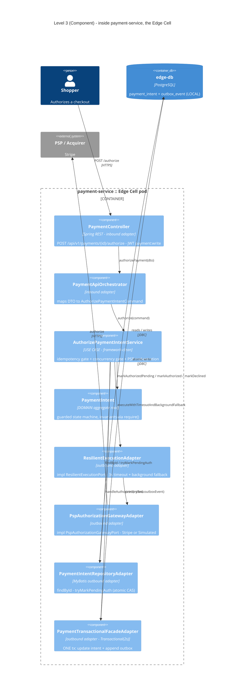
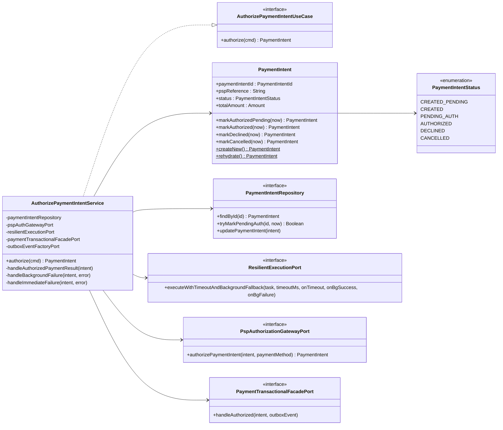
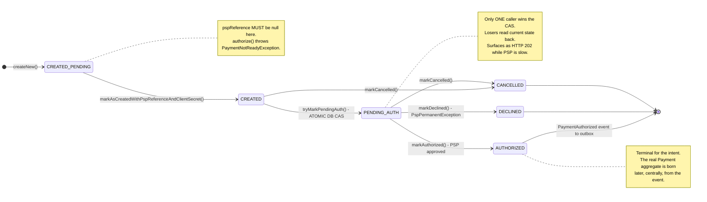
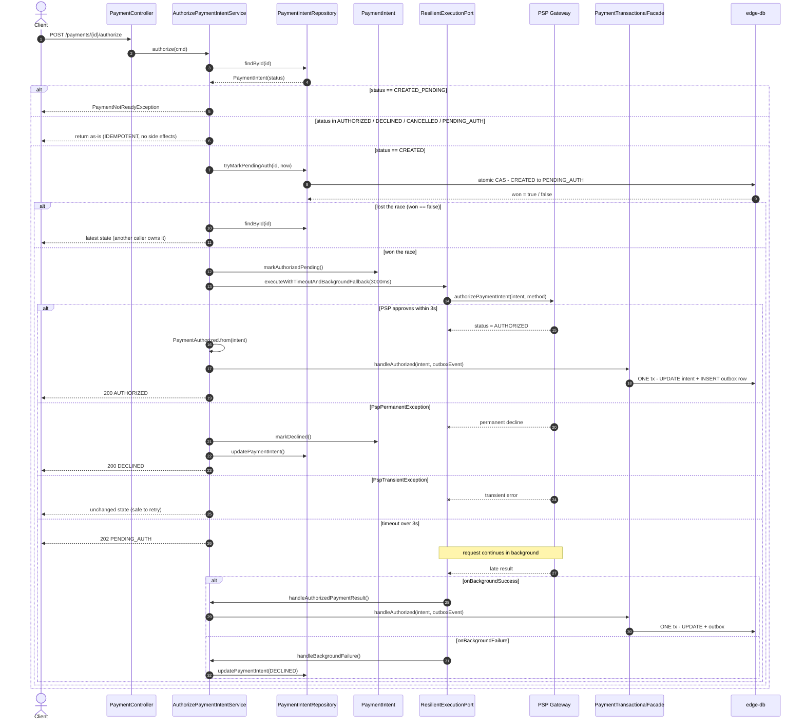

# Payment Authorization — architecture views

> **Scope:** one use case — `POST /api/v1/payments/{paymentIntentId}/authorize`.
> **Grounding:** written against source (`AuthorizePaymentIntentService.kt`, `PaymentIntent.kt`),
> not prose docs. Verify against the executable spec `e2e-tests/.../PaymentFlowE2EIntegrationTest.kt` (M0–M13).

This document uses the **C4 model** for structure (levels 3 and 4) and **UML behavioural
diagrams** for logic (state machine + sequence). Structure and behaviour are deliberately
separate diagrams — see [Notation](#notation) at the bottom.

---

## Level 3 — Component (inside `payment-service`, an Edge Cell)

*Question answered: which building blocks exist inside the edge container, and how do they collaborate?*

**Reading the hexagon:** `AuthorizePaymentIntentService` depends only on *port interfaces*
(defined in `payment-application/ports`). Everything drawn as an "adapter" is a
concretion living in `payment-service`/`payment-infrastructure`. Dependencies point inward only.

---

## Level 4 — Code

*Question answered: what are the actual types and signatures?*

> C4's own guidance: draw level 4 rarely, and only for the parts that carry real design
> intent. Here that's the port interfaces and the guarded aggregate.

**Design intent visible here:** `PaymentIntent` has a `private constructor` + static
`createNew`/`rehydrate` factories, and every transition returns a *new* instance via a
private `copy(...)`. The aggregate is immutable and always-valid-by-construction.

---

## The logic (1) — state machine

*Question answered: what transitions are legal, and what enforces them?*

Every `markX()` method opens with `require(status == <legal source>)`. The state machine
is therefore **enforced by the domain**, not merely documented.

---

## The logic (2) — sequence, with every branch

*Question answered: what actually happens at runtime, including the failure paths?*

This is the diagram that carries the real complexity. The three gates — **idempotency**,
**concurrency**, **timeout** — are the whole design.

**The one line that matters most:** `TX->>DB: ONE tx - UPDATE intent + INSERT outbox row`.
State change and event emission commit together, so there is no dual-write window.
`payment-service` never publishes to Kafka — see
[outbox-two-stage-pattern.md](./outbox-two-stage-pattern.md) for what happens to that row next.

---

## Notation

| View | Notation | Why this one |
|---|---|---|
| Level 3 Component | C4 (Mermaid `C4Component`) | Structure at a fixed abstraction level; C4 forbids mixing levels |
| Level 4 Code | UML class diagram | Types and signatures; the only thing that shows the port interfaces |
| State machine | UML state diagram | Legal transitions — the business rules of the aggregate |
| Sequence | UML sequence diagram | Ordering, concurrency and failure branches over time |

**C4 shows structure. It cannot show logic.** Branches, races, timeouts and ordering are
behavioural, so they need behavioural notation. That is why this document pairs the two —
using C4 alone for a flow like this is the single most common misuse of the model.

Diagrams are committed as Mermaid text so they diff in review and render in
IntelliJ and GitHub without a build step.
