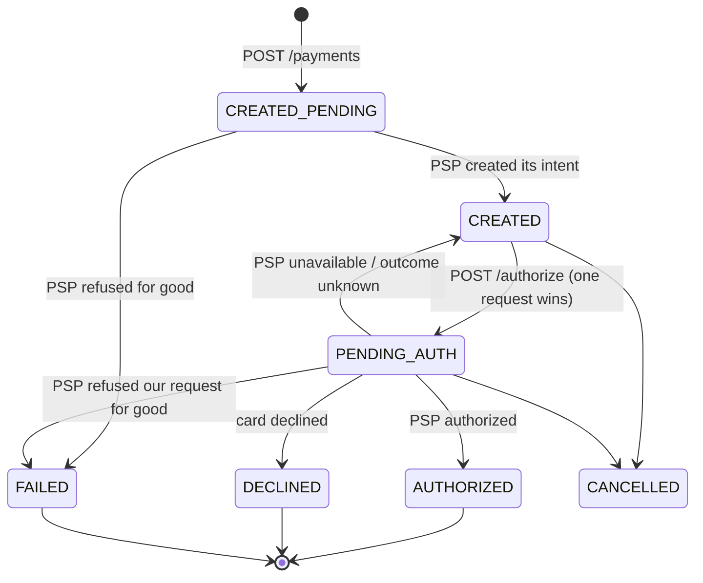
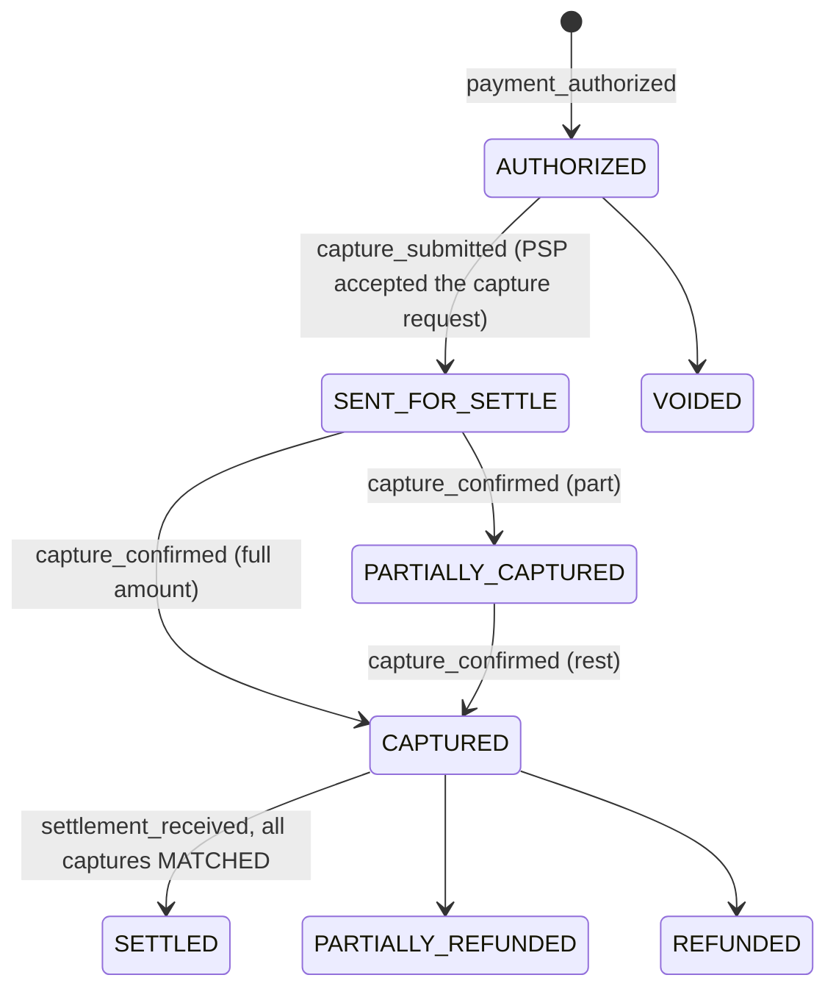

# Domain Model — how a payment evolves, and how far the ledger protects itself

This document explains the DDD design of the payment platform: the aggregates, how a payment moves through its states, which invariants the code enforces, and — just as important — which wrong records the ledger does **not** stop. It ends with a worked reconciliation scenario.

Everything in sections 1–4 is taken from the code (file references given). Section 5.4 is a proposal, marked as such.

---

## 1. Two contexts, one handover

The platform has two places where a payment lives, and the split is a domain decision, not an accident of deployment:

| | **Edge** (`payment-service`, one edge-db per cell) | **Central** (`payment-consumers`, central-db) |
|---|---|---|
| Aggregate | `PaymentIntent` — the *intent* to pay | `Payment` — the real money movement |
| Question it answers | "Did the PSP authorize this checkout?" | "What happened to the money, and who is owed what?" |
| Lifetime | create → authorize (seconds) | authorize → capture → allocate → settle (hours/days) |
| Talks to the PSP | synchronously (create, authorize) | asynchronously (capture) |

The **only** link between them is the event `payment_authorized`. The edge writes it to its local outbox in the same transaction that marks the intent `AUTHORIZED`; the central side creates the `Payment` when it consumes it. There is no foreign key and no shared database: `payments.payment_intent_id` is a logical reference.

### Aggregates and value objects

| Aggregate root | Context | Guards | Code |
|---|---|---|---|
| `PaymentIntent` | edge | status machine, PSP reference rules, splits = total | `payment-domain/.../payment/PaymentIntent.kt` |
| `Payment` | central | status machine, captured ≤ total, refunded ≤ captured, splits = total | `.../payment/Payment.kt` |
| `JournalEntry` (+ `Posting`) | central | balanced double entry | `.../ledger/JournalEntry.kt`, `Posting.kt` |
| `Tx` (Auth/Capture/Settle/…) | central | the *proof* of one external interaction; journals cite it by `tx_id` | `.../ledger/Tx.kt` |
| `InternalTransfer` | central | one allocation movement (seller share, commission) | `.../payment/InternalTransfer.kt` |
| `OutboxEvent` | both | technical aggregate: the event travels with the state change | `.../payment/OutboxEvent.kt` |

Value objects: `Amount` (minor units, positive, same-currency arithmetic only), `Currency` (`^[A-Z]{3}$`), `PaymentSplit`, and a `@JvmInline value class` for every id (`PaymentIntentId`, `PaymentId`, `TxId`, …).

Construction convention (all aggregates): private constructor; `createNew(...)` enforces the invariants; `rehydrate(...)` trusts the database; transitions return a new instance and first `require` the legal source status.

---

## 2. How a payment evolves

### 2.1 Edge: `PaymentIntent`

Invariants (`PaymentIntent.kt`): total amount positive; `pspReference` is **null** in `CREATED_PENDING` and **required** from `CREATED` on; a MARKETPLACE intent has splits in the intent's currency that sum exactly to the total; every transition guards its source status (e.g. `markAuthorized` only from `PENDING_AUTH`).

Who moves each waiting state (root `CLAUDE.md` §5: every pending state needs an owner):

| Waiting state | Owner | Gap |
|---|---|---|
| `CREATED_PENDING` | the background PSP call started by create | if the pod dies before the answer, nothing moves it (deferred item) |
| `PENDING_AUTH` | the background PSP call started by authorize | same: a pod restart loses the thread; a failed save after the PSP answered leaves it too (logged as error). `GET` only re-asks the PSP for `CREATED`, not for `PENDING_AUTH` |

### 2.2 Central: `Payment` and the journals each step posts

| Step | Journal (`JournalEntry` factory) | Postings |
|---|---|---|
| authorized | `AUTH:<pi>` (`authHold`) | DR `AUTH_RECEIVABLE` / CR `AUTH_LIABILITY` |
| capture confirmed | `CAPTURE:<pi>` (`captureGrossAsset`) | DR `AUTH_LIABILITY` / CR `AUTH_RECEIVABLE` + DR `PSP_RECEIVABLE` / CR `CAPTURE_SUSPENSE` |
| allocation, per split | `INTERNAL_TRANSFER:<id>` (`internalTransfer`) | DR `CAPTURE_SUSPENSE` / CR `SELLER_PAYABLE` or `MERCHANT_*_PAYABLE` |
| platform commission | `MOR_DC_COMMISSION:<id>` (`commissionFeeRegistered`) | DR `MERCHANT_*_PAYABLE` / CR `PLATFORM_FEE_RESERVE` |
| settlement line | `SETTLE:<id>` (`settlementLineItem`) | DR `PLATFORM_CASH` + DR `PSP_FEE_EXPENSE` / CR `PSP_RECEIVABLE` |

After a full cycle the clearing accounts (`AUTH_*`, `CAPTURE_SUSPENSE`, `PSP_RECEIVABLE`) are back to 0; what remains is cash, fee expense, and what we owe (sellers, merchant, fee reserve). The e2e test prints these T-accounts (`e2e-tests`, milestone M15).

`Payment` invariants (`Payment.kt`): total positive; `0 ≤ captured ≤ total`; `0 ≤ refunded ≤ captured`; all amounts in one currency; MARKETPLACE splits sum to the total; `applyCapture` only from `SENT_FOR_SETTLE`/`PARTIALLY_CAPTURED`; `reconcileCaptureSettlement` only from `CAPTURED`/`PARTIALLY_CAPTURED` and moves to `SETTLED` only when every capture is `MATCHED` — a `DISCREPANCY` keeps the payment where it is.

---

## 3. What protects the ledger

Protection works in layers. Each layer stops a different kind of mistake:

| Layer | What it stops | Where |
|---|---|---|
| Value objects | negative / zero money, mixed currencies, float rounding | `Amount`, `Currency` |
| `JournalEntry` construction | an unbalanced entry (Σ debit ≠ Σ credit), < 2 postings, the same account twice | `JournalEntry.init` |
| Journal factories | some wrong account types (e.g. commission must credit `PLATFORM_FEE_RESERVE`, revenue must credit `PLATFORM_REVENUE`) | `commissionFeeRegistered`, `recognizePlatformRevenue` |
| Posting sign by normal balance | wrong signs in balances (a debit on a credit-normal account reduces it) | `Posting.getSignedAmount()` |
| Aggregate state machines | illegal steps (capture before submit, settle before capture, over-capture, over-refund) | `Payment`, `PaymentIntent` |
| One DB transaction per step | half-written steps: state + tx + journal + postings + next outbox event commit together | `CentralDbTransactionalFacadeAdapter` (`@Transactional`) |
| Deterministic journal ids | posting the same journal twice: `insert … ON CONFLICT (id) DO NOTHING`, postings skipped when the journal already exists | `LedgerMapper.xml`, facade |
| Deterministic event ids + dedupe | processing the same event twice: ids like `pi_…:payment_authorized`, consumers skip ids seen in Redis | `PaymentBaseEvent.deterministicEventId`, `EventDeduplicationPort` |
| Outbox + single publisher | an event without its state change (or the reverse); publishing order per aggregate | edge/central outbox, `OutboxRelayJob` |

## 4. What the ledger does **not** stop

These are gaps in the current code, found by reading it (not by a failing test). They matter for reconciliation:

1. **A balanced but wrong entry is accepted.** The ledger checks that debits equal credits, not that the *right* accounts or amounts were used. Booking a seller's share to the wrong seller, or a wrong amount on both sides, passes every check. Only reconciliation against an outside source (PSP reports, settlement files) can catch it.
2. **Balance is not enforced in the database.** `JournalEntry` is balanced in memory; the `postings` table has no constraint that a journal's postings sum to zero, and `rehydrate` trusts whatever is stored.
3. **The ledger is append-only by convention only.** There is no trigger or grant that blocks `UPDATE`/`DELETE` on `journal_entries` / `postings`; the consumers' DB role has all privileges on all tables.
4. **One `Payment` per intent is not enforced.** `processAuthorized` generates a new `paymentId` and `txId` every time, `payments.payment_intent_id` has a normal (non-unique) index, and the Payment upsert conflicts only on `payment_id`. A `payment_authorized` processed twice (e.g. after the 1-hour dedupe window) would create a **second `Payment` row and a second AuthTx**; the `AUTH:<pi>` journal is skipped (same id), but the new `journal_entries_recorded` event carries those entries with a new `globalJournalEntryId`, so the **balance projection** counts the AUTH postings again even though `postings` has them once.
5. **Deduplication is time-limited.** Consumer dedupe keys live in Redis for 3600 s. After that, a redelivered or re-emitted event is processed again; protection then falls back to the journal id (point 4 shows where that is not enough).
6. **Some waiting states have no owner.** Capture: after 5 failed attempts `ProcessCaptureService` only logs, and the `Payment` stays `AUTHORIZED`. Edge: see the `PENDING_AUTH` row in 2.1. Settlement: the capture tx is saved *after* the ledger commit, and a `DISCREPANCY` has no follow-up.

---

## 5. Worked scenario: the PSP authorized, we think it is still pending

### 5.1 How the drift happens

`/authorize` waits 3 s for the PSP. If there is no answer, it returns `202 PENDING_AUTH` and a background thread keeps waiting. The drift appears when:

- the pod restarts before the PSP answers (the background thread is lost), or
- the PSP answers "authorized" but saving the result fails (logged, intent left `PENDING_AUTH`), or
- our HTTP call timed out on our side (`PspUnknownException`) and the intent went back to `CREATED`, although the PSP did authorize.

Result: the PSP has an authorized payment; the edge intent is `PENDING_AUTH` (or `CREATED`); **no `payment_authorized` was ever written**, so central has no `Payment`, no `AUTH` journal, no capture.

Because we create PSP intents with **manual capture** (`StripePspAuthorizationGatewayAdapter`: `CaptureMethod.MANUAL`), the PSP will not capture on its own. In this state the PSP shows *authorized, not captured*, and the hold expires after the PSP's authorization window (Stripe: 7 days for most cards). If the PSP shows *captured*, someone captured outside our flow (e.g. the PSP dashboard) — that is a different, worse case (see 5.3 point 4).

### 5.2 How reconciliation finds it

The PSP report lists the authorization (by PSP reference / our payment intent id). On our side:
- central: no `Payment` and no `AUTH:<pi>` / `CAPTURE:<pi>` journal for that intent;
- edge: the intent (in the cell encoded in its snowflake id) is `PENDING_AUTH` or `CREATED`, with the same `psp_reference`.

That pair — *PSP says authorized, central has nothing, edge is waiting* — identifies the intent.

### 5.3 The fix job inserts only `outbox<payment_authorized>` into the edge-db — what happens

Traced through the current code:

1. **payment-edge-workers** of that cell claim the `NEW` row and forward it to the central outbox, advancing the cell's watermark. The worker never looks at the intent, so it forwards the row like any other.
2. **payment-central-relay** publishes it to `payment.psp.results` once it is behind `T_safe`.
3. **PspResultConsumer**: the event id is `pi_…:payment_authorized`. No event with that id was ever processed for this intent, so dedupe lets it through → `processAuthorized` runs normally, in one transaction:
   - new `Payment` `AUTHORIZED`, AuthTx `SUCCESS`,
   - journal `AUTH:<pi>` (DR `AUTH_RECEIVABLE` / CR `AUTH_LIABILITY`),
   - outbox: `capture_requested` (auto-capture) + `journal_entries_recorded`.
4. **Capture** goes through the normal chain (`CaptureCommandExecutor` → PSP capture → `capture_submitted` → `SENT_FOR_SETTLE` → confirmation → `CAPTURED` + `CAPTURE:<pi>` → allocation → settlement). **The central ledger heals completely** — as long as the PSP authorization is still valid. If the PSP had already captured it (outside our flow), a real PSP rejects the second capture; `ProcessCaptureService` retries 5 times, then only logs, and the `Payment` stays `AUTHORIZED`: the drift moves from "missing authorization" to "missing capture".

What does **not** heal:

- **The edge intent stays `PENDING_AUTH` (or `CREATED`).** The merchant's `GET` keeps showing it as not authorized, while central is capturing the money. `POST /authorize` on a `PENDING_AUTH` intent returns `202` forever (no PSP call, no owner).
- **If the intent is `CREATED`, a merchant retry authorizes again.** Within the PSP's idempotency-key window (Stripe: 24 h) the PSP returns the original "authorized" → the edge marks it `AUTHORIZED` and writes a **second** `payment_authorized` with the **same** event id: skipped if it arrives within the 1-hour dedupe window, otherwise it creates a duplicate `Payment` (section 4, point 4). Outside the key window, a real PSP may reject the confirm of an already-authorized intent → the edge marks it `FAILED` while central captures it: edge and central now disagree in both directions.
- **The job cannot avoid reading the intent.** `PaymentAuthorized` needs the amount, currency, merchant, processing model and splits, which only the intent has. Not updating it saves nothing and leaves the two sides out of sync.
- **Cell ownership.** The row must go into the edge-db of the cell that owns the intent. Written into another cell's outbox, it would still be forwarded (the worker doesn't check), but it breaks the rule that one cell owns each intent.

### 5.4 Proposal: fix it through the domain, not around it

*Proposal — not implemented.*

1. **One local transaction in the owning cell**, the same path a normal authorization takes (`PaymentTransactionalFacadePort.handleAuthorized`): intent → `AUTHORIZED` **and** `outbox<payment_authorized>`. Add a domain transition for it, e.g. `PaymentIntent.reconcileAuthorized(pspReference)`, allowed from `PENDING_AUTH` and `CREATED`, so the state machine records *why* (reconciliation) instead of pretending the synchronous call succeeded. The edge and central then agree, and the merchant sees the truth.
2. **Make `payment_authorized` idempotent per intent on the central side**: a unique index on `payments.payment_intent_id`, and `processAuthorized` returns early when a `Payment` for the intent exists. This closes section 4, point 4 for good, independent of Redis TTLs.
3. **Report what the PSP knows, not only the authorization.** If the PSP already captured, the job should also produce the capture confirmation (or the capture adapter should treat "already captured" as success), otherwise the payment gets stuck at `AUTHORIZED`.
4. **Give `PENDING_AUTH` an owner**: a sweeper that re-asks the PSP for intents in `PENDING_AUTH` older than N minutes (same PSP idempotency key), so this drift is fixed within minutes instead of by a nightly reconciliation.
