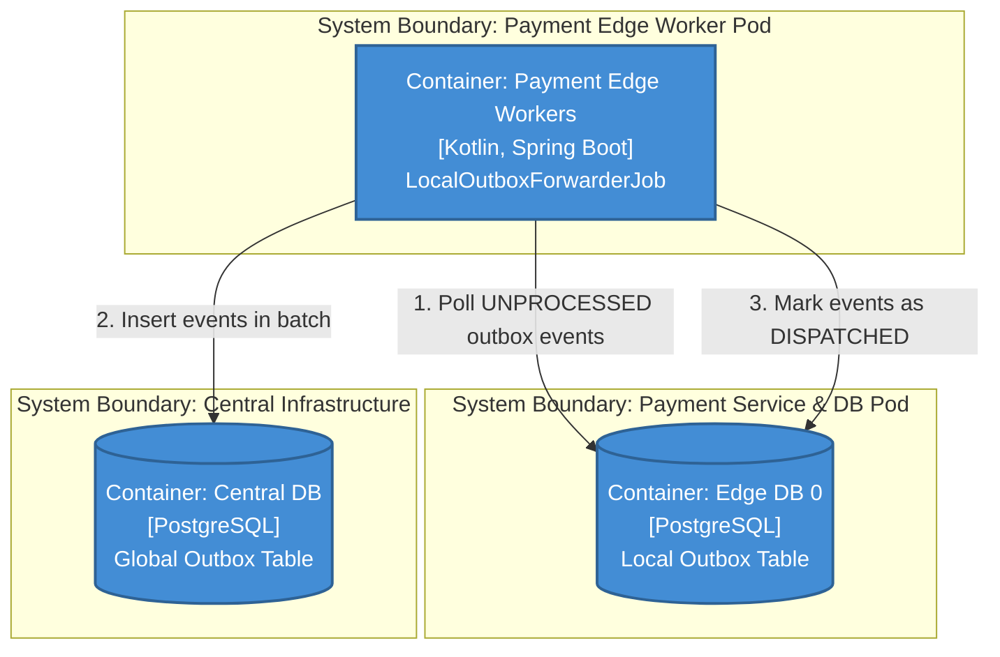

# Payment Edge Workers (Local Sidecar Forwarder)

This background worker bridges the gap between the isolated edge cells and the central cluster. It strictly reads from its local edge outbox and pushes to the central outbox.

