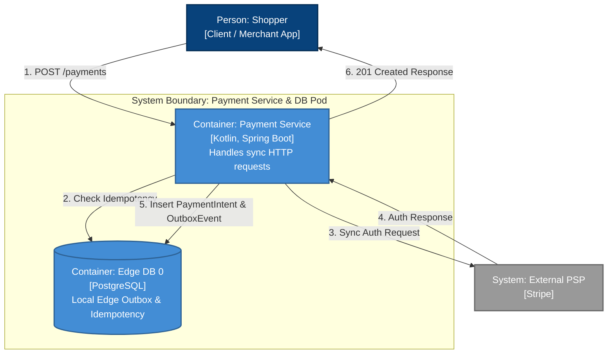

# Payment Service (Edge Web API)

This service handles the synchronous HTTP requests, writes to its local edge database, and returns the response to the shopper. It does not publish to Kafka or talk to the central database directly.

