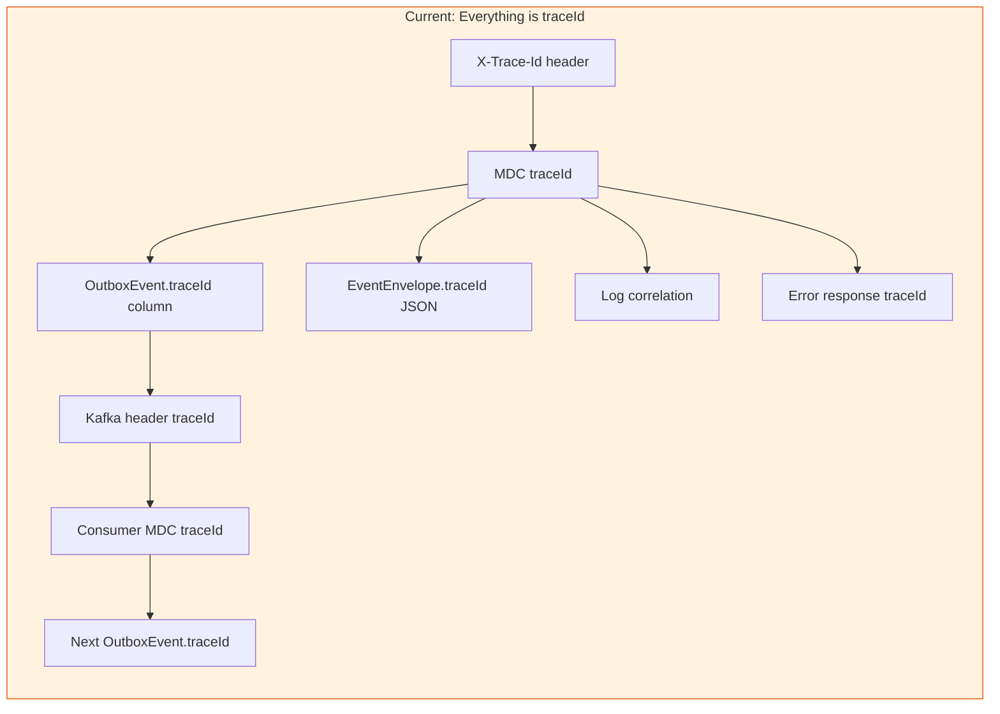
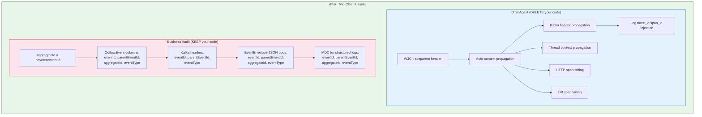
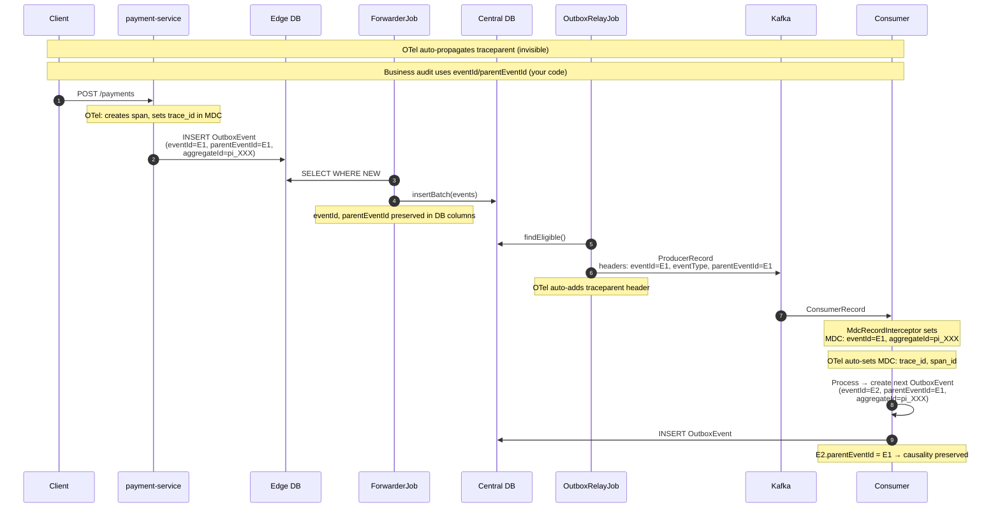

# 🔀 Observability Split: Decommission vs. Retain

## The Separation Principle

---

## ❌ DECOMMISSION: Manual traceId Plumbing (Delete List)

These elements exist **only** to manually propagate an operational trace ID. An OTel Java agent replaces all of them automatically.

### D1 — `TraceFilter` (entire class)

| | |
|---|---|
| **File** | [TraceFilter.kt](file:///Users/dogancaglar/IdeaProjects/ecommerce-platform-kotlin/payment-service/src/main/kotlin/com/dogancaglar/paymentservice/adapter/inbound/rest/webconfig/TraceFilter.kt) |
| **Module** | `payment-service` |
| **What it does** | Reads `X-Trace-Id` header → `MDC.put("traceId")` → `MDC.clear()` in finally |
| **Why delete** | OTel agent auto-injects `trace_id` and `span_id` into MDC for every HTTP request. The `X-Trace-Id` custom header is replaced by W3C `traceparent`. |
| **Action** | **Delete entire file.** Remove `@Component` registration. |

> [!TIP]
> The slow-request logging (`SLOW REQUEST`, `SLOW_FLUSH`) in TraceFilter is useful operational telemetry. Extract it into a separate `RequestTimingFilter` that does **not** touch MDC or traceId, or rely on OTel's `http.server.duration` histogram with alerting on P99.

---

### D2 — `GenericLogFields.TRACE_ID` constant

| | |
|---|---|
| **File** | [GenericLogFields.kt](file:///Users/dogancaglar/IdeaProjects/ecommerce-platform-kotlin/common/src/main/kotlin/com/dogancaglar/common/logging/GenericLogFields.kt#L4) |
| **Module** | `common` |
| **Line** | `const val TRACE_ID = "traceId"` |
| **Why delete** | OTel uses `trace_id` (with underscore) as the MDC key. This constant drives all the manual plumbing. |
| **Action** | **Delete the constant.** |

---

### D3 — `EventLogContext.getTraceId()` method

| | |
|---|---|
| **File** | [EventLogContext.kt](file:///Users/dogancaglar/IdeaProjects/ecommerce-platform-kotlin/common/src/main/kotlin/com/dogancaglar/common/logging/EventLogContext.kt#L12) |
| **Module** | `common` |
| **Line** | `fun getTraceId(): String = MDC.get(GenericLogFields.TRACE_ID) ?: UUID.randomUUID().toString()` |
| **Why delete** | This was the bridge between MDC and outbox/envelope creation. With OTel, you never need to read the trace ID manually — the agent handles propagation. The `UUID.randomUUID()` fallback was creating orphaned traces (audit finding G3). |
| **Action** | **Delete entire method.** Fix 2 call sites (D9, D10). |

---

### D4 — `EventLogContext.with(envelope)` — traceId line only

| | |
|---|---|
| **File** | [EventLogContext.kt](file:///Users/dogancaglar/IdeaProjects/ecommerce-platform-kotlin/common/src/main/kotlin/com/dogancaglar/common/logging/EventLogContext.kt#L32) |
| **Module** | `common` |
| **Line** | `MDC.put(GenericLogFields.TRACE_ID, envelope.traceId)` |
| **Why delete** | OTel context propagation handles trace correlation. The business fields (`eventId`, `aggregateId`, `eventType`, `parentEventId`) stay. |
| **Action** | **Delete only this one line** inside the `with(envelope)` method. Keep the rest of the method intact. |

---

### D5 — `EventEnvelope.traceId` field

| | |
|---|---|
| **File** | [EventEnvelope.kt](file:///Users/dogancaglar/IdeaProjects/ecommerce-platform-kotlin/common/src/main/kotlin/com/dogancaglar/common/event/EventEnvelope.kt#L24-L25) |
| **Module** | `common` |
| **Lines** | `@JsonProperty("traceId") val traceId: String` |
| **Why delete** | The envelope carries `traceId` purely for manual propagation across Kafka. OTel's Kafka instrumentation propagates `traceparent` automatically via Kafka headers. The business audit fields (`eventId`, `parentEventId`, `aggregateId`) remain. |
| **Action** | **Delete the field.** This is a breaking JSON schema change — coordinate with any external consumers. |

> [!WARNING]
> Removing `traceId` from EventEnvelope changes the Kafka message JSON schema. If any external system reads `traceId` from the JSON body, they need to migrate to reading OTel's `traceparent` Kafka header instead. Use `@JsonIgnoreProperties(ignoreUnknown = true)` on deserializers during the transition.

---

### D6 — `EventEnvelopeFactory` — `traceId` parameter

| | |
|---|---|
| **File** | [EventEnvelopeFactory.kt](file:///Users/dogancaglar/IdeaProjects/ecommerce-platform-kotlin/common/src/main/kotlin/com/dogancaglar/common/event/EventEnvelopeFactory.kt#L12) |
| **Module** | `common` |
| **Lines** | `traceId: String` parameter on both `envelopeFor()` and `envelopeWithRandomId()` |
| **Why delete** | No longer needed once `EventEnvelope.traceId` is removed. |
| **Action** | **Remove `traceId` parameter** from both factory methods. Update all call sites. |

---

### D7 — `OutboxEvent.traceId` field (domain model)

| | |
|---|---|
| **File** | [OutboxEvent.kt](file:///Users/dogancaglar/IdeaProjects/ecommerce-platform-kotlin/payment-domain/src/main/kotlin/com/dogancaglar/paymentservice/domain/model/payment/OutboxEvent.kt#L14) |
| **Module** | `payment-domain` |
| **Line** | `val traceId: String` |
| **Why delete** | This field exists only to carry the operational trace ID through the outbox pattern (edge DB → central DB → Kafka header). OTel's context propagation makes this unnecessary. `eventId`, `parentEventId`, and `aggregateId` remain on the domain model. |
| **Action** | **Delete the field.** Remove from constructor, `copy()`, `createNew()`, `rehydrate()`, and `toString()`. |

> [!IMPORTANT]
> This requires a **DB migration**: `ALTER TABLE outbox_event DROP COLUMN trace_id;` on both edge and central databases. Run the migration **after** all in-flight outbox events with the old schema are drained.

---

### D8 — `trace_id` PostgreSQL column (both databases)

| | |
|---|---|
| **Files** | [central-payment-outbox-changelog.xml](file:///Users/dogancaglar/IdeaProjects/ecommerce-platform-kotlin/charts/central-db/db/central-payment-outbox-changelog.xml#L16), [local-outbox-changelog.xml](file:///Users/dogancaglar/IdeaProjects/ecommerce-platform-kotlin/charts/payment-edge-cell/db/local-outbox-changelog.xml#L16) |
| **Module** | Liquibase changelogs (Helm charts) |
| **Line** | `trace_id VARCHAR(255) NOT NULL` |
| **Why delete** | The DB column is the persistent storage for the manual trace ID. |
| **Action** | Add a **new Liquibase changeset** to drop the column. Do NOT modify the original changeset. |

---

### D9 — `OutboxEventEventFactory` — traceId sourcing from MDC

| | |
|---|---|
| **File** | [OutboxEventEventFactory.kt](file:///Users/dogancaglar/IdeaProjects/ecommerce-platform-kotlin/payment-infrastructure/src/main/kotlin/com/dogancaglar/paymentservice/infra/adapter/outbound/serialization/OutboxEventEventFactory.kt#L26) |
| **Module** | `payment-infrastructure` |
| **Line** | `traceId = EventLogContext.getTraceId()` |
| **Why delete** | This reads the manual trace ID from MDC to stamp it on the outbox event. Once `OutboxEvent.traceId` and `EventEnvelope.traceId` are removed, this line and its downstream wiring disappear. |
| **Action** | **Delete the `traceId` assignment line.** Update `OutboxEvent.createNew()` call to omit `traceId`. |

---

### D10 — `CaptureRetryQueueAdapter` — traceId sourcing from MDC

| | |
|---|---|
| **File** | [CaptureRetryQueueAdapter.kt](file:///Users/dogancaglar/IdeaProjects/ecommerce-platform-kotlin/payment-infrastructure/src/main/kotlin/com/dogancaglar/paymentservice/infra/adapter/outbound/redis/CaptureRetryQueueAdapter.kt#L40) |
| **Module** | `payment-infrastructure` |
| **Line** | `traceId = EventLogContext.getTraceId()` |
| **Why delete** | Same pattern as D9. Stamps manual trace ID on retry envelope. |
| **Action** | **Delete the `traceId` assignment.** Update `EventEnvelopeFactory.envelopeFor()` call to omit `traceId`. |

---

### D11 — `RawEventPublisher` — traceId Kafka header injection

| | |
|---|---|
| **File** | [RawEventPublisher.kt](file:///Users/dogancaglar/IdeaProjects/ecommerce-platform-kotlin/common-kafka/src/main/kotlin/com/dogancaglar/common/kafka/publisher/RawEventPublisher.kt#L34) |
| **Module** | `common-kafka` |
| **Line** | `headers().addString("traceId", outboxEvent.traceId)` |
| **Why delete** | OTel's Kafka producer instrumentation auto-injects `traceparent` into Kafka headers. This manual `traceId` header becomes redundant. |
| **Action** | **Delete this single line.** Keep `eventId`, `eventType`, `parentEventId` header injections — those are business audit. |

---

### D12 — `RawEventPublisherPort` — `traceId` parameter

| | |
|---|---|
| **File** | [RawEventPublisherPort.kt](file:///Users/dogancaglar/IdeaProjects/ecommerce-platform-kotlin/payment-application/src/main/kotlin/com/dogancaglar/paymentservice/ports/outbound/RawEventPublisherPort.kt#L19) |
| **Module** | `payment-application` |
| **Line** | `traceId: String` parameter in `publishAsync()` |
| **Why delete** | Port interface carries `traceId` for manual Kafka header injection. No longer needed. |
| **Action** | **Delete `traceId` parameter.** Update implementation and all call sites. |

---

### D13 — `MdcRecordInterceptor` — traceId extraction from Kafka

| | |
|---|---|
| **File** | [KafkaTypedConsumerFactoryConfig.kt](file:///Users/dogancaglar/IdeaProjects/ecommerce-platform-kotlin/payment-consumers/src/main/kotlin/com/dogancaglar/paymentservice/infra/adapter/inbound/kafka/KafkaTypedConsumerFactoryConfig.kt#L373) |
| **Module** | `payment-consumers` |
| **Line** | `MDC.put(GenericLogFields.TRACE_ID, h("traceId") ?: env?.traceId)` |
| **Why delete** | OTel's Kafka consumer instrumentation reads `traceparent` from Kafka headers and sets `trace_id`/`span_id` in MDC automatically. |
| **Action** | **Delete this single line** inside `putFrom()`. Keep the `eventId`, `parentEventId`, `aggregateId`, `eventType` MDC puts — those are business audit. |

---

### D14 — `MdcTaskDecorator` (all 4 copies)

| | |
|---|---|
| **Files** | [PaymentServiceThreadPoolConfig.kt:L117-130](file:///Users/dogancaglar/IdeaProjects/ecommerce-platform-kotlin/payment-service/src/main/kotlin/com/dogancaglar/paymentservice/config/PaymentServiceThreadPoolConfig.kt#L117-L130), [CentralOutboxRelayJobThreadPoolConfig.kt:L67-80](file:///Users/dogancaglar/IdeaProjects/ecommerce-platform-kotlin/payment-central-relay/src/main/kotlin/com/dogancaglar/paymentservice/config/CentralOutboxRelayJobThreadPoolConfig.kt#L67-L80), [ConsumerThreadPoolConfig.kt:L67-80](file:///Users/dogancaglar/IdeaProjects/ecommerce-platform-kotlin/payment-consumers/src/main/kotlin/com/dogancaglar/paymentservice/config/ConsumerThreadPoolConfig.kt#L67-L80), [PaymentEdgeWorkersThreadPoolConfig.kt:L91-104](file:///Users/dogancaglar/IdeaProjects/ecommerce-platform-kotlin/payment-edge-workers/src/main/kotlin/com/dogancaglar/paymentservice/config/PaymentEdgeWorkersThreadPoolConfig.kt#L91-L104) |
| **Module** | All 4 runtime modules |
| **What it does** | Copies MDC context map across thread pool boundaries |
| **Why delete** | OTel Java agent uses `ContextPropagation` to automatically propagate trace context across `Executor`, `ExecutorService`, `ForkJoinPool`, and `CompletableFuture` boundaries. It hooks into the JVM's `Runnable`/`Callable` wrapping. |
| **Action** | **Delete all 4 classes and their `@Bean` registrations.** Remove `decorator` constructor parameters from all `ThreadPoolConfig` classes. |

> [!IMPORTANT]
> After deleting `MdcTaskDecorator`, your **business audit MDC fields** (`eventId`, `aggregateId`, etc.) set by `EventLogContext.with()` will NOT automatically propagate across threads. This is correct — those fields should be scoped to the consumer's processing block, not leaked to background threads. If you need them in async work, pass them explicitly as method parameters.

---

### D15 — `PaymentControllerWebExceptionHandler.traceId` in error response

| | |
|---|---|
| **File** | [PaymentControllerWebExceptionHandler.kt](file:///Users/dogancaglar/IdeaProjects/ecommerce-platform-kotlin/payment-service/src/main/kotlin/com/dogancaglar/paymentservice/adapter/inbound/rest/webconfig/PaymentControllerWebExceptionHandler.kt#L185) |
| **Module** | `payment-service` |
| **Line** | `traceId = MDC.get("traceId") ?: request.getHeader("X-Trace-Id")` |
| **Why delete** | Replace with OTel's trace ID: `Span.current().spanContext.traceId` or read from MDC key `trace_id` (OTel's key uses underscore). |
| **Action** | **Replace** `MDC.get("traceId")` with `MDC.get("trace_id")` or OTel API. Remove `X-Trace-Id` header fallback. |

---

### D16 — Logback MDC `traceId` include

| | |
|---|---|
| **Files** | All 4 `logback-spring.xml` files |
| **Line** | `<mdc includes="traceId,eventId,parentEventId,..."/>` |
| **Why modify** | OTel auto-injects `trace_id` and `span_id` into MDC. The logback config should export the OTel keys instead. |
| **Action** | **Replace `traceId` with `trace_id,span_id`** in the MDC includes list. Keep `eventId`, `parentEventId`, `aggregateId`, `eventType`. |

---

### D17 — `RecordCaptureSubmissionUseCase` — `traceId` parameter

| | |
|---|---|
| **File** | [RecordCaptureSubmissionUseCase.kt](file:///Users/dogancaglar/IdeaProjects/ecommerce-platform-kotlin/payment-application/src/main/kotlin/com/dogancaglar/paymentservice/ports/inbound/usecases/RecordCaptureSubmissionUseCase.kt#L10) |
| **Module** | `payment-application` |
| **Line** | `fun recordSubmission(event: CaptureSubmitted, traceId: String, parentEventId: String)` |
| **Why delete** | The `traceId` parameter is **dead code** — `RecordCaptureSubmissionService` never reads it (it relies on `OutboxEventEventFactory` which reads MDC). |
| **Action** | **Remove `traceId` parameter** from interface and implementation. The `parentEventId` parameter **stays** — it's business audit. |

---

### D18 — `CapturePspPerformedConsumer` — passing `envelope.traceId` to use case

| | |
|---|---|
| **File** | [CapturePspPerformedConsumer.kt](file:///Users/dogancaglar/IdeaProjects/ecommerce-platform-kotlin/payment-consumers/src/main/kotlin/com/dogancaglar/paymentservice/infra/adapter/inbound/kafka/consumers/CapturePspPerformedConsumer.kt#L45) |
| **Module** | `payment-consumers` |
| **Line** | `traceId = envelope.traceId` |
| **Why delete** | Feeds the dead `traceId` parameter (D17) from the envelope field that's being deleted (D5). |
| **Action** | **Remove `traceId = envelope.traceId`** from the `recordSubmission()` call. |

---

### D19 — `PaymentEventPublisher` (entire commented-out file)

| | |
|---|---|
| **File** | [PaymentEventPublisher.kt](file:///Users/dogancaglar/IdeaProjects/ecommerce-platform-kotlin/common-kafka/src/main/kotlin/com/dogancaglar/common/kafka/publisher/PaymentEventPublisher.kt) |
| **Module** | `common-kafka` |
| **What** | Entire file is `/* commented out */`. Contains manual traceId header injection. |
| **Action** | **Delete entire file.** Dead code. |

---

### D20 — Unused `GenericLogFields` constants

| | |
|---|---|
| **File** | [GenericLogFields.kt](file:///Users/dogancaglar/IdeaProjects/ecommerce-platform-kotlin/common/src/main/kotlin/com/dogancaglar/common/logging/GenericLogFields.kt#L5-L7) |
| **Module** | `common` |
| **Lines** | `PAYMENT_ID`, `PAYMENT_ORDER_ID`, `JOURNAL_ID`, `TOPIC_NAME`, `CONSUMER_GROUP` |
| **Why delete** | Never populated anywhere. Create false expectations. |
| **Action** | **Delete all 5 constants.** Remove from logback MDC includes if present. |

---

## ✅ RETAIN / REFINE: Business Audit Core (Keep List)

These elements implement your **payment journey causality chain** (`paymentIntentId → eventId → parentEventId`) and must survive the OTel migration.

### R1 — `EventEnvelope` — keep `eventId`, `parentEventId`, `aggregateId`, `eventType`

| | |
|---|---|
| **File** | [EventEnvelope.kt](file:///Users/dogancaglar/IdeaProjects/ecommerce-platform-kotlin/common/src/main/kotlin/com/dogancaglar/common/event/EventEnvelope.kt) |
| **Fields to keep** | `eventId`, `eventType`, `aggregateId`, `data`, `timestamp`, `parentEventId` |
| **Why** | `aggregateId` = your `paymentIntentId` — the correlator across the entire payment journey. `eventId` + `parentEventId` = the causal DAG of events from PaymentAuthorized → CaptureRequested → CaptureSubmitted → CaptureConfirmed → JournalEntriesRecorded → InternalTransferCommand. |

---

### R2 — `OutboxEvent` — keep `eventId`, `parentEventId`, `aggregateId`, `eventType`

| | |
|---|---|
| **File** | [OutboxEvent.kt](file:///Users/dogancaglar/IdeaProjects/ecommerce-platform-kotlin/payment-domain/src/main/kotlin/com/dogancaglar/paymentservice/domain/model/payment/OutboxEvent.kt) |
| **Fields to keep** | `oeid`, `partitionKey`, `eventType`, `aggregateId`, `eventId`, `parentEventId`, `payload`, `status`, `createdAt`, `updatedAt` |
| **Why** | The outbox row IS the business audit record. `eventId` provides deduplication. `parentEventId` establishes which event caused this one. `aggregateId` ties everything to the `paymentIntentId`. These survive edge → central → Kafka → consumer → next outbox. |

---

### R3 — `EventEnvelopeFactory` — keep factory methods (minus traceId param)

| | |
|---|---|
| **File** | [EventEnvelopeFactory.kt](file:///Users/dogancaglar/IdeaProjects/ecommerce-platform-kotlin/common/src/main/kotlin/com/dogancaglar/common/event/EventEnvelopeFactory.kt) |
| **Why** | Creates the deterministic `eventId` from `data.deterministicEventId()` and wires `parentEventId`. This is core causality logic. |
| **Refine** | Remove `traceId` parameter (D6). Keep everything else. |

---

### R4 — `EventLogContext.with(envelope)` — keep for business MDC fields

| | |
|---|---|
| **File** | [EventLogContext.kt](file:///Users/dogancaglar/IdeaProjects/ecommerce-platform-kotlin/common/src/main/kotlin/com/dogancaglar/common/logging/EventLogContext.kt#L24-L45) |
| **Why** | Sets `eventId`, `parentEventId`, `aggregateId`, `eventType` in MDC so every log line during consumer processing is tagged with the business context. This is essential for searching logs by `paymentIntentId`. |
| **Refine** | Delete only the `MDC.put(TRACE_ID, ...)` line (D4). Keep `eventId`, `parentEventId`, `aggregateId`, `eventType` puts. |

---

### R5 — `EventLogContext.withRetryFields()` — keep entirely

| | |
|---|---|
| **File** | [EventLogContext.kt](file:///Users/dogancaglar/IdeaProjects/ecommerce-platform-kotlin/common/src/main/kotlin/com/dogancaglar/common/logging/EventLogContext.kt#L63-L80) |
| **Why** | Retry metadata (`retryCount`, `retryReason`, `retryBackoffMillis`) is business-level operational context that OTel doesn't provide. |

---

### R6 — `GenericLogFields` — keep business constants

| | |
|---|---|
| **File** | [GenericLogFields.kt](file:///Users/dogancaglar/IdeaProjects/ecommerce-platform-kotlin/common/src/main/kotlin/com/dogancaglar/common/logging/GenericLogFields.kt) |
| **Keep** | `EVENT_TYPE`, `EVENT_ID`, `PARENT_EVENT_ID`, `AGGREGATE_ID`, `RETRY_COUNT`, `RETRY_REASON`, `RETRY_ERROR_MESSAGE`, `RETRY_BACKOFF_MILLIS` |
| **Delete** | `TRACE_ID` (D2), `PAYMENT_ID`, `PAYMENT_ORDER_ID`, `JOURNAL_ID`, `TOPIC_NAME`, `CONSUMER_GROUP` (D20) |

---

### R7 — Kafka headers — keep `eventId`, `eventType`, `parentEventId`

| | |
|---|---|
| **File** | [RawEventPublisher.kt](file:///Users/dogancaglar/IdeaProjects/ecommerce-platform-kotlin/common-kafka/src/main/kotlin/com/dogancaglar/common/kafka/publisher/RawEventPublisher.kt#L33-L38) |
| **Keep lines** | `headers().addString("eventId", ...)`, `headers().addString("eventType", ...)`, `headers().addString("parentEventId", ...)` |
| **Why** | These headers enable the `MdcRecordInterceptor` (R8) to populate business MDC fields before the consumer processes the record. They're also useful for Kafka header-based filtering and routing. |

---

### R8 — `MdcRecordInterceptor` — keep for business fields

| | |
|---|---|
| **File** | [KafkaTypedConsumerFactoryConfig.kt](file:///Users/dogancaglar/IdeaProjects/ecommerce-platform-kotlin/payment-consumers/src/main/kotlin/com/dogancaglar/paymentservice/infra/adapter/inbound/kafka/KafkaTypedConsumerFactoryConfig.kt#L370-L399) |
| **Keep lines** | `MDC.put(EVENT_ID, ...)`, `MDC.put(PARENT_EVENT_ID, ...)`, `MDC.put(AGGREGATE_ID, ...)`, `MDC.put(EVENT_TYPE, ...)` |
| **Delete line** | `MDC.put(TRACE_ID, ...)` (D13) |
| **Why** | The interceptor bridges Kafka headers → MDC for business context. The save/restore pattern (`prevCtx`) stays. |

---

### R9 — All consumer `EventLogContext.with(envelope)` calls — keep

| | |
|---|---|
| **Files** | [PspResultConsumer.kt:L43](file:///Users/dogancaglar/IdeaProjects/ecommerce-platform-kotlin/payment-consumers/src/main/kotlin/com/dogancaglar/paymentservice/infra/adapter/inbound/kafka/consumers/PspResultConsumer.kt#L43), [CaptureCommandExecutor.kt:L34](file:///Users/dogancaglar/IdeaProjects/ecommerce-platform-kotlin/payment-consumers/src/main/kotlin/com/dogancaglar/paymentservice/infra/adapter/inbound/kafka/consumers/CaptureCommandExecutor.kt#L34), [CapturePspPerformedConsumer.kt:L32](file:///Users/dogancaglar/IdeaProjects/ecommerce-platform-kotlin/payment-consumers/src/main/kotlin/com/dogancaglar/paymentservice/infra/adapter/inbound/kafka/consumers/CapturePspPerformedConsumer.kt#L32), [GrossCaptureAllocationConsumer.kt:L52](file:///Users/dogancaglar/IdeaProjects/ecommerce-platform-kotlin/payment-consumers/src/main/kotlin/com/dogancaglar/paymentservice/infra/adapter/inbound/kafka/consumers/GrossCaptureAllocationConsumer.kt#L52) |
| **Why** | These set business audit MDC context for the duration of each event's processing. After D4 removes the `traceId` line from `with()`, these calls only set `eventId`, `parentEventId`, `aggregateId`, `eventType`. |

---

### R10 — Logback MDC includes — keep business fields

| | |
|---|---|
| **Files** | All 4 `logback-spring.xml` |
| **Keep** | `eventId`, `parentEventId`, `aggregateId`, `eventType`, `retryCount`, `retryBackoffMillis`, `retryReason`, `retryErrorMessage` |
| **Add** | `trace_id`, `span_id` (OTel's MDC keys) |
| **Delete** | `traceId` (D16) |

---

### R11 — All Micrometer `MeterRegistry` usage — keep

| | |
|---|---|
| **Where** | `OutboxRelayJob`, `LocalOutboxStoreAndForwardJob`, `SimulatedPspCaptureGatewayAdapter`, `AccountBalanceRedisCacheAdapter`, all `ThreadPoolConfig` classes |
| **Why** | Custom business and infrastructure metrics (backlog gauges, dispatch counters, PSP latency) are orthogonal to OTel tracing. OTel provides distributed tracing spans; Micrometer provides custom business metrics. They coexist. |

---

## Causality Chain After Migration

---

## Migration Execution Order

| Phase | What | Risk |
|---|---|---|
| **1** | Add OTel Java agent to all 4 runtime JVMs. Verify `trace_id`/`span_id` appear in logs. **Change nothing else.** | None — additive. Both old `traceId` and new `trace_id` coexist. |
| **2** | Update logback MDC includes (D16): add `trace_id,span_id`, keep `traceId` temporarily. | None — both keys exported. |
| **3** | Delete `TraceFilter` (D1), `MdcTaskDecorator` ×4 (D14). OTel handles HTTP context and thread propagation. | Low — if OTel agent is confirmed working. |
| **4** | Delete `GenericLogFields.TRACE_ID` (D2), `EventLogContext.getTraceId()` (D3), traceId line in `with()` (D4), MdcRecordInterceptor traceId line (D13). | Low — OTel already provides trace context in MDC. |
| **5** | Remove `traceId` from `EventEnvelope` (D5), `EventEnvelopeFactory` (D6), `OutboxEvent` domain model (D7), `OutboxEventEventFactory` (D9), `CaptureRetryQueueAdapter` (D10), `RawEventPublisher` header (D11), `RawEventPublisherPort` (D12). | Medium — schema change. |
| **6** | Remove dead `traceId` parameter from `RecordCaptureSubmissionUseCase` (D17), `CapturePspPerformedConsumer` call site (D18). | Low — parameter was never read. |
| **7** | DB migration: drop `trace_id` column from edge and central outbox tables (D8). | High — run after all in-flight events are drained. |
| **8** | Delete dead code: `PaymentEventPublisher` (D19), unused `GenericLogFields` (D20). Remove `traceId` from logback MDC includes. | None — cleanup. |
