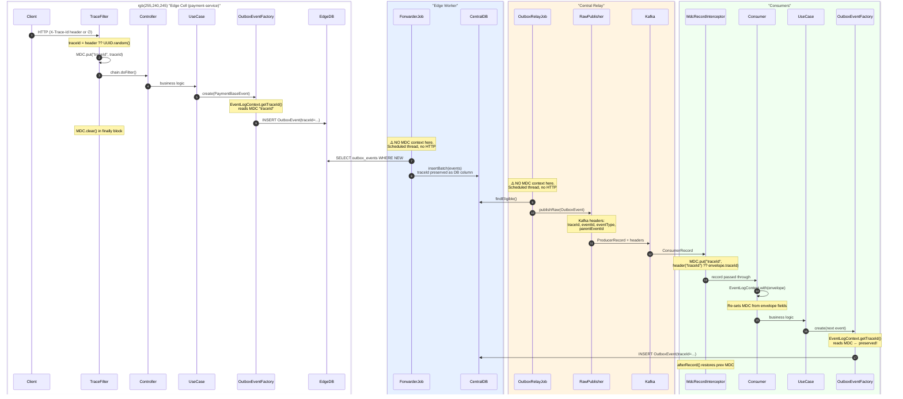

# 🔍 Observability Audit — Payment Platform

## Trace Context Lifecycle (End-to-End)



---

## 1. Inventory of All Manually Implemented Tracing Elements

| # | Element | Module | File | Mechanism | What It Does |
|---|---------|--------|------|-----------|-------------|
| **T1** | `TraceFilter` | `payment-service` | [TraceFilter.kt](file:///Users/dogancaglar/IdeaProjects/payment-platform-for-marketplaces/payment-service/src/main/kotlin/com/dogancaglar/paymentservice/adapter/inbound/rest/webconfig/TraceFilter.kt) | Servlet `OncePerRequestFilter` | Reads `X-Trace-Id` HTTP header (or generates `UUID.randomUUID()`), puts into MDC as `traceId`. Clears MDC in `finally`. Also logs timing breakdown (total/app/flush ms) and slow-request warnings. |
| **T2** | `EventLogContext.with(envelope)` | `common` | [EventLogContext.kt](file:///Users/dogancaglar/IdeaProjects/payment-platform-for-marketplaces/common/src/main/kotlin/com/dogancaglar/common/logging/EventLogContext.kt) | MDC context manager | Scoped MDC injection: sets `traceId`, `eventId`, `parentEventId`, `aggregateId`, `eventType` from `EventEnvelope` fields. Restores previous MDC state after block completes. |
| **T3** | `EventLogContext.getTraceId()` | `common` | [EventLogContext.kt](file:///Users/dogancaglar/IdeaProjects/payment-platform-for-marketplaces/common/src/main/kotlin/com/dogancaglar/common/logging/EventLogContext.kt#L12) | MDC read + fallback | Reads `traceId` from MDC. **If null, generates a new `UUID.randomUUID()`** — silent trace context loss. |
| **T4** | `EventLogContext.withRetryFields()` | `common` | [EventLogContext.kt](file:///Users/dogancaglar/IdeaProjects/payment-platform-for-marketplaces/common/src/main/kotlin/com/dogancaglar/common/logging/EventLogContext.kt#L63-L80) | MDC context manager | Adds `retryCount`, `retryReason`, `retryErrorMessage`, `retryBackoffMillis` to MDC during retry blocks. |
| **T5** | `GenericLogFields` | `common` | [GenericLogFields.kt](file:///Users/dogancaglar/IdeaProjects/payment-platform-for-marketplaces/common/src/main/kotlin/com/dogancaglar/common/logging/GenericLogFields.kt) | Constants | Defines all 12 MDC field names: `traceId`, `PAYMENT_ID`, `PAYMENT_ORDER_ID`, `JOURNAL_ID`, `eventType`, `eventId`, `parentEventId`, `aggregateId`, `topicName`, `consumerGroup`, `retryCount`, `retryReason`, `retryErrorMessage`, `retryBackoffMillis`. |
| **T6** | `EventEnvelope<T>` | `common` | [EventEnvelope.kt](file:///Users/dogancaglar/IdeaProjects/payment-platform-for-marketplaces/common/src/main/kotlin/com/dogancaglar/common/event/EventEnvelope.kt) | Data class | Carries `traceId`, `eventId`, `parentEventId` as first-class JSON fields inside every event payload. |
| **T7** | `EventEnvelopeFactory` | `common` | [EventEnvelopeFactory.kt](file:///Users/dogancaglar/IdeaProjects/payment-platform-for-marketplaces/common/src/main/kotlin/com/dogancaglar/common/event/EventEnvelopeFactory.kt) | Factory | Creates `EventEnvelope` with caller-supplied `traceId`, deterministic `eventId`, and `parentEventId` (defaults to self if null). |
| **T8** | `OutboxEvent` (domain entity) | `payment-domain` | [OutboxEvent.kt](file:///Users/dogancaglar/IdeaProjects/payment-platform-for-marketplaces/payment-domain/src/main/kotlin/com/dogancaglar/paymentservice/domain/model/payment/OutboxEvent.kt) | Domain model | Contains `traceId`, `eventId`, `parentEventId` as first-class fields persisted to PostgreSQL. Carried across edge → central DB boundary. |
| **T9** | `OutboxEventEventFactory` | `payment-infrastructure` | [OutboxEventEventFactory.kt](file:///Users/dogancaglar/IdeaProjects/payment-platform-for-marketplaces/payment-infrastructure/src/main/kotlin/com/dogancaglar/paymentservice/infra/adapter/outbound/serialization/OutboxEventEventFactory.kt) | Factory | Creates `OutboxEvent` by calling `EventLogContext.getTraceId()` and `EventLogContext.getEventId()` — the critical bridge from MDC to persisted state. |
| **T10** | `RawEventPublisher` | `common-kafka` | [RawEventPublisher.kt](file:///Users/dogancaglar/IdeaProjects/payment-platform-for-marketplaces/common-kafka/src/main/kotlin/com/dogancaglar/common/kafka/publisher/RawEventPublisher.kt) | Kafka header injection | Injects `traceId`, `eventId`, `eventType`, `parentEventId` as Kafka `RecordHeader` entries alongside the JSON payload. |
| **T11** | `MdcRecordInterceptor` | `payment-consumers` | [KafkaTypedConsumerFactoryConfig.kt](file:///Users/dogancaglar/IdeaProjects/payment-platform-for-marketplaces/payment-consumers/src/main/kotlin/com/dogancaglar/paymentservice/infra/adapter/inbound/kafka/KafkaTypedConsumerFactoryConfig.kt#L370-L399) | `RecordInterceptor` | Extracts `traceId`, `eventId`, `parentEventId`, `aggregateId`, `eventType` from Kafka headers (with envelope body fallback) into MDC **before** consumer method runs. Restores previous MDC in `afterRecord()`. |
| **T12** | `MdcTaskDecorator` (×4 copies) | `payment-service`, `payment-consumers`, `payment-central-relay`, `payment-edge-workers` | [PaymentServiceThreadPoolConfig.kt](file:///Users/dogancaglar/IdeaProjects/payment-platform-for-marketplaces/payment-service/src/main/kotlin/com/dogancaglar/paymentservice/config/PaymentServiceThreadPoolConfig.kt#L117-L130) etc. | `TaskDecorator` | Copies parent thread's MDC map to child threads in `ThreadPoolTaskExecutor`. Ensures MDC propagation for `@Async` and scheduled tasks. |
| **T13** | `PaymentControllerWebExceptionHandler` | `payment-service` | [PaymentControllerWebExceptionHandler.kt](file:///Users/dogancaglar/IdeaProjects/payment-platform-for-marketplaces/payment-service/src/main/kotlin/com/dogancaglar/paymentservice/adapter/inbound/rest/webconfig/PaymentControllerWebExceptionHandler.kt#L185) | Error response | Includes `traceId` in error response body (`ErrorResponse.traceId`) by reading from MDC or falling back to `X-Trace-Id` header. |
| **T14** | Logback JSON + MDC export (×4) | All runtime modules | [logback-spring.xml](file:///Users/dogancaglar/IdeaProjects/payment-platform-for-marketplaces/payment-service/src/main/resources/logback-spring.xml) | LoggingEventCompositeJsonEncoder | Exports MDC fields (`traceId`, `eventId`, `parentEventId`, `aggregateId`, `eventType`, `retryCount`, `retryBackoffMillis`, `retryReason`, `retryErrorMessage`) to top-level JSON fields. Also includes `threadName`, `loggerName`, and static `app` tag. |

---

## 2. Propagation Gaps Analysis

```mermaid
stateDiagram-v2
    direction LR

    state "HTTP Request" as HTTP
    state "MDC (TraceFilter)" as MDC1
    state "OutboxEvent DB Row" as OUTBOX_DB
    state "Central DB Row" as CENTRAL_DB
    state "Kafka Headers + JSON Body" as KAFKA
    state "MDC (Consumer Interceptor)" as MDC2
    state "Next OutboxEvent DB Row" as OUTBOX2

    HTTP --> MDC1: ✅ X-Trace-Id → MDC
    MDC1 --> OUTBOX_DB: ✅ MDC → OutboxEventFactory → DB
    OUTBOX_DB --> CENTRAL_DB: ✅ DB column copied verbatim
    CENTRAL_DB --> KAFKA: ✅ RawPublisher injects headers
    KAFKA --> MDC2: ✅ Interceptor extracts headers → MDC
    MDC2 --> OUTBOX2: ✅ OutboxEventFactory reads MDC

    note left of HTTP: ⚠️ GAP: If client omits X-Trace-Id,<br/>a random UUID is minted.<br/>No W3C traceparent support.
    note right of CENTRAL_DB: ⚠️ GAP: OutboxRelayJob runs on<br/>@Scheduled thread. MdcTaskDecorator<br/>copies from parent, but parent<br/>MDC is empty → relay logs<br/>have NO traceId.
    note right of OUTBOX_DB: ⚠️ GAP: ForwarderJob same issue.<br/>@Scheduled thread with empty MDC.
```

### Gap Detail Table

| # | Gap Location | Boundary Crossing | What Happens | Severity | Impact |
|---|-------------|-------------------|-------------|----------|--------|
| **G1** | `TraceFilter` → first UUID generation | HTTP ingress | If no `X-Trace-Id` header, a random UUID is minted. No W3C `traceparent` format, no OpenTelemetry interop, no span hierarchy. | 🟡 Medium | Cannot correlate with upstream services using standard distributed tracing. |
| **G2** | `MDC.clear()` in `TraceFilter.finally` | End of HTTP request | MDC is completely wiped after the response is flushed. Any async work spawned from the request thread that hasn't started yet may get a blank MDC (though `MdcTaskDecorator` mitigates for thread pool tasks). | 🟢 Low | Mitigated by `MdcTaskDecorator`, but not for raw `Thread()` or `CompletableFuture.supplyAsync()` without custom executor. |
| **G3** | `EventLogContext.getTraceId()` fallback | Any call site where MDC `traceId` is null | **Silently generates a new `UUID.randomUUID()`** — the trace chain is broken and you have no way to know it happened. The log shows a traceId that doesn't match anything upstream. | 🔴 **Critical** | Creates orphaned traces. Particularly dangerous in the `OutboxEventFactory` where a new traceId would be persisted and propagated through the entire async chain with zero linkage to the original HTTP request. |
| **G4** | `LocalOutboxStoreAndForwardJob` | Edge Worker (`@Scheduled` thread) | Runs on a Spring `@Scheduled` timer thread. No HTTP context. The `MdcTaskDecorator` copies from the parent thread's MDC, but the parent (`@Scheduled` entrypoint) has **empty MDC**. All `logger.info("Forwarded ok={}...")` log lines have **no traceId, no eventId, no aggregateId**. | 🟡 Medium | Cannot correlate forwarder logs with the payment they're forwarding. The `OutboxEvent` row *has* the traceId in a column, but it's not put into MDC during processing. |
| **G5** | `OutboxRelayJob.poll()` | Central Relay (`@Scheduled` thread) | Same issue as G4. The relay processes `OutboxEvent` rows that contain traceId, but never puts it into MDC. All relay scheduling/publishing logs (`"✅ Marked dispatched"`, `"🛑 Breaking chain"`) are **traceId-blind**. | 🟡 Medium | You can't search Kibana for a traceId and find the relay logs that published that event to Kafka. |
| **G6** | `OutboxRelayJob` → `executor.execute {}` | Relay thread pool (`resilientExecutor`) | When the relay submits aggregate-ordered publish tasks to the `resilientExecutor` pool, the `MdcTaskDecorator` copies from the relay polling thread. Since the polling thread has no MDC (G5), the executor threads also have no MDC. | 🟡 Medium | Cascading effect of G5. |
| **G7** | `AccountBalanceConsumer` | Kafka batch consumer | Uses `List<ConsumerRecord>` signature — a **batch listener**. The `MdcRecordInterceptor` only fires once per poll batch, setting MDC from the **first record**. All subsequent records in the batch log under the wrong traceId/eventId. | 🔴 **Critical** | In a batch of 100 journal entries, 99 will have incorrect tracing context in their log lines. |
| **G8** | `AccountBalanceConsumer` missing `EventLogContext.with()` | Consumer processing | Unlike `PspResultConsumer`, `CaptureCommandExecutor`, `CapturePspPerformedConsumer`, and `GrossCaptureAllocationConsumer` — `AccountBalanceConsumer` **never calls `EventLogContext.with(envelope)`**. It relies entirely on the interceptor (which is broken for batch — G7). | 🟡 Medium | Inconsistent MDC context within the consumer's processing logic. |
| **G9** | `PaymentEventPublisher` (commented out) | `common-kafka` | The original typed publisher (with `KafkaTemplate<String, EventEnvelope<*>>`) is **entirely commented out**. The active publisher is `RawEventPublisher` using `KafkaTemplate<String, String>`. The commented code had identical header injection but also had a `MeterRegistry` for metrics. | 🟢 Info | No functional gap, but the dead code creates confusion during audits. |
| **G10** | No `traceId` in `@Scheduled` maintenance jobs | Edge workers + Central relay | `reclaimStuck()`, `LocalOutboxMaintenanceJob`, and `CentralOutboxMaintenanceJob` run with empty MDC. Their logs are completely untraceable. | 🟢 Low | These are operational maintenance, not payment-specific. But during incident response you can't tell which payment's stuck event was reclaimed. |
| **G11** | Stripe PSP call boundary | `payment-service` → Stripe API | The traceId is NOT sent to Stripe in any header or metadata. If you need to correlate Stripe dashboard events with your internal traces, there's no link. | 🟡 Medium | Cross-system correlation impossible during Stripe incident investigation. |

---

## 3. Telemetry Categorization

### Infrastructure-Level Telemetry

| Element | Type | Module(s) | Description |
|---------|------|-----------|-------------|
| `micrometer-binder-kafka` | Metrics (auto) | All via parent `pom.xml` | Automatic Kafka client JMX metrics (consumer lag, producer acks, fetch latency) exposed via Micrometer. |
| `MeterRegistry` counters/timers | Metrics (manual) | `payment-central-relay` | `relay_published_total`, `relay_publish_failed_total`, `relay_poll_duration`, `relay_reclaimed_total`, `central_outbox_backlog_size` (gauge). |
| `MeterRegistry` counters/timers | Metrics (manual) | `payment-edge-workers` | `outbox_dispatched_total`, `outbox_dispatch_failed_total`, `outbox_dispatcher_duration`, `local_outbox_backlog_size` (gauge). |
| `MeterRegistry` in PSP adapter | Metrics (manual) | `payment-consumers` | `SimulatedPspCaptureGatewayAdapter` records PSP call metrics. |
| `MeterRegistry` in Redis adapter | Metrics (manual) | `payment-infrastructure` | `AccountBalanceRedisCacheAdapter` and `CaptureRetryQueueAdapter` record cache metrics. |
| Kafka `RecordHeader` injection | Tracing (manual) | `common-kafka` | `traceId`, `eventId`, `eventType`, `parentEventId` injected as Kafka record headers by `RawEventPublisher`. |
| Kafka `MdcRecordInterceptor` | Tracing (manual) | `payment-consumers` | Extracts Kafka headers → MDC before consumer method invocation. |
| `MdcTaskDecorator` (×4) | MDC propagation | All runtime modules | Copies MDC across thread pool boundaries in `ThreadPoolTaskExecutor`. |
| Logback JSON encoder (×4) | Logging config | All runtime modules | `LoggingEventCompositeJsonEncoder` with structured JSON output, MDC field export, `threadName`, `loggerName`. |
| Logback `globalCustomFields` | Static tags | All runtime modules | Hardcoded `"app"` field (`payment-service`, `payment-consumers`, `payment-central-relay`, `payment-edge-workers`). |

### Domain-Level Telemetry

| Element | Type | Domain Entity | Description |
|---------|------|--------------|-------------|
| `OutboxEvent.traceId` | Data field | `OutboxEvent` | TraceId persisted as a PostgreSQL column alongside the event payload. Survives edge → central DB boundary and Kafka publish. |
| `OutboxEvent.eventId` | Data field | `OutboxEvent` | Deterministic event ID derived from the domain event. Used for idempotency deduplication. |
| `OutboxEvent.parentEventId` | Data field | `OutboxEvent` | Establishes causal event lineage (which event caused this one). |
| `EventEnvelope.traceId/eventId/parentEventId` | JSON payload fields | `EventEnvelope<T>` | Same trace context carried inside the Kafka message JSON body (redundant with headers — intentional for resilience). |
| `PaymentIntent` lifecycle logging | Log messages | `PaymentIntent` | `"paymentintent ${id} is created successfully"`, `"payment ${id} is authorized successfully"`. |
| `Payment` lifecycle logging | Log messages | `Payment` | Consumer logs like `"Processing PaymentAuthorized event for paymentIntentId: ..."`. |
| `Seller/Split` allocation logging | Log messages | `PaymentSplit` | `"Direct Sale context identified"`, `"Marketplace multi-party transaction identified"`, `"Staged split ledger allocations across all ${splits.size} distribution paths"`. |
| `JournalEntry` processing logging | Log messages | `JournalEntry` | `"Processing journal CAPTURE with journal entry id ... tx id ..."`. |
| `GenericLogFields.PAYMENT_ID` | MDC field name | `Payment` | Defined but **never populated** anywhere in the codebase. |
| `GenericLogFields.PAYMENT_ORDER_ID` | MDC field name | `PaymentOrder` | Defined but **never populated** anywhere in the codebase. |
| `GenericLogFields.JOURNAL_ID` | MDC field name | `JournalEntry` | Defined but **never populated** anywhere in the codebase. |
| `GenericLogFields.TOPIC_NAME` | MDC field name | Kafka consumer | Defined but **never populated** anywhere in the codebase. |
| `GenericLogFields.CONSUMER_GROUP` | MDC field name | Kafka consumer | Defined but **never populated** anywhere in the codebase. |

> [!WARNING]
> **5 out of 12 `GenericLogFields` constants are defined but never used.** These are `PAYMENT_ID`, `PAYMENT_ORDER_ID`, `JOURNAL_ID`, `TOPIC_NAME`, `CONSUMER_GROUP`. They appear in logback MDC includes but are never `MDC.put()` anywhere, so they always emit as `null`/absent in your JSON logs.

---

## 4. Implicit (Accidental) Telemetry

| # | Element | Where | What's Happening | Risk Level |
|---|---------|-------|-----------------|-----------|
| **I1** | `threadName` in Logback | All modules via `<threadName/>` provider | Thread names like `resilientExecutor-1`, `outboxJobTaskScheduler-2`, `kafka-consumer-psp-result-consumer-1` leak into every JSON log line. **You're depending on thread names to identify which pool/consumer is running**, but you're not explicitly controlling or documenting this. Thread pool name changes would silently break dashboards/alerts. | 🟡 |
| **I2** | `loggerName` in Logback | All modules via `<loggerName/>` provider | The fully-qualified class name (e.g., `com.dogancaglar.paymentservice.infra.adapter.inbound.kafka.consumers.PspResultConsumer`) is logged. Used implicitly for filtering in log aggregation. Refactoring class names or packages would break log queries. | 🟢 |
| **I3** | Spring Boot auto-configuration metrics | All modules with `MeterRegistry` | Spring Boot auto-configures JVM metrics (`jvm.memory.*`, `jvm.gc.*`, `jvm.threads.*`), HTTP server metrics (`http.server.requests`), and JDBC metrics (`jdbc.connections.*`) through Micrometer auto-configuration. You're not explicitly managing these. | 🟢 |
| **I4** | Kafka consumer group lag | All consumer modules | `micrometer-binder-kafka` automatically exposes `kafka.consumer.fetch.manager.records.lag`, partition assignment metrics, etc. This happens because of the BOM dependency, not because you configured it. | 🟡 |
| **I5** | Spring `@Scheduled` fixed-delay/initial-delay values | Edge workers + Central relay | The `fixedDelay` and `initialDelay` values in `@Scheduled` annotations implicitly define your polling SLA. There are no metrics on "how long since last successful poll" — you rely on the absence of `outbox_dispatcher_duration` timer entries. | 🟡 |
| **I6** | `MDC.clear()` side effects | `TraceFilter` | `MDC.clear()` wipes **all** MDC entries, not just the ones TraceFilter set. If another filter or framework (e.g., Spring Security) sets MDC entries upstream, they'd be destroyed. Currently not a problem because TraceFilter is the only MDC writer in the HTTP path. | 🟢 |
| **I7** | `app.instance-id` in worker/relay logs | Edge workers + Central relay | The `$appInstanceId` (e.g., `"central-relay"`) appears in `workerId` strings logged during claim/unclaim operations. This accidentally provides pod-level tracing but is not a structured MDC field. | 🟢 |
| **I8** | Error stack traces as observability | All modules | `logger.error("❌ Failed to ...", exception)` — the stack trace itself is the primary diagnostic tool. There's no structured error code, error category, or error metric counter for business logic failures (only for infrastructure publish failures). | 🟡 |
| **I9** | `response.status` in TraceFilter | `payment-service` | HTTP status code is logged in the TraceFilter's finally block but **not** emitted as a structured MDC field. You're parsing it from the message string rather than having it as a queryable JSON field. | 🟡 |
| **I10** | Kafka `record.offset()` and `record.partition()` | `common-kafka` | `KafkaDeliveryResult` captures `topic`, `partitionKey`, and `offset` upon successful publish, but these are only returned to the caller (OutboxRelayJob) and never logged or metricated. | 🟢 |

---

## 5. Summary Findings

### What Works Well ✅
1. **Trace continuity through the outbox pattern** — `traceId` flows HTTP → MDC → `OutboxEvent` DB column → Kafka headers → consumer MDC → next `OutboxEvent`. The chain is structurally sound.
2. **Dual trace context in Kafka** — Both Kafka headers AND JSON body carry `traceId`, providing resilience against header stripping.
3. **Scoped MDC management** — `EventLogContext.with()` properly saves/restores MDC state, preventing context pollution between consumer records.
4. **MDC propagation across thread pools** — `MdcTaskDecorator` is configured on all 4 runtime modules' thread pools.
5. **Consistent JSON log format** — All 4 modules use identical `logback-spring.xml` structure with the same MDC field exports.

### Critical Issues 🔴
1. **G3: Silent trace regeneration** — `EventLogContext.getTraceId()` generates new UUIDs when MDC is empty instead of failing fast. Creates orphaned traces.
2. **G7: Batch consumer MDC corruption** — `AccountBalanceConsumer` processes batches under wrong traceId context.
3. **5 unused GenericLogFields** — Defined constants never populated, creating false expectations about log searchability.

### Recommended Priority Actions
1. **Fix G3**: Make `getTraceId()` throw or log a WARN when MDC is empty, rather than silently generating.
2. **Fix G7+G8**: Wrap each record in `AccountBalanceConsumer` with `EventLogContext.with(record.value())`.
3. **Fix G4+G5**: In `OutboxRelayJob` and `LocalOutboxStoreAndForwardJob`, put the `OutboxEvent.traceId` into MDC before logging.
4. **Populate unused MDC fields** or remove them from `GenericLogFields` and logback includes.
5. **Adopt W3C traceparent** format instead of custom `X-Trace-Id` for future OpenTelemetry interop.
