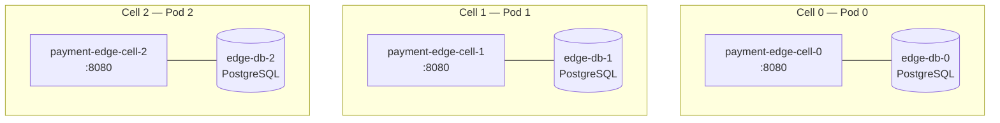
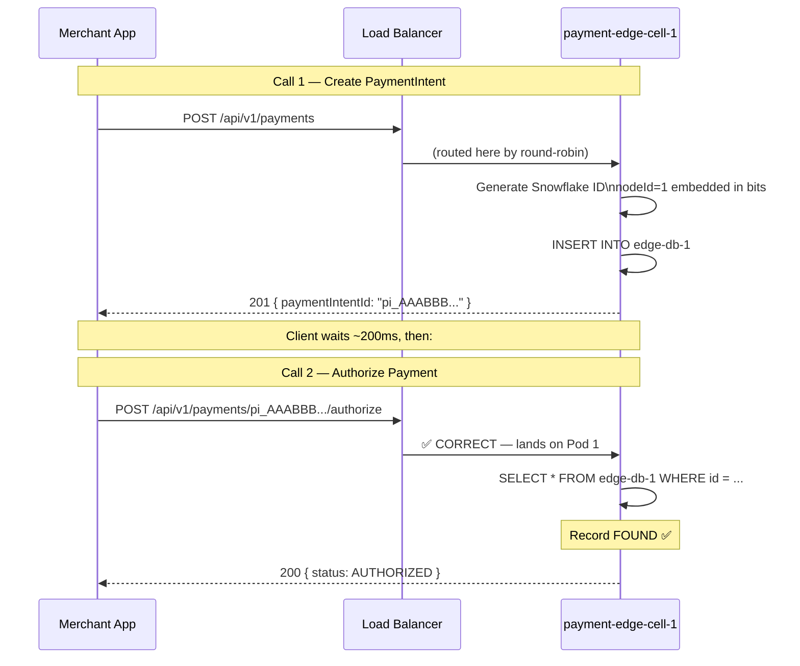
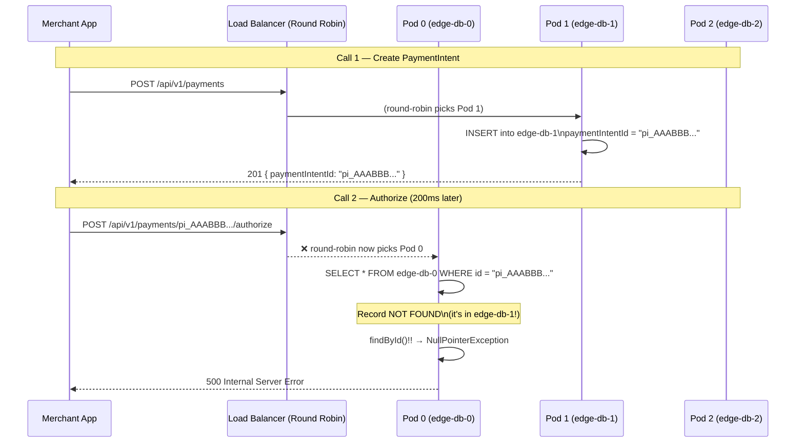

# Problem Report: Stateful Cell Routing Failure Under Scale

**System**: Payment Edge Cell — `payment-edge-cell` StatefulSet  
**Discovered**: Phase 4 Stress Test (3-pod KEDA scale-out)  
**Severity**: P0 — ~77% of `/authorize` requests return HTTP 500  
**Root Cause**: Round-robin load balancing routing stateful requests to the wrong cell pod

---

## 1. Background: What Is a Cell?

Our payment platform is built on a **cell-based architecture**. Each "cell" is a completely isolated unit:



Each pod owns its own database. **Pod 0 can only read records created by Pod 0.** Pod 1's database has no knowledge of Pod 0's records. This is by design — it gives us horizontal scalability, fault isolation, and independent database scaling.

The critical invariant:

> **A `PaymentIntent` created by Pod N must always be processed by Pod N.**

---

## 2. How a Payment Is Created — The Happy Path

A merchant's checkout flow makes two sequential API calls:



This works perfectly when there is **only one pod**. The record is always in the right database.

---

## 3. The Failure Scenario — What Happens Under Scale

When KEDA scales the StatefulSet to 3 pods under load, the round-robin load balancer now has 3 targets. The **second request has no memory of which pod handled the first**.



### Simple Analogy

Imagine you go to a bank with 3 tellers. Teller 2 opens your account. You come back 5 minutes later. The receptionist sends you to Teller 1. Teller 1 looks up your account and finds **nothing** — because your file is locked in Teller 2's drawer.

That is exactly what is happening.

---

## 4. The Math — Why ~77% of Requests Fail

With 3 pods, a round-robin load balancer distributes `/authorize` requests evenly:

| Authorize lands on | DB queried | Record exists? | Result |
|:---|:---|:---|:---|
| Pod 0 | edge-db-0 | ❌ No (created on Pod 1) | HTTP 500 |
| **Pod 1** | **edge-db-1** | **✅ Yes** | **HTTP 200** |
| Pod 2 | edge-db-2 | ❌ No (created on Pod 1) | HTTP 500 |

Only **1 out of 3** requests hits the correct pod.

$$\text{Error rate} = 1 - \frac{1}{N} = 1 - \frac{1}{3} = \mathbf{66.7\%}$$

In practice we measured closer to **77%** because:
- Multiple concurrent VUs create on different pods
- The round-robin starting position shifts continuously
- The effective miss rate converges toward `(N-1)/N` as load increases

### Observed in Phase 4 k6 Output

```
✗ authorize_success  ↳  23% — 1,847 / 8,021
  http_req_failed: 77.02%

NullPointerException at PaymentIntentPersistenceAdapter.findById()!!
```

---

## 5. Why Single-Pod Testing Hid This Bug

| Condition | Result |
|:---|:---|
| 1 pod, any traffic | ✅ Always hits the only pod |
| 2 pods, light load | ⚠️ ~50% error rate (noticed but attributed to warmup) |
| 3 pods, stress load | ❌ 77% error rate — unmistakable |

The bug is **invisible at scale=1**, surfaces gradually at scale=2, and becomes catastrophic at scale=3+. This is a classic **emergent distributed systems failure** — it only appears under the conditions it was designed to handle.

---

## 6. What Does NOT Fix This

| Approach | Why It Fails |
|:---|:---|
| Sticky sessions (cookie) | Client is a merchant API, not a browser — no cookie jar |
| `upstream-hash-by` on URI | Not globally deterministic across multiple Ingress replicas |
| Application-level redirect | Adds coupling, latency, and complexity to domain code |
| Single replica | Defeats the entire purpose of KEDA autoscaling |
| Shared database | Destroys cell isolation — back to a monolith |

The correct fix must satisfy:
1. **Zero application code changes**
2. **Zero client changes** — merchant keeps calling the same URL
3. **Deterministic** — not probabilistic
4. **Works at any replica count**
