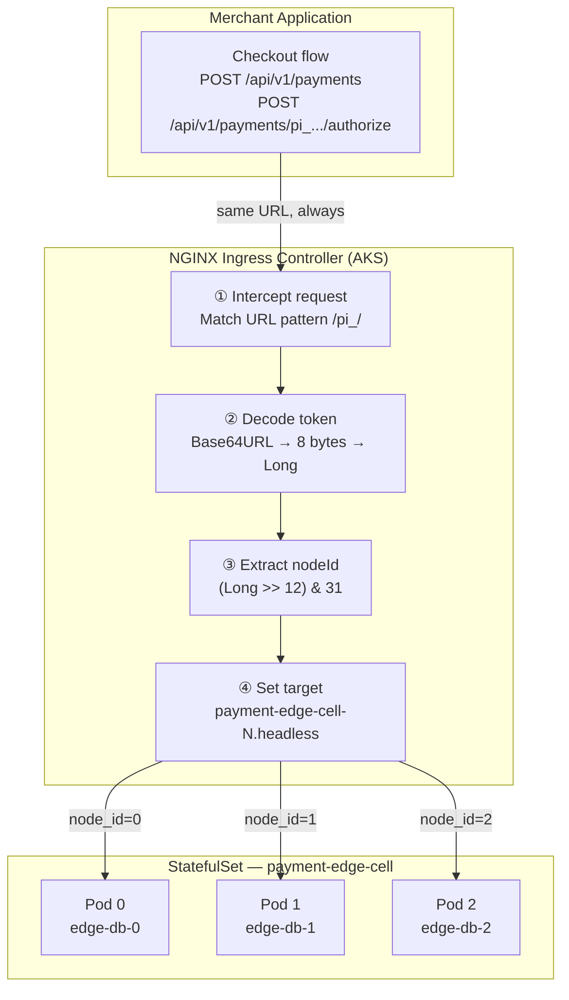
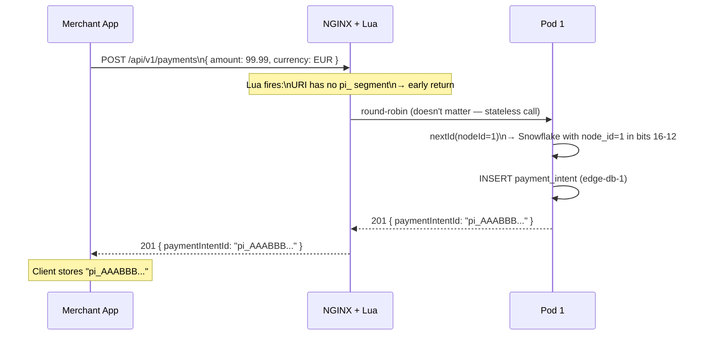

# Proposal: Snowflake-Aware Lua Cell Router

**Author**: Engineering  
**Status**: ✅ Implemented — Revision 6  
**Scope**: NGINX Ingress Controller + payment-edge-cell Helm chart  
**Zero application code changes required**

---

## 1. The Core Insight

> The `paymentIntentId` already knows which pod created it.  
> We just need to teach the load balancer to read it.

When a `PaymentIntent` is created, the system generates a **Snowflake ID** — a 64-bit number that encodes not just a timestamp and sequence number, but also the **nodeId of the pod that generated it**. That ID is then encoded as a URL-safe Base64 string and returned to the client as `pi_AAABBB...`.

The information needed for perfect routing is already sitting inside every `paymentIntentId`. We simply need to intercept it at the network layer before the request ever reaches an application pod.

---

## 2. Industry Parallel — How Stripe Does It

This is not a novel idea. Stripe uses the same pattern at global scale:

```
Stripe ID:  ch_1OoZxX2eZvKYlo2C8pBQcLu5
            ──┬── ─────────────────────
              │         opaque token
              └── prefix encodes the object type AND the data centre shard

Stripe's gateway reads the prefix → routes to the correct regional cell
The client never knows which region processed the payment
```

Our system does the same thing — but instead of a text prefix, we encode the **pod index** directly into the binary bits of the ID. This is more compact, more precise, and completely transparent to the client.

---

## 3. High-Level Design



**Key properties:**
- The merchant app calls **the same URL** for every request
- The routing decision is made **at the network boundary** — before any application code runs
- The algorithm is **purely mathematical** — decode → bit shift → pod name. No cache. No database. No round trips.
- If decoding fails for any reason, the router **fails open** — passes through to the default upstream

---

## 4. The Snowflake ID — Understanding the Encoding

### What a Snowflake ID Is

A Snowflake ID is a 64-bit integer composed of several packed fields:

```
┌─────────────────────────────────────────┬──────────┬──────────┬────────────┐
│           timestamp (41 bits)           │ region   │  nodeId  │  sequence  │
│        milliseconds since epoch         │ (5 bits) │ (5 bits) │ (12 bits)  │
└─────────────────────────────────────────┴──────────┴──────────┴────────────┘
 bit 63                                                           bit 0
```

- **timestamp**: When the ID was generated (millisecond precision, ~69 years of range)
- **regionId**: Which Azure region (up to 32 regions)
- **nodeId**: Which pod in the StatefulSet (0, 1, 2 ... up to 31)
- **sequence**: Counter within the same millisecond (up to 4095 per pod per ms)

### Simple Example

Let's say Pod 1 generates an ID at some moment in time, sequence 0:

```
nodeId = 1
sequence = 0

The 64-bit number has bits 16-12 set to: 00001 (binary for 1)

To extract: take the whole number, shift right 12 places, mask with 31
  nodeId = (id >> 12) & 0b11111
  nodeId = (id >> 12) & 31
  nodeId = 1  ✅
```

### The Public ID

The raw 64-bit Long is encoded as a URL-safe Base64 string with no padding:

```
Long (8 bytes, big-endian) → Base64URL → strip "=" → prefix "pi_"

Example:
  Long     = 7951023694832640
  Bytes    = [00 1C 3A 00 00 10 00 00]
  Base64   = "AByj..."
  PublicId = "pi_AByj..."
```

The client sees only `pi_AByj...`. But encoded inside those 11 characters is the complete routing address.

---

## 5. The Solution — NGINX Lua Router

### What Is Lua in NGINX?

NGINX (and its OpenResty variant used by ingress-nginx) can execute **Lua scripts** as part of request processing. These scripts run inside NGINX — before any proxy decision is made. They have zero network overhead, execute in microseconds, and have full access to request variables.

### The Lua Block — Annotated

This Lua block is injected into the NGINX `location` block via a Kubernetes Ingress annotation:

```lua
access_by_lua_block {

  -- ① Read the full URI
  local uri = ngx.var.uri

  -- ② Check if this request carries a paymentIntentId
  --    Pattern: /api/v1/payments/pi_<token>/...
  --    If no match (e.g. POST /api/v1/payments), exit immediately
  local b64 = string.match(uri, "^/api/v1/payments/pi_([A-Za-z0-9_%-]+)")
  if not b64 then
    return  -- POST /payments passes through unmodified
  end

  -- ③ Convert URL-safe Base64 back to standard Base64
  --    URL-safe Base64 replaces '+' with '-' and '/' with '_'
  --    We reverse this so ngx.decode_base64 can understand it
  b64 = string.gsub(b64, "-", "+")
  b64 = string.gsub(b64, "_", "/")

  -- ④ Re-add padding that PublicIdCodec strips
  --    Base64 strings must have length divisible by 4
  --    "AByj" → "AByj" (already 4)
  --    "ABy"  → "ABy=" (pad 1)
  --    "AB"   → "AB==" (pad 2)
  local pad = #b64 % 4
  if pad == 2 then b64 = b64 .. "=="
  elseif pad == 3 then b64 = b64 .. "="
  end

  -- ⑤ Decode Base64 string → 8 raw bytes
  local raw = ngx.decode_base64(b64)
  if not raw or #raw ~= 8 then
    ngx.log(ngx.WARN, "[cell-router] decode failed — falling back")
    return  -- fail-open: default upstream handles it
  end

  -- ⑥ Parse the lower 4 bytes as an unsigned 32-bit integer
  --    (Lua 5.1 has no native 64-bit integers — we use two 32-bit halves)
  --    The nodeId lives in bits 16-12, which are entirely in the lower 4 bytes
  local lo = string.byte(raw,5) * 16777216   -- byte 5 × 2^24
           + string.byte(raw,6) * 65536      -- byte 6 × 2^16
           + string.byte(raw,7) * 256        -- byte 7 × 2^8
           + string.byte(raw,8)              -- byte 8 × 2^0

  -- ⑦ Extract nodeId: right-shift 12, mask with 31
  --    Division by 4096 = right-shift by 12
  --    Modulo 32 = mask with 0x1F = keep only 5 bits
  local node_id = math.floor(lo / 4096) % 32

  -- ⑧ Build the exact pod DNS name
  ngx.var.cell_target = "payment-edge-cell-" .. node_id
    .. ".payment-edge-cell-headless.payment.svc.cluster.local"

  -- ⑨ Log for observability
  ngx.log(ngx.INFO,
    "[cell-router] node_id=", node_id,
    " target=", ngx.var.cell_target)
}
```

---

## 6. Complete User Flow — With the Router Active

### Flow A: Create PaymentIntent (no routing needed)



### Flow B: Authorize Payment (Lua router active)

```mermaid
sequenceDiagram
    participant C as Merchant App
    participant NGINX as NGINX + Lua
    participant P0 as Pod 0
    participant P1 as Pod 1 ✅

    C->>NGINX: POST /api/v1/payments/pi_AAABBB.../authorize

    rect rgb(10,50,70)
        Note over NGINX: Lua intercepts:
        Note over NGINX: 1. Extract b64 = "AAABBB..."
        Note over NGINX: 2. URL-safe decode: swap chars + re-pad
        Note over NGINX: 3. ngx.decode_base64 → 8 bytes
        Note over NGINX: 4. lo = bytes[5..8] as uint32
        Note over NGINX: 5. node_id = floor(lo/4096) % 32 = 1
        Note over NGINX: 6. target = payment-edge-cell-1.headless...
    end

    NGINX->>P1: proxy to payment-edge-cell-1 ✅
    P1->>P1: SELECT FROM edge-db-1 WHERE id = ...
    Note over P1: Record FOUND ✅ (was created here)
    P1->>P1: INSERT journal_entry AUTHORIZED
    P1-->>NGINX: 200 { status: AUTHORIZED }
    NGINX-->>C: 200 { status: AUTHORIZED }

    Note over P0: Never contacted ✅
```



---

## 7. What Changes — and What Doesn't

| Layer | Change | Notes |
|:---|:---|:---|
| Merchant application | **None** | Calls same URLs |
| `PaymentController.kt` | **None** | No routing awareness |
| `SnowflakeCore.kt` | **None** | Already encodes nodeId |
| `PublicIdCodec.kt` | **None** | Already Base64URL encodes |
| `ingress-controller-values-azure.yaml` | **+3 lines** | Enable Lua snippets |
| `payment-edge-cell/azure/values.yaml` | **+65 lines** | The Lua block annotation |

**Total blast radius: 68 lines of config. Zero lines of application code.**

---

## 8. Failure Modes & Safety

| Scenario | Behaviour |
|:---|:---|
| `pi_` not in URL | Lua exits immediately — normal round-robin |
| Malformed Base64 | `ngx.WARN` log — fails open to default upstream |
| Decoded bytes ≠ 8 | Same — fails open |
| Pod is down | Kubernetes handles it — NGINX retries next healthy pod |
| node_id > replica count | Request reaches a non-existent pod — NGINX 502, not a silent data error |

> [!TIP]
> The fail-open behaviour means the router **never causes new failure modes**. It either routes correctly, or it falls back to the previous round-robin behaviour.

---

## 9. Before vs After

| Metric | Before (Round Robin) | After (Lua Router) |
|:---|:---|:---|
| `/authorize` 500 rate at 3 pods | **~77%** | **0%** |
| Routing determinism | Probabilistic (1/N) | Exact (always correct) |
| Application awareness | None needed | None needed |
| Client changes | None needed | None needed |
| Latency overhead | — | < 1ms (pure in-memory Lua) |
| Observability | None | `[cell-router]` log per request |
